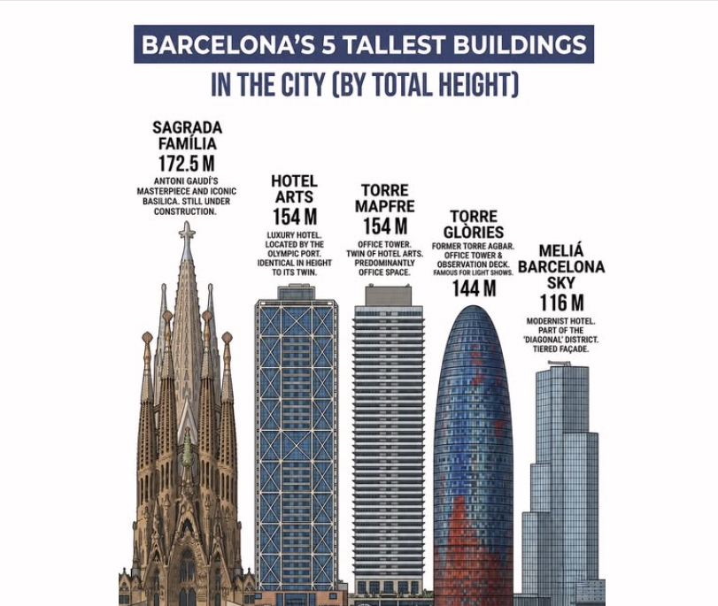

# Barcelońska miejska legenda, którą wymyślił Gaudí

*Żeby to nie zaginęło, bo to ciekawe*

A czy wiesz, że Sagrada Família jest dziś najwyższym kościołem świata?

Gaudí zaprojektował najwyższą wieżę Sagrady Família tak, aby była niższa niż wzgórze Montjuïc.

Wieża Jezusa Chrystusa ma 172,5 metra, podczas gdy Montjuïc sięga około 177–178 metrów nad poziomem morza. Różnica wynosi więc około pięciu metrów.

Powód był głęboko religijny: Gaudí uważał bowiem, że **dzieło stworzone przez człowieka nie może przewyższyć dzieła Bożego**.

A za dzieło Boże uważał przyrodę, więc zaprojektował najwyższy kościół świata, ale jednocześnie zadbał o to, by nie był wyższy niż wzgórze.

## Czy powstała przez to jakaś regulacja miejska?

Nie. Nie istniała historyczna ustawa ani oficjalny zakaz, że w Barcelonie nie może stać budynek wyższy niż Montjuïc.

To była osobista decyzja Gaudíego, a później pewna część barcelońskiej tożsamości.

## Czy przestrzegali tego także inni budowniczowie?

Tak.

Aż do drugiej połowy XX wieku Barcelona nie była miastem wieżowców. Panoramę tworzyły wieże kościelne, Montjuïc, Tibidabo i śródziemnomorskie horyzonty.

Gdy powstawały projekty olimpijskie na rok 1992, zbudowano na przykład:

- Torre Mapfre (154 m)
- Hotel Arts (154 m)

Oba budynki pozostały wyraźnie poniżej Montjuïc.

Później powstała Torre Glòries (dawniej Torre Agbar), ale i ona ma tylko około 145 metrów.

Dziś najwyższą budowlą Barcelony jest właśnie Sagrada Família, która przewyższyła Hotel Arts i Torre Mapfre, ale wciąż pozostaje poniżej Montjuïc.

## Jak bardzo jest to zakorzenione wśród barcelończyków?

Bardziej, niż można by przypuszczać.

Przeciętny barcelończyk może nie zna dokładnych liczb, ale bardzo często zna tę historię: „Gaudí nie chciał przewyższyć dzieła Bożego".

Ta opowieść powtarza się w mediach, przewodnikach, szkołach, dokumentach i podczas zwiedzania z komentarzem.

Stała się częścią lokalnego mitu o Gaudím.

Gaudí zbudował najwyższy kościół świata. Mógł go zrobić wyższym. Technicznie i architektonicznie. Ale tego nie zrobił.

Bo był przekonany, że człowiek może tworzyć wielkie rzeczy.

Tyle że nigdy nie powinien zapominać, że nie jest Stwórcą.

To myśl, która nawet po stu latach wyjaśnia, dlaczego o Gaudím wciąż mówi się inaczej niż o większości architektów.

