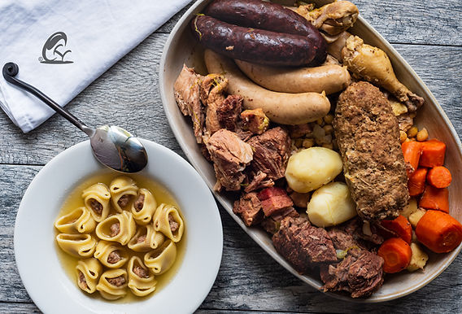
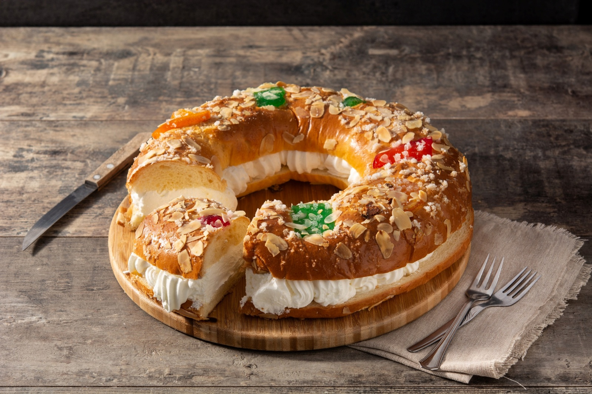

# Boże Narodzenie w Barcelonie

*czyli katalońskie Boże Narodzenie na talerzu*

Po latach spędzonych w Katalonii człowiek rozumie, że tutejsze Boże Narodzenie rozgrywa się głównie przy stole. Nie chodzi o to, ile kto upiecze rodzajów ciastek, lecz jak długo i z kim się przy jedzeniu siedzi.

Katalońskie menu świąteczne ma jasne zasady, które niewiele się zmieniają. I właśnie dzięki temu działa już od stuleci.

Jest też dowodem na to, że tradycje da się pielęgnować nawet bez stresu i niekończącego się pieczenia. Wystarczy wiedzieć, co naprawdę ma na świątecznym stole swoje miejsce. Katalonki nie muszą bowiem piec żadnych ciastek -- i wcale im to nie przeszkadza.

Świąteczne stoły opanowują TORRONS, słodycz, której bliżej do średniowiecza niż do książki kucharskiej naszych babć.

Podstawowy przepis jest prosty, a zarazem genialny: migdały, miód, cukier i białko.

Historycznie torrons pochodzą z regionu Morza Śródziemnego, a ich wyrób wiąże się z wpływem arabskim w średniowiecznej Hiszpanii.

Najsłynniejsze są warianty Jijona (miękki, kremowy) i Alicante (twardy, z całymi migdałami), ale w Katalonii wyrabia się też wersje lokalne, na przykład w Agramunt.

Dziś istnieją torrons z czekoladą, pistacjami, alkoholem, a nawet z solą -- tradycja zdecydowanie nie boi się tu innowacji.

Podczas gdy słodycze je się przez całe święta, głównym daniem Wigilii jest ESCUDELLA I CARN D'OLLA.

To sycąca zupa, która przypomina naszą mocną wywarową klasykę, ale w katalońskiej skali. Największą uwagę przyciągają GALETS -- ogromne muszlowate makarony, w które zmieściłaby się spokojnie połowa łyżki.

Wywar gotuje się z kilku rodzajów mięsa, warzyw i kiełbas i ma nasycić całą rodzinę na długie godziny.

To nie lekkie danie, lecz symbol obfitości i wspólnego biesiadowania.

Słodki szczyt świąt przychodzi jednak dopiero ze świętem Trzech Króli, w postaci ROSCÓ DE REIS.

To okrągłe ciasto ozdobione kandyzowanymi owocami, które w środku kryje dwie niespodzianki.

Figurka oznacza, że zostajesz królem dnia, a fasolka przeciwnie -- decyduje o tym, kto następnym razem zapłaci za ciasto.

I nie, na wiek ani wymówki się nie gra :-)

