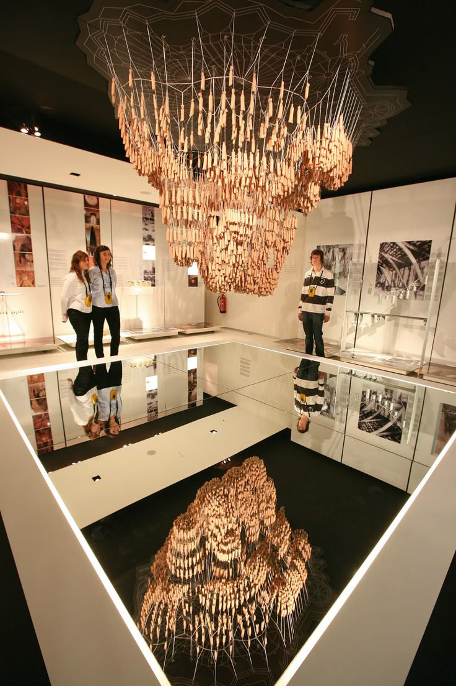
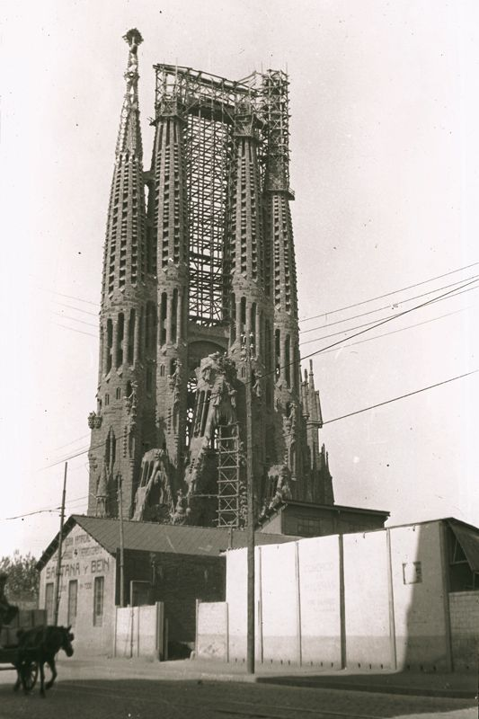

# Jak buduje się Sagradę Família — część II: od sznurków i makiet po anarchistów

Kiedy dziś patrzymy na świątynię Sagrada Família, łatwo zapominamy, że przez większość swojej budowy powstawała bez elektryczności, bez komputerów i bez nowoczesnych maszyn.

A mimo to stoi.

## Jak budowano na samym początku

Gdy w 1883 roku Antoni Gaudí przejął kierownictwo projektu budowy, budowano niemal wyłącznie ręcznie. Podstawowym materiałem był dobrej jakości piaskowiec ze wzgórza Montjuïc, czyli kamień, z którego zbudowana jest duża część historycznej Barcelony. Jest twardy, dobrze obrabialny i ma typową ciepłą barwę, którą dziś rozpoznajemy głównie na najstarszych częściach świątyni.

Kamień obrabiano bezpośrednio na miejscu, bez prefabrykacji i bez dźwigów w dzisiejszym znaczeniu. Wszystko postępowało powoli -- ale z ogromną precyzją. Każdy blok przeszedł przez ręce kamieniarzy, którzy pracowali dłutami, młotkami i szablonami.

Dobrze ilustruje to pierwsza ukończona wieża świątyni.

Była nią wieża św. Barnaby na fasadzie Narodzenia Pańskiego -- jedyna wieża, którą Gaudí za życia zobaczył ukończoną. Budowano ją mniej więcej od 1894 do 1925 roku, czyli ponad 30 lat, i ma około 98 metrów.

Trzydzieści lat pracy nad jedną wieżą dziś brzmi niewiarygodnie. Ale właśnie takie tempo odpowiadało wyobrażeniu Gaudíego: budować powoli, z szacunkiem do materiału i do sensu całej budowli.

Gaudí pracował przy tym zupełnie inaczej niż większość architektów swoich czasów. Praktycznie nie używał klasycznych rysunków technicznych.

Zamiast tego modelował.

I właśnie tu dochodzimy do jednego z najciekawszych technicznych momentów całej Sagrady.

## Jak Gaudí „obliczał" nośność świątyni

Gaudí był przekonany, że przyroda jest najlepszym konstruktorem. Więc pozwolił jej liczyć za siebie.

Zamiast skomplikowanych obliczeń i tabel używał modeli fizycznych. Ze stropu zwieszał sznurki, na których końcach przywiązane były małe woreczki z obciążeniem -- najczęściej z piaskiem lub ołowiem. Te ciężarki symulowały obciążenie przyszłej budowli. Pod działaniem grawitacji sznurki same układały się w krzywe, po których naturalnie i najefektywniej rozkłada się ciężar.

Gdy taki model odwrócono do góry nogami, powstawał idealny kształt łuków i sklepień -- stabilna konstrukcja, która nie potrzebowała masywnych murów oporowych. Gaudí fotografował swoje modele, czasem obserwował je za pomocą luster, a z tych obrazów wychodził później przy projektowaniu rzeczywistej budowli.

To było kluczowe, ponieważ Gaudí chciał, aby świątynia była inspirowana przyrodą nie tylko z zewnątrz, ale i wewnątrz. Kolumny nie miały być potężne i ciężkie jak w tradycyjnych katedrach, lecz smukłe, rozgałęzione, przypominające pnie drzew. Takie wnętrze sprawia wrażenie lekkiego i przewiewnego, ale stawia ogromne wymagania co do precyzyjnego rozłożenia obciążeń.

Im cieńsze kolumny, tym staranniej musiała być przemyślana nośność. I właśnie tu metoda Gaudíego okazała się genialna -- zamiast walczyć z przyrodą, pozwolił jej pracować za siebie.

Dzięki temu mógł zaprojektować wnętrze, które nie potrzebuje masywnych ścian -- a Sagrada Família od środka przypomina raczej las niż twierdzę.

## Co Gaudí zobaczył ukończone za swojego życia

Gdy Gaudí zmarł w 1926 roku, świątynia była gotowa tylko w niewielkiej części -- ta jednak wystarczyła, by nadać Sagradzie jej historię i kierunek.

Za jego życia ukończono kryptę (była gotowa już w latach 80. XIX wieku), stopniowo wyrosły mury apsydy, a największy „podpis" jego epoki stał się widoczny z daleka: fasada Narodzenia Pańskiego -- bogata, żywa, pełna roślin, zwierząt i radości.

Gaudí od początku przeczuwał, że reszty nie zobaczy. Sam kilkakrotnie zauważył:

„Mój klient się nie spieszy." (mając na myśli Boga.)

Mówił, że będzie to budowla na kilka stuleci. Wielokrotnie dawał do zrozumienia, że jego zadaniem nie jest ukończenie świątyni, lecz ustawienie jej DNA -- zasad, logiki, symboliki i języka konstrukcyjnego, aby kolejne pokolenia miały się czego trzymać.

## Wojna domowa: moment, gdy to wszystko o mało się nie skończyło

Rok 1936 był dla Sagrady Família jednym z najmroczniejszych momentów jej historii.

Wiosną tego roku Hiszpania zaczęła pogrążać się w chaosie, który w lipcu doprowadził do tego, co dziś nazywamy hiszpańską wojną domową. Było to starcie głęboko podzielonego społeczeństwa, w którym przeciwko sobie stały siły republikańskie (od lewicowych demokratów przez socjalistów po anarchistów) i nacjonaliści dowodzeni przez generała Franco. Wyjaśnienie wszystkich przyczyn i motywacji wystarczyłoby na kilka książek, ale w praktyce zderzyły się dwie zupełnie odmienne wizje przyszłości Hiszpanii.

Barcelona znalazła się po stronie republikanów -- i zarazem w epicentrum silnej przemocy antyklerykalnej. Kościół był w oczach wielu radykalnych grup symbolem władzy, ucisku i sojuszu z elitami. A Sagrada Família, choć była świątynią ekspiacyjną finansowaną z darów, była postrzegana po prostu jako budowla kościelna.

Pod koniec lipca 1936 doszło do tego, czego obawiali się ludzie związani ze świątynią.

Świątynia została zaatakowana, jej pomieszczenia splądrowane, a przede wszystkim -- pracownie Gaudíego podpalono. To właśnie tam znajdowało się to, co najcenniejsze, co architekt po sobie zostawił: gipsowe modele w skali, studia konstrukcyjne, obliczenia, notatki, robocze szkice i części planów. Ogień zniszczył większość z nich.

Nie był to przemyślany atak na architekturę.

Był to chaotyczny wybuch nienawiści i gniewu, wymierzony we wszystko, co przypominało kościół i stary porządek.

A skutki były druzgocące.

To, co Gaudí przez dziesięciolecia tworzył rękami -- jego trójwymiarowe „myślenie w przestrzeni" -- w krótkim czasie zamieniło się w gruz i popiół. W tej chwili naprawdę wyglądało na to, że projekt Sagrady Família skończył się na zawsze.

Tyle że się nie skończył.

Po wojnie zaczęła się niemal detektywistyczna praca. Architekci i inżynierowie próbowali zrekonstruować zamysł Gaudíego z fragmentów: z kilku uratowanych kawałków modeli, ze starych fotografii, z zapisów pisemnych, a przede wszystkim ze wspomnień jego współpracowników, którzy jeszcze pamiętali, jak Gaudí myślał i pracował.

Do dziś toczy się dlatego spór, który nie ma jednoznacznej odpowiedzi: gdzie kończy się Gaudí -- a gdzie zaczyna już interpretacja jego następców?

Pewne jest jedno: to, że dziś Sagrada Família w ogóle stoi i kontynuuje budowę, to mały cud przetrwania. A także przypomnienie tego, jak krucha może być nawet największa wizja, gdy zderzy się z dziejami.

