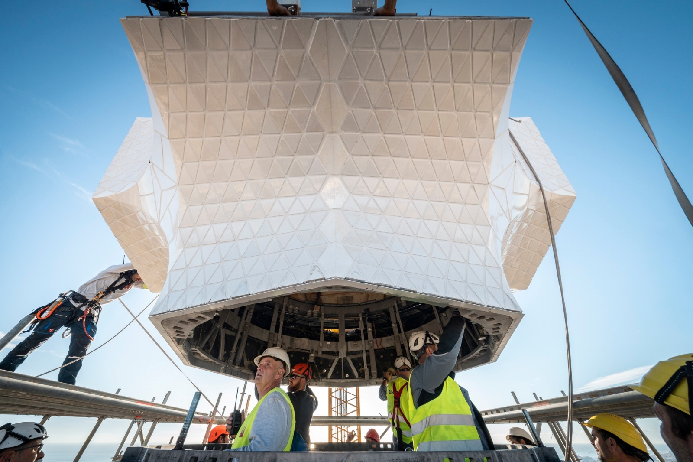
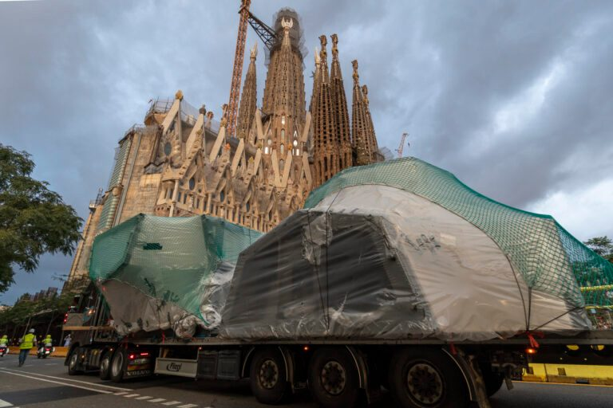
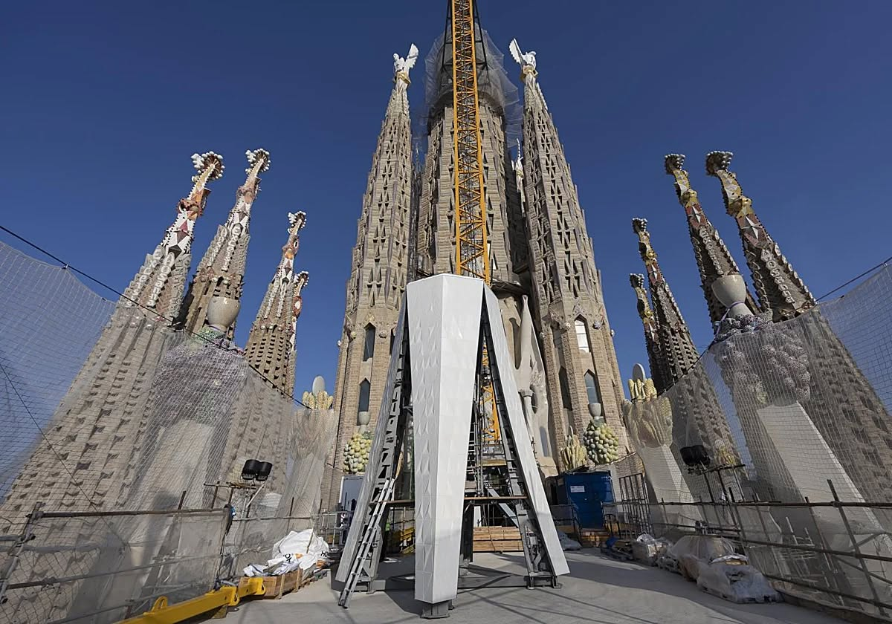
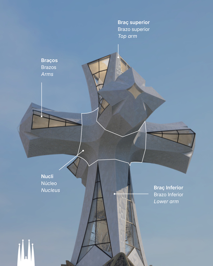

# Sagrada Família — część III

## Techniczne cudo i najwyższa świątynia chrześcijańska świata

Budowa Sagrady Família w ostatnich miesiącach weszła w fazę, którą bez przesady można nazwać historyczną.

Świątynia jako całość wprawdzie w 2026 roku jeszcze się nie domknie, ale jej część pionowa -- czyli wszystkie wieże -- zmierza ku ukończeniu właśnie na 100. rocznicę śmierci Antonia Gaudíego.

A uwaga skupia się dziś logicznie na najwyższej z nich.

## Najwyższa wieża świątyni — i najwyższa budowla chrześcijańska świata

Wieża Jezusa Chrystusa po ukończeniu osiągnie 172,5 metra i stanie się tym samym najwyższą świątynią chrześcijańską na świecie, wyższą niż dotychczasowy rekordzista -- katedra w Ulm.

A mimo to nie chodzi o pogoń za wysokością. Gaudí bardzo świadomie wyznaczył granicę: żadne dzieło człowieka nie może przewyższyć dzieła Bożego. Dlatego szczyt wieży jest nieco niższy niż wzgórze Montjuïc, które wznosi się nad Barceloną.

Nawet w tej technicznie ekstremalnej budowli obecna jest więc symbolika i pokora wobec przyrody.

Z punktu widzenia konstrukcji jest to najbardziej obciążony punkt całej świątyni. Wieża stoi nad skrzyżowaniem nawy głównej i poprzecznej, a jej ciężar -- wraz z dynamicznym obciążeniem wiatrem -- przenosi się na system masywnych filarów pod nią.

Wewnętrzny rdzeń żelbetowy działa jak pionowy kręgosłup, podczas gdy kamienny i ceramiczny płaszcz aktywnie uczestniczy w stabilności.

Wieża nie jest „sztywna i nieruchoma" -- została zaprojektowana tak, by przy silnym wietrze wychylać się sprężyście w granicach centymetrów, podobnie jak drzewo, i tym samym chronić się przed niebezpiecznym rezonansem.

## Techniczna bomba — krzyż na wieży Jezusa Chrystusa

Na tej wieży montuje się teraz krzyż, który sam w sobie jest dziełem technicznym o niezwykłej skali.

Gotowy krzyż będzie miał około 17 metrów wysokości i 13,5 metra szerokości, czyli wielkość pięciopiętrowego domu. Zaprojektowano go jako przestrzenny, czteroramienny krzyż, a nie płaski symbol, a jego całkowita masa szacowana jest na nawet 100 ton.

Nie jest to jednak masywny blok. Konstrukcja łączy wysokiej jakości stal nierdzewną, beton ultrawysokowartościowy (UHPC) oraz płaszcz z białej szkliwionej ceramiki i szkła.

Dzięki temu krzyż jest zarazem wytrzymały, relatywnie „lżejszy", korzystny aerodynamicznie i częściowo prześwitujący. Wiatr może przez niego do pewnego stopnia przechodzić, co na wysokości niemal 173 metrów jest kluczowe.

## Jak montuje się taki kolos

Jednym z najciekawszych technicznych szczegółów całej operacji jest sam sposób montażu. Poszczególne części krzyża nie są wyciągane prosto na szczyt wieży.

Najpierw są dostarczane na budowę, a następnie podnoszone na platformę roboczą na wysokości 54 metrów nad nawą główną. To właśnie tam odbywa się ich wstępny montaż, kompletacja konstrukcji, oszklenie i kolejne prace wykończeniowe.

Dopiero gotowy element jest następnie w jednej, starannie zaplanowanej operacji przenoszony na szczyt wieży.

Na przykład dolne pionowe ramię krzyża, długie na 7,25 metra i ważące 24 tony, dotarło na budowę już latem, ale ostatecznie zostało osadzone dopiero 30 października 2025 -- po tygodniach przygotowań na górze, na platformie.

Następnie środkowy węzeł konstrukcyjny, element ważący około 16,5 tony, który łączy wszystkie ramiona. Każde z poziomych ramion waży z kolei około 11 ton i ma skomplikowaną geometrię z delikatnym „twistem", typowym dla późnych projektów Gaudíego.

Cały proces umożliwiają specjalne żurawie wieżowe z wychylnym wysięgnikiem, przede wszystkim Liebherr 710 HC-L, zdolny pracować z ekstremalnymi ładunkami na wysokościach ponad 170 metrów.

Szczyt żurawia sięga aż granicy 200 metrów nad ziemią, a każde podnoszenie jest ściśle uzależnione od pogody -- zwłaszcza od siły i kierunku wiatru.

## Symbolika, nie koniec

Jeśli wszystko pójdzie zgodnie z planem, montaż krzyża zostanie ukończony na początku 2026 roku, a wieża Jezusa Chrystusa zostanie symbolicznie zwieńczona właśnie na rocznicę śmierci Gaudíego.

Świątynia jako całość nie będzie jednak jeszcze gotowa -- największym wyzwaniem pozostaje główny portal Glòria i jego relacja z dzisiejszą zabudową miejską. Temu tematowi poświęcimy się następnym razem.

To, co dziś obserwujemy na budowie, nie jest jednak tylko „kontynuacją budowy".

To zwieńczenie pionowej wizji Gaudíego, która po ponad stu latach wreszcie staje się rzeczywistością.

Aktualne wideo z budowy:

[**https://www.youtube.com/watch?v=RviHvwWrMw0**](https://l.facebook.com/l.php?u=https%3A%2F%2Fwww.youtube.com%2Fwatch%3Fv%3DRviHvwWrMw0%26fbclid%3DIwZXh0bgNhZW0CMTAAYnJpZBEwbGgxVkVGTjhhdDRhWEhxNHNydGMGYXBwX2lkEDIyMjAzOTE3ODgyMDA4OTIAAR7WkhlboohGKdlosFsDrim5LcXCtP8YXPP2vI7rnLEagJJeXszG6mcZphi2Qw_aem_yfNc4XDVNB-F_kL0NB2rcQ&h=AUDtIeZtgMOzOfxK-psFuV6xUsk-qW1Jc-ed8cTswEGFStHiFZ_gJQbi2kGRtQDxxCUS4fL3NdnSWtQOq-nuRSp4vp3RT-cbxvxK17bzmgB0oPmHHagA_ph_6sZXTYQRTDky-XzaY_nMNnPGRf25VCVGqqJd5w&__tn__=-UK-y-R&c%5b0%5d=AUBfUkiixXoKaFOr_uxz6CmrksebN2jgZDzdXmhaihGKvPiHoIolZA5J4YXgYKKREYF0vpSW03C05Ka6DkBUxk-hcTroNR2-tZpaO6L5RwYivZPgtjd8JSFBUw_vwfctIRC0yjm2N8XzZ9hzzVot69hG5bsovaG8C9SXQbNbTNeFm6_N6BXdPR_CWm5UyDD-pyMIl9aqB9zfUMajfX2jq3tbkDJpCfdNbHyOODv8udmwwDztsIWi00Z6QCI3iykPSLzVAXkcDu1UlVDQwFVi8tRs)

