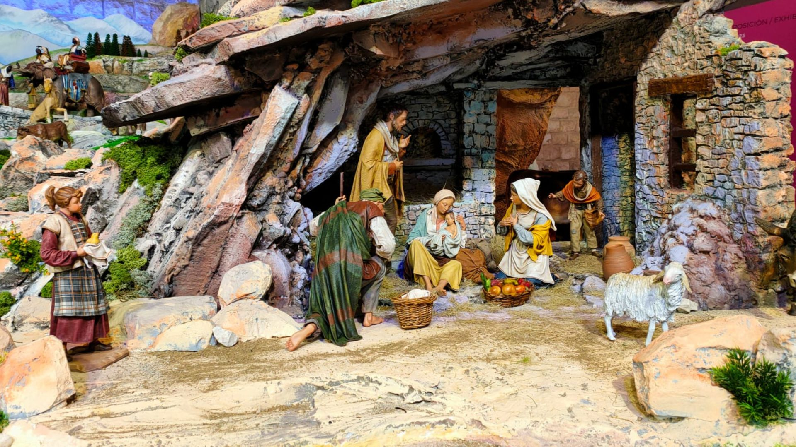
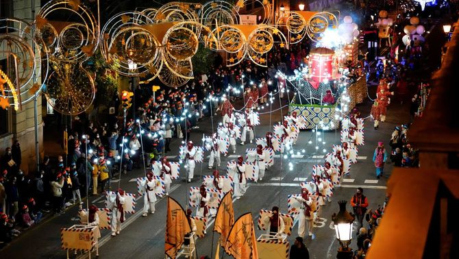

# Katalońskie Boże Narodzenie II: pragmatyczne, hałaśliwe i z głębokimi tradycjami

Katalońskie Boże Narodzenie zdecydowanie nie jest tylko o jedzeniu. Nie jest ani przesadnie pobożne, ani przesadnie sentymentalne. Jest praktyczne, symboliczne i często zaskakująco stare. Mieszają się w nim chrześcijaństwo z rytuałami przedchrześcijańskimi, tradycje rodzinne z nowoczesną presją konsumpcji, a poważne symbole z typowym katalońskim humorem. Właśnie ta kombinacja czyni z niego święta, które nie są „na pokaz", lecz naprawdę przeżywane.

## Zdrowie i pieniądze — jedno i drugie jest ważne

Świąteczne życzenie „Salut i força al canut" podsumowuje kataloński sposób patrzenia na świat z rozbrajającą bezpośredniością. Canut był kiedyś skórzanym mieszkiem lub rurką, którą ludzie nosili u pasa lub chowali pod ubraniem. Służył do przechowywania monet i drobnych kosztowności w czasach, gdy kieszenie nie istniały, a banki były odległym wyobrażeniem. Życzyć komuś „siły do canutu" znaczyło więc życzyć mu, by jego mieszek był ciężki, pełny i wytrzymały -- po prostu by przetrwał i nie był pusty. Boże Narodzenie było tradycyjnie momentem bilansowania i życzeń pomyślności na kolejny rok. Katalończycy nigdy nie udawali, że pieniądze nie są ważne. Przeciwnie: zdrowie i zabezpieczenie materialne idą w parze i jest całkowicie w porządku powiedzieć to na głos.

## Prezenty dopiero w styczniu i czekanie jako część świąt

Główne katalońskie rozdawanie prezentów przychodzi dopiero 6 stycznia, gdy przynoszą je Trzej Królowie -- Els Reis Mags. Boże Narodzenie nie jest tu jednym wieczorem, lecz długim okresem, który kulminuje dopiero po Nowym Roku. Wieczór 5 stycznia należy do pochodów Cavalcada de Reis, które w Katalonii mają masowy charakter. W Barcelonie bierze w nich udział setki tysięcy ludzi, a Trzej Królowie przejeżdżają przez miasto w przemyślanej choreografii (wielbłądy dość często są częścią pochodu). Dzieci piszą listy, przygotowują wodę dla wielbłądów i uczą się czekać -- co kiedyś uważano za naturalną część wychowania. Pod wpływem globalizacji dziś wiele rodzin dodaje mniejsze prezenty już na Boże Narodzenie, ale Trzej Królowie pozostają symbolem prawdziwego końca świąt oraz ich głównego sensu.

## Szopki nie tylko jako scena biblijna, ale i mapa świata

Szopki, po katalońsku pessebres, są w Katalonii wszechobecne i często monumentalne. Nie chodzi o jedną scenę, lecz o cały model świata, w którym biblijna opowieść rozgrywa się pośrodku katalońskiego krajobrazu. Góry przypominają Pireneje, domy wyglądają jak miejscowe gospodarstwa, ludzie pracują, piorą, pasą bydło. Szopka w trakcie świąt jest stopniowo rozbudowywana i dopracowywana, czasem aż do Trzech Króli. Jej częścią jest też caganer, którego już znamy. W nowoczesnych wersjach pojawiają się także aktualne osobistości, co pokazuje, że tradycja nie jest skostniała, lecz nieustannie reaguje na współczesność.

## Gdy Boże Narodzenie zapala się ogniem

W górskich rejonach Pirenejów Boże Narodzenie ma zupełnie inną postać niż w miastach. W miejscowościach Bagà i Sant Julià de Cerdanyola w Wigilię obchodzi się FIA-FAIA, rytuał o korzeniach sięgających prawdopodobnie aż do przedchrześcijańskich obrzędów przesilenia. Po zachodzie słońca w górach rozpala się ogień, od którego zapala się pochodnie z żywicznego drewna. Te następnie znosi się do wsi, gdzie ludzie zapalają nimi kolejne ogniska. Bierze w tym udział niemal cała społeczność -- setki ludzi w społecznościach liczących kilka tysięcy mieszkańców. Ogień nie jest tu dekoracją, lecz symbolem ochrony, światła i ciągłości. Dopiero gdy płomienie dogasną, nastaje spokój, śpiew i prawdziwy początek świąt.

Katalońskie Boże Narodzenie jest przede wszystkim bardzo autentyczne. Życzenie pełnego portfela, prezenty dopiero w styczniu, szopki jako obraz świata i ognie zapalane w górach -- to wszystko pokazuje, że tradycje nie są tu eksponatem muzealnym, lecz żywą częścią życia. Katalończycy nie udają Bożego Narodzenia. Przeżywają je po swojemu. I może właśnie dlatego ma ono tak dobry sens.

