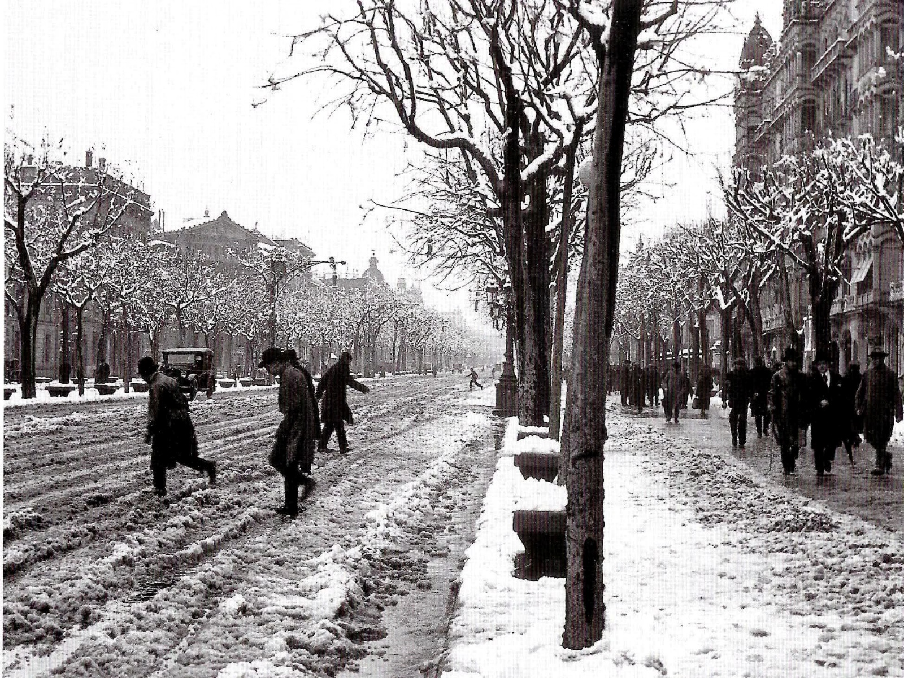
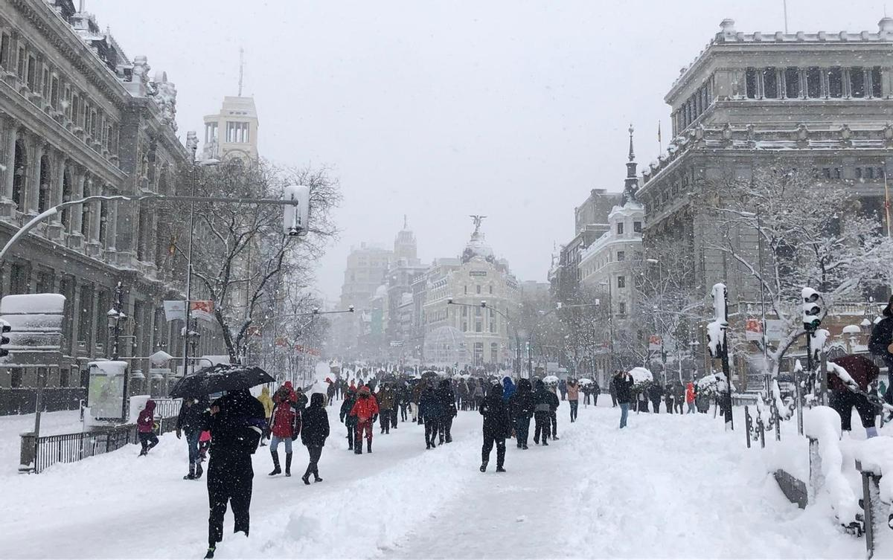
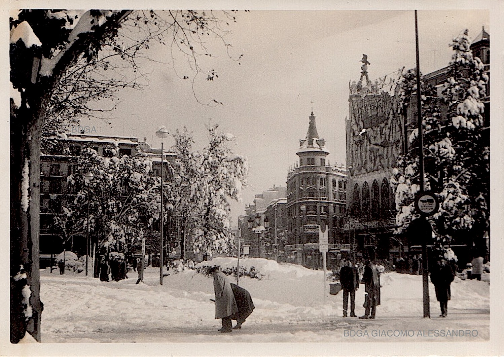
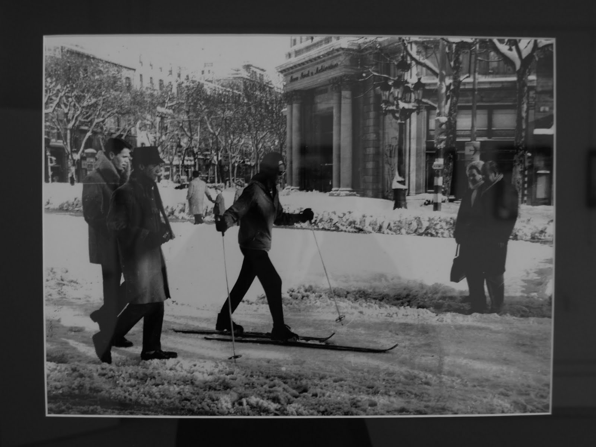
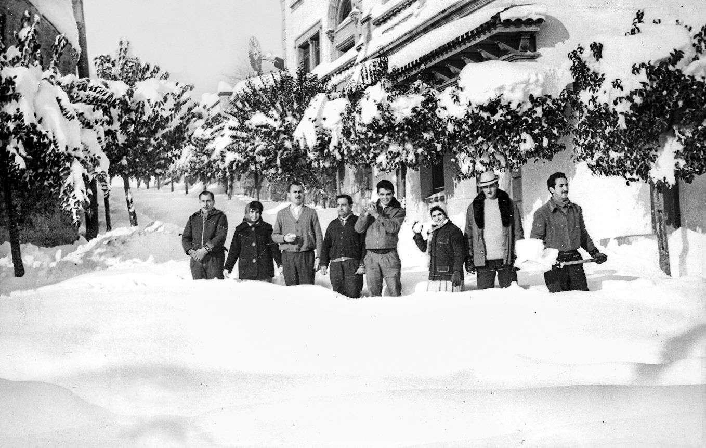
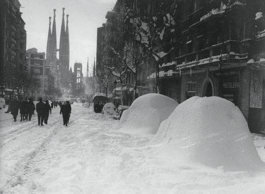
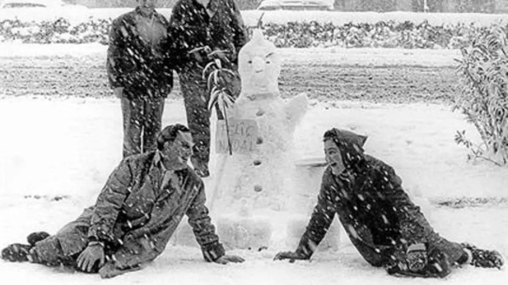
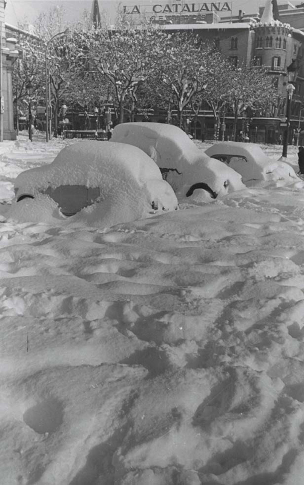

# Kiedy w Barcelonie spadnie śnieg

ACAM (Associació Catalana de Meteorologia) ma pięknie opracowane dane historyczne: w latach 1867–1966 odnotowano 94 „dni śnieżne", ale tylko mniejsza część z nich była taka, że dało się zmierzyć pokrywę śnieżną -- najczęściej były to tylko płatki, które od razu topniały, albo „woda ze śniegiem".

A teraz to, co ciekawe dla naszych ZDJĘĆ Z PIERWSZEJ POŁOWY XX WIEKU - niektóre zimy były naprawdę białe:

15 stycznia 1914: w mieście podaje się nawet 24 cm śniegu.

27 lutego 1924: opady śniegu z burzą, nawet 18 cm.

15 lutego 1938: znów śnieg z burzą, około 13 cm.

A teraz drobny szczegół, który na zdjęciach często wyjaśnia, dlaczego gdzieś śniegu wydaje się więcej, a gdzie indziej mniej: w zapisach historycznych pisze się, że w Eixample śnieg utrzymywał się lepiej, podczas gdy na brukowanych uliczkach często szybciej zamieniał się w breję.

## Odśnieżanie przed 1962 — ale co odśnieżać?

To właśnie to: ponieważ większość opadów nie była taka, by utworzyć ciągłą warstwę, miasto najczęściej nie miało powodu zajmować się jakąś wielką logistyką zimową. ACAM podsumowuje to dość wymownie: spora część epizodów śnieżnych nie pokryła ziemi i nie dało się ich nawet zmierzyć -- czyli i „nie czyniły szkód", a dla miejskich ekip nie były problemem.

Innymi słowy: Barcelona historycznie „znała" śnieg, ale najczęściej nie był to śnieg, dla którego potrzeba pługów.

## A potem przyszło Boże Narodzenie 1962: Gran Nevada, na którą nikt nie był przygotowany

25 grudnia 1962 spadło w Barcelonie tyle śniegu, że miasto dosłownie się zatrzymało. Według ówczesnych źródeł podaje się, że na ulicach było nawet 46 cm, a na Observatori Fabra na wzgórzach nad Barceloną zmierzono około 70 cm.

A co jeszcze bardziej szalone: przez kilka dni było tak zimno, że 25 i 26 grudnia temperatura nawet nie przekroczyła 0 °C (na Fabrze), więc śnieg nie miał powodu topnieć.

A odśnieżanie? Barcelona nie była na to wyposażona.

Zapisy opisują, że ekipy próbowały usuwać śnieg solą i łopatami, ale było to nie do udźwignięcia -- a przede wszystkim:

## W grudniu 1962 Barcelona nie miała żadnych pługów ani sprzętu do odśnieżania!

Ówczesny burmistrz Barcelony poprosił więc o pomoc swojego osobistego przyjaciela, andorskiego przedsiębiorcę Andreu Clareta, który zajmował się zimowym utrzymaniem dróg. To właśnie on zorganizował przewóz frezarek śnieżnych i pługów z Andory do sparaliżowanej śniegiem Barcelony. W pamięci miasta pozostał więc jako człowiek, który pomógł Barcelonie poradzić sobie z największą klęską śnieżną XX wieku. A z Andory dotarły frezarki śnieżne i pługi -- w Barcelonie ludzie witali je niemal jak „armię wyzwoleńczą".

CZY LUDZIE BYLI PRZYGOTOWANI NA ZIMĘ? SZCZERZE, RACZEJ NIE (i to nawet w „lepszych" domach)

Tu jest piękny paradoks: Barcelona potrafi być zimą nieprzyjemnie chłodna głównie dlatego, że wiele domów było historycznie budowanych raczej na lato niż na mróz. A gdy przychodziły ekstrema, był to szok. ACAM na przykład przy ekstremalnym lutym 1956 wspomina, że nawet „lepsze" gospodarstwa domowe zostawały bez ogrzewania, ponieważ mróz powodował problemy z instalacjami (pękanie rur itp.) -- po prostu sytuacja, z którą zwykle się nie liczono.

## A jak ogrzewano się w domach na co dzień?

W Hiszpanii (w tym w Katalonii) tradycyjnym i bardzo rozpowszechnionym źródłem ciepła było brasero -- piecyk/żarzące się węgielki pod stołem (typowo „mesa camilla"), które ogrzewa ludzi siedzących wokół stołu, ale na pewno nie ogrzeje całego mieszkania.

## A co z ostatnimi latami?

Filomena 2021: choć spodziewano się „czegoś wielkiego", śnieg ostatecznie raczej ominął Barcelonę --- tylko ciche, krótkie opady w górnych partiach (Vallvidrera/Tibidabo) 8 stycznia nad ranem. Barcelona więc obeszła się smakiem.

Luty 2023 (Juliette): na Observatori Fabra odnotowano 3 dni z rzędu ze śniegiem, a największa pokrywa była 27 lutego -- ok. 5--6 cm na Tibidabo i nawet 7 cm na Fabrze.

Zima 2024: w mieście śniegu nie było, ale na plażach było go całkiem sporo. To dlatego, że nawet przy bardzo słabych opadach w Barcelonie może się zdarzyć, że śnieg pozostanie widoczny na plaży. Piasek nie jest nagrzany jak asfalt, nie ma miejskiej wyspy ciepła i nikt go natychmiast nie usuwa ani nie rozdeptuje. Dlatego plaża Barceloneta może wyglądać „śnieżnie", podczas gdy w tym samym czasie w mieście śniegu praktycznie nie ma.

NA KONIEC... MINIPORÓWNANIE (gdzie w Hiszpanii śnieg rządzi, a gdzie prawie go nie znają)

„Śnieżne pewniaki" to oczywiście góry (Pireneje, Kantabria...). Dla zobrazowania: Puerto de Navacerrada (Sistema Central) ma normalnie ok. 71 dni śnieżnych rocznie.

Z kolei w nizinnych częściach Wysp Kanaryjskich śnieg to ekstremalna rzadkość; jeśli już, dotyczy raczej wysokości (typowo Teide) i są to wyjątkowe sytuacje.

