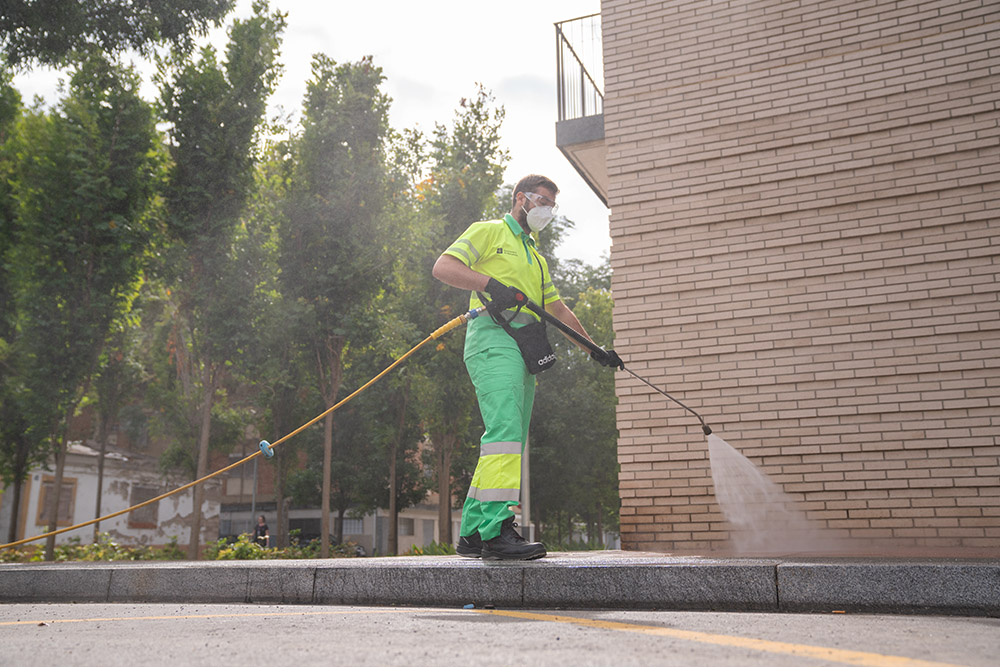
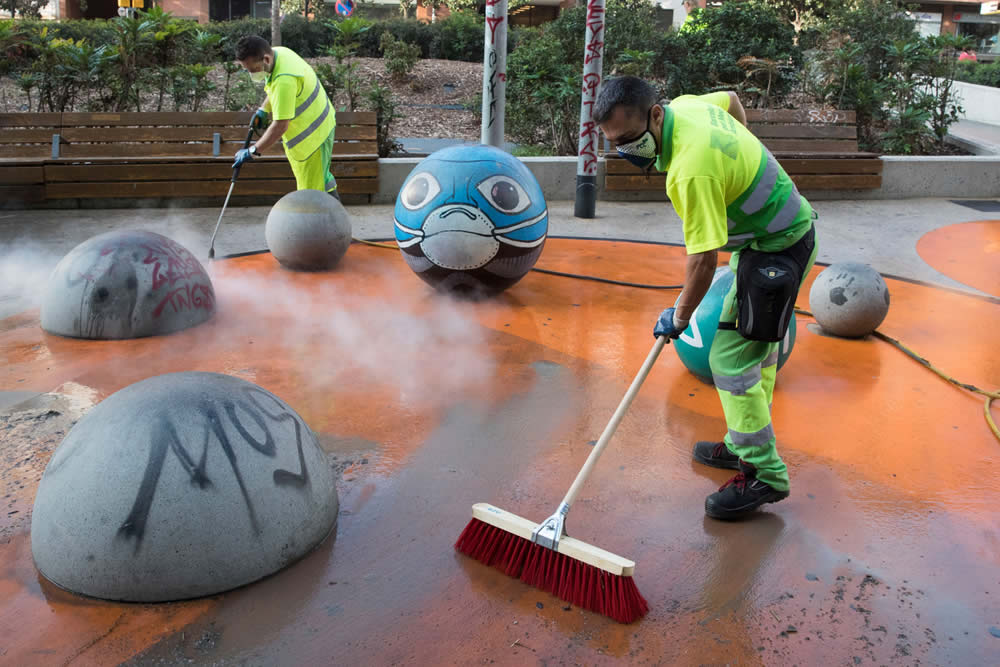
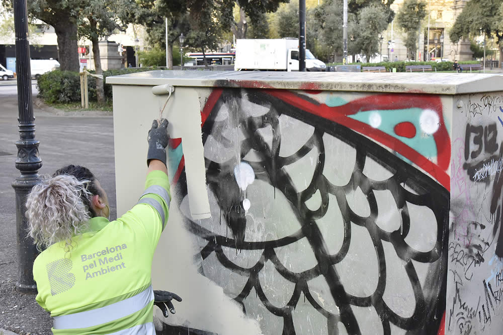
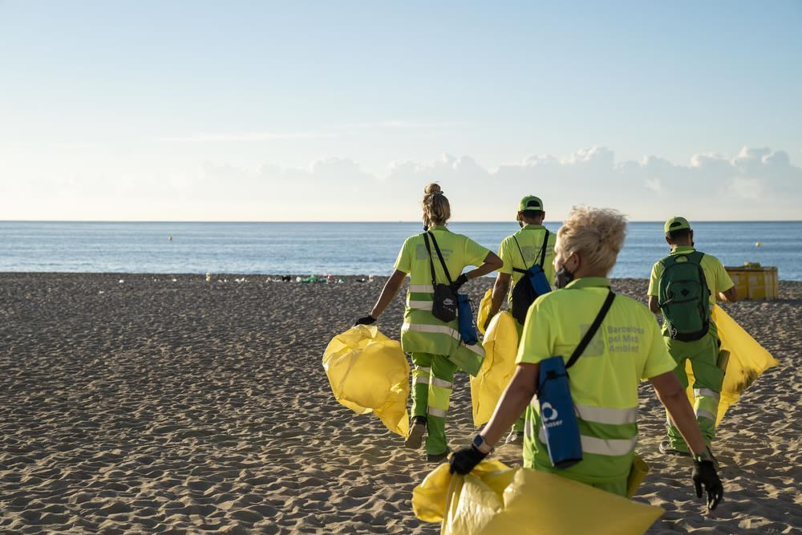
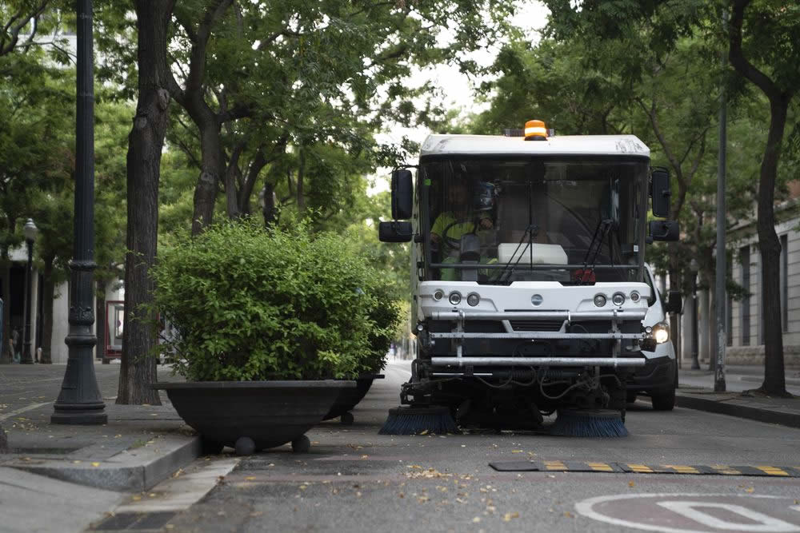
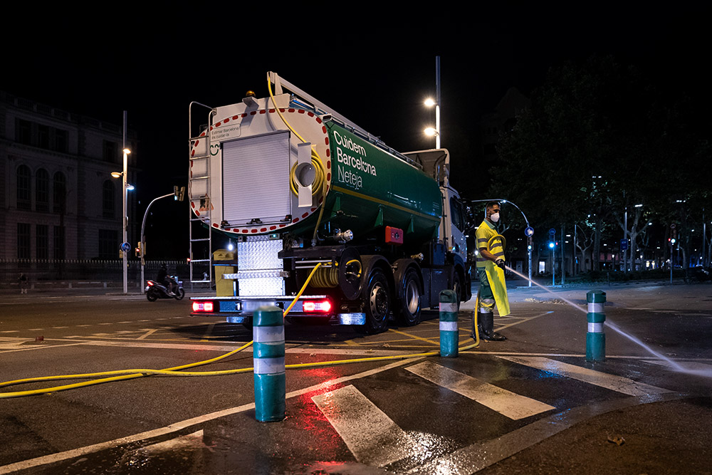

# Małe wielkie sprzątanie wielkiego miasta

Kiedy mówi się o sprzątaniu miasta, większość ludzi wyobraża sobie śmieciarkę lub zamiatarkę, która od czasu do czasu przejedzie ulicą. Tyle że w przypadku Barcelony (miasto: 1,7 miliona mieszkańców; aglomeracja barcelońska -- 3,4 miliona mieszkańców; gęstość zaludnienia miasta 16 904,3 mieszk./km² -- dla porównania: Warszawa ok. 3 500 mieszk./km², Kraków ok. 2 400 mieszk./km² i Wrocław ok. 2 170 mieszk./km²) jest to w rzeczywistości OGROMNY I BARDZO DOBRZE ZARZĄDZANY SYSTEM.

Barcelona ma od niedawna na sprzątanie ulic i wywóz odpadów największy kontrakt miejski, jaki kiedykolwiek zawarła. Rocznie idzie na niego prawie 300 milionów euro, a za cały okres 2022--2030 ponad 2,3 miliarda euro.

W tym pakiecie jest absolutnie wszystko: sprzątanie ulic, wywóz odpadów komunalnych, kontenery (ich mycie, utrzymanie i wymiana), sprzątanie plaż, sprzęt, flota pojazdów, pracownicy oraz zarządzanie całym systemem w poszczególnych częściach miasta. Po prostu wszystko, co zwykle odbieramy jako „miasto się sprząta".

Ten ogromny system utrzymuje w ruchu około 4 400 PRACOWNIKÓW I PRACOWNIC. To nie są urzędnicy miejscy, lecz pracownicy prywatnych firm, które mają z miastem DŁUGOTERMINOWĄ UMOWĘ NA 8 LAT. I właśnie to jest w Hiszpanii kluczowe. W kraju, gdzie powszechna jest umowa o pracę na trzy lub sześć miesięcy, stabilny kontrakt, układ zbiorowy oraz ubezpieczenie społeczne i zdrowotne oznaczają ogromne poczucie pewności.

Może zauważyliście, że na ulicach pracuje dziś wielu młodych ludzi. To nie przypadek. Bezrobocie wśród młodych jest w Hiszpanii od dawna wysokie, zwłaszcza wśród osób bez wykształcenia wyższego. Wielu nie chce już lub nie może pracować w turystyce -- z powodu sezonowości, wieczorów, weekendów i niepewności. Praca w służbach technicznych jest fizycznie wymagająca, ale przewidywalna czasowo, legalna i stabilna. DLA WIELU młodych Hiszpanów to REALNY AWANS SPOŁECZNY, a nie porażka.

Co więcej, miasto i firmy podwykonawcze celowo wspierają WYMIANĘ POKOLENIOWĄ.

Starsi pracownicy odchodzą na emeryturę, pojawiają się nowe technologie, pojazdy elektryczne i cyfrowe planowanie tras. Kontrakty mają też silny wymiar społeczny -- przewidują zaangażowanie osób bez kwalifikacji, z ograniczeniami zdrowotnymi lub z trudnego środowiska społecznego. Sprzątanie miasta nie jest tu tylko o czystości, ale i o spójności społecznej.

Wielką zmianą ostatnich lat jest SPRZĘT.

Barcelona eksploatuje dziś około 870 pojazdów, z których 66% jest elektrycznych (jeszcze niedawno było to około 20%). Powodem są emisje, hałas i możliwość pracy w nocy. Właśnie te „małe fajne autka", które spotkasz w gotyckich uliczkach lub w strefach pieszych, to kompaktowe elektryczne zamiatarki zaprojektowane dokładnie do historycznego centrum -- ciche, zwrotne i bez spalin. Na szerszych alejach pracują z kolei większe zamiatarki i pojazdy myjące z wodą pod wysokim ciśnieniem. Niektóre maszyny są wielofunkcyjne: potrafią zamiatać, zbierać odpady i myć nawierzchnię podczas jednego przejazdu.

Ważnym tematem jest też woda. Miasto coraz częściej wykorzystuje wodę gruntową (freatyczną) do mycia ulic tam, gdzie to możliwe, co jest kluczowe w czasach suszy i ograniczeń w zużyciu wody pitnej.

Może zauważyliście też, że Barcelona sprząta się głównie WIECZOREM I W NOCY.

To nie przypadek. W najbardziej obleganych turystycznie miejscach -- w centrum, na Ramblach, przy plażach -- dzienne sprzątanie oznaczałoby ciągłe konflikty z pieszymi, samochodami i ruchem. Nocne sprzątanie pozwala miastu funkcjonować w ciągu dnia i każdego ranka trochę się „zresetować". Bez elektrycznych i cichszych maszyn nie byłoby to jednak możliwe.

Wiele uwagi miasto poświęca także KONTENEROM, bo to właśnie ich otoczenie ludzie odbierają najbardziej wyczuleni. Wnętrza kontenerów myje się w sezonie co tydzień, poza sezonem raz na dwa tygodnie. Części zewnętrzne czyści się raz na 15 dni, ewentualnie raz w miesiącu. Nowością jest też głębokie mycie przestrzeni pod kontenerami za pomocą specjalnych maszyn, które potrafią je podnieść.

Cały system organizacyjnie nadzoruje miasto, ale samą usługę zapewniają różne firmy według poszczególnych stref miejskich -- centrum, zachód, północ i wschód Barcelony. Miasto zachowuje przy tym silną kontrolę nad danymi, jakością i sankcjami, aby mieć system bardziej „we własnych rękach".

A mimo wszystko pozostają wyzwania. Ekstremalne obciążenie turystyczne w niektórych miejscach, dłuższe i upalne lata, segregacja odpadów, która wciąż jest poniżej celów UE, oraz codzienne zachowanie ludzi -- niedopałki, kubki, psie odchody. Sprzęt potrafi wiele, ale nie wszystko.

Barcelona nie sprząta się po to, by była ładna. Sprząta się w nocy, by w ciągu dnia mogła funkcjonować. A to, że rano miasto najczęściej wygląda względnie czysto, nie jest oczywistością -- lecz wynikiem ogromnej, codziennej, często niewidocznej pracy.

