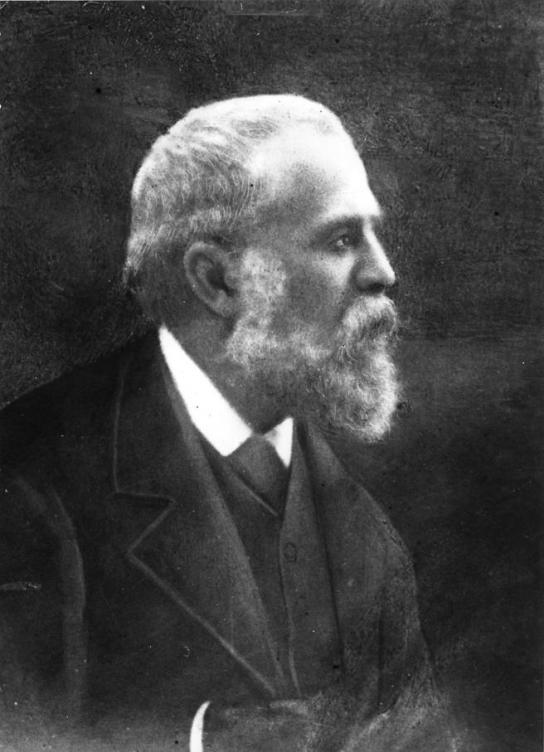
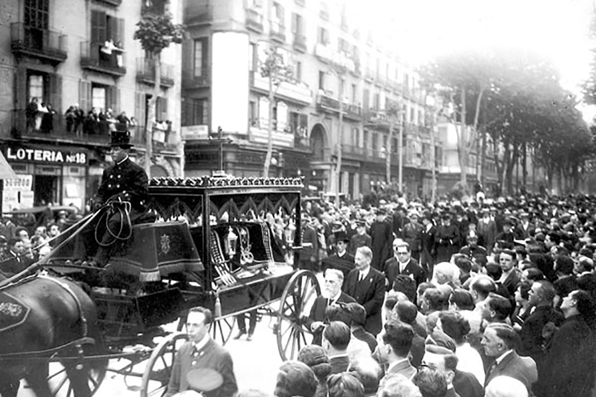

# Okruchy z życia Antoniego Gaudíego

*Dziś, 10 czerwca 2026 roku, mija dokładnie 100 lat od śmierci Antoniego Gaudíego. Znamy jego budowle. O samym Gaudím wiemy zaskakująco mało. Oto, co udało mi się znaleźć o prywatnym życiu barcelońskiego geniusza.*

Jego życie było równie niezwykłe jak jego architektura: nigdy się nie ożenił. Nie miał dzieci. Pod koniec życia żył niemal jak mnich. Gdy umarł, przechodnie brali go za zwykłego żebraka. Kilka dni później przyszło się z nim pożegnać około trzydziestu tysięcy ludzi.

## Gaudí i kobiety

Antoni Gaudí nigdy się nie ożenił i nie miał żadnych dzieci.

Według historyków istniała tylko jedna kobieta, którą naprawdę kochał – Josefa „Pepeta" Moreu, nauczycielka z Mataró. Gaudí głęboko ją podziwiał i ostatecznie poprosił o jej rękę. Pepeta jednak go odrzuciła. Nie dlatego, że go nie ceniła, lecz podobno dlatego, że nie potrafiła wyobrazić sobie wspólnego życia z człowiekiem całkowicie pochłoniętym swoją pracą.

Gaudí był znany ze swojego roztargnienia, niepraktycznej natury i absolutnego skupienia na architekturze. Pepeta wyobrażała sobie najwyraźniej innego typu męża. Odrzucenie dotknęło go znacznie bardziej, niż dawał po sobie poznać.

Pepeta później kilkakrotnie wychodziła za mąż, podczas gdy Gaudí nigdy już nie nawiązał żadnego poważnego związku.

Niektórzy biografowie sądzą, że właśnie to doświadczenie przyczyniło się do jego stopniowego odsuwania się od życia towarzyskiego i do głębszej religijności.

## Młodość

Dziś często wyobrażamy sobie Gaudíego jako dziwacznego starca, który żyje wyłącznie dla Sagrady Família.

W rzeczywistości w młodości był zupełnie inny.

Bywał w kawiarniach, teatrach, interesował się polityką, literaturą i życiem kulturalnym. Należał do pokolenia młodych katalońskich intelektualistów, którzy chcieli zmodernizować Katalonię.

Dopiero stopniowo zaczął zamykać się w sobie. Wielki wpływ miały osobiste tragedie. Zmarła mu matka, później brat Francesc, następnie bratanica Rosa, którą się opiekował. Stopniowo stracił niemal wszystkich najbliższych krewnych.

U schyłku życia został praktycznie sam.

## Gdy jeszcze mieszkał w Parku Güell

Mało kto wie, że Gaudí przez niemal dwadzieścia lat mieszkał w domu w Parku Güell.

Dziś mieści się tu muzeum Gaudíego.

Wprowadził się do domu w 1906 roku i mieszkał w nim aż do końca 1925 roku. Każdego ranka wyruszał pieszo na budowę Sagrady Família, a wieczorem wracał z powrotem.

Dziś to około trzy kilometry. Trzeba jednak pamiętać, że ówczesny Park Güell znajdował się niemal na obrzeżach Barcelony. Gaudí codziennie schodził ze wzgórza do miasta, a wieczorem pokonywał tę samą trasę w przeciwnym kierunku. Robił to nawet po siedemdziesiątce. Przez niemal dwadzieścia lat. Ta codzienna droga doskonale oddaje jego zdyscyplinowany tryb życia.

Pod koniec 1925 roku przeprowadził się bezpośrednio do małej pracowni obok Sagrady Família. Chciał być jak najbliżej dzieła swojego życia.

## Rywale czy koledzy

Gdy mówi się o katalońskim modernizmie, zwykle wymienia się trzy wielkie nazwiska:

- Antoni Gaudí
- Lluís Domènech i Montaner
- Josep Puig i Cadafalch

Często twierdzi się, że panowała między nimi silna rywalizacja. Rzeczywistość była bardziej złożona.

Domènech i Montaner był nawet jednym z profesorów Gaudíego w szkole architektury. Choć mieli odmienne poglądy na architekturę, wzajemnie się szanowali. Gaudí uczestniczył nawet w jego pogrzebie.

Również relacja z Puigiem i Cadafalchem była raczej zawodową konkurencją niż osobistą wrogością. Każdy z nich reprezentował inne oblicze katalońskiego modernizmu. Domènech był intelektualistą, Puig historykiem i politykiem, a Gaudí wizjonerem i eksperymentatorem.

Dziś wszyscy trzej uważani są za wielkich twórców, którzy wspólnie ukształtowali architektoniczną tożsamość nowoczesnej Barcelony.

## Mnisze życie

Przez ostatnie mniej więcej dwanaście lat życia Gaudí poświęcał się wyłącznie Sagradzie Família. Przestał przyjmować nowe zlecenia. Nosił stare, znoszone ubrania. Jadł bardzo skromnie. Większość czasu spędzał wśród robotników na budowie.

Wielu współczesnych wspominało później, że wyglądał raczej jak ubogi mnich niż najsłynniejszy architekt Hiszpanii. Całą energię poświęcał jednemu celowi – ukończeniu świątyni.

Gdy ktoś pytał go, dlaczego prace postępują tak wolno, odpowiadał: „Mój klient się nie spieszy." Miał na myśli Boga.

## Dni przed śmiercią

7 czerwca 1926 roku, jak każdego dnia, wybrał się do kościoła Sant Felip Neri na modlitwę i spowiedź.

Podczas przechodzenia przez Gran Via de les Corts Catalanes potrącił go tramwaj. Doznał poważnych obrażeń i stracił przytomność. Nikt jednak nie domyślał się, kogo ma przed sobą. Siedemdziesięciotrzyletni mężczyzna był ubrany w stary, sfatygowany płaszcz, nie miał przy sobie dokumentów i wyglądał jak biedak z ulicy.

Kilku taksówkarzy podobno odmówiło przewiezienia „żebraka" do szpitala. Ostatecznie przewieziono go do szpitala Santa Creu, gdzie przyjęto go jako nieznanego ubogiego mężczyznę. Dopiero następnego dnia okazało się, że to najsłynniejszy architekt kraju.

Przyjaciele proponowali mu przewóz do lepszego szpitala. Gaudí odmówił. Według świadectw wypowiedział zdanie: „Moje miejsce jest tu, wśród biednych."

10 czerwca 1926 roku zmarł. Miał 73 lata.

## Pogrzeb, który zatrzymał całe miasto

Pogrzeb odbył się 12 czerwca 1926 roku.

To, co nastąpiło, zaskoczyło całe miasto: Barcelona praktycznie się zatrzymała. Wzdłuż trasy konduktu pogrzebowego zgromadziły się dziesiątki tysięcy ludzi. Sklepy zamykano, biły kościelne dzwony, a tłumy wypełniały ulice. Według ówczesnych relacji przyszło się pożegnać około 30 000 ludzi.

Kondukt przeszedł przez historyczne centrum miasta i zatrzymywał się w miejscach związanych z jego życiem i twórczością.

Mężczyzna, którego kilka dni wcześniej brano za bezdomnego, był teraz żegnany jak postać narodowa.

## Gdzie jest pochowany

Gaudí jest pochowany w krypcie Sagrady Família, w kaplicy Matki Boskiej z Karmelu. Niewielu architektom przypadł w udziale taki zaszczyt.

Spoczywa wewnątrz budowli, której poświęcił ostatnie dziesięciolecia swojego życia.

## Co po nim zostało

Nie miał żony ani dzieci.

Jego dziedzictwem są jego budowle:

- Sagrada Família
- Park Güell
- Casa Batlló
- Casa Milà (La Pedrera)
- Casa Vicens
- Palau Güell
- Colònia Güell

i wiele innych.

W 2025 roku Watykan uznał jego „heroiczne cnoty" i nadał mu tytuł Czcigodnego. To ważny krok na drodze do ewentualnej beatyfikacji.

Gaudí być może kiedyś przejdzie do historii nie tylko jako genialny architekt, ale także jako człowiek niezwykłej wiary.

Jego życie jest pełne paradoksów. Nigdy nie założył rodziny, ale stworzył dzieło, które podziwia cały świat.

Zmarł niemal anonimowo, jako ubogi człowiek na ulicy, ale na jego pogrzeb przyszła cała Barcelona.

A budowla, którą uważał za niedokończoną, stała się jednym z najsłynniejszych symboli ludzkości.
