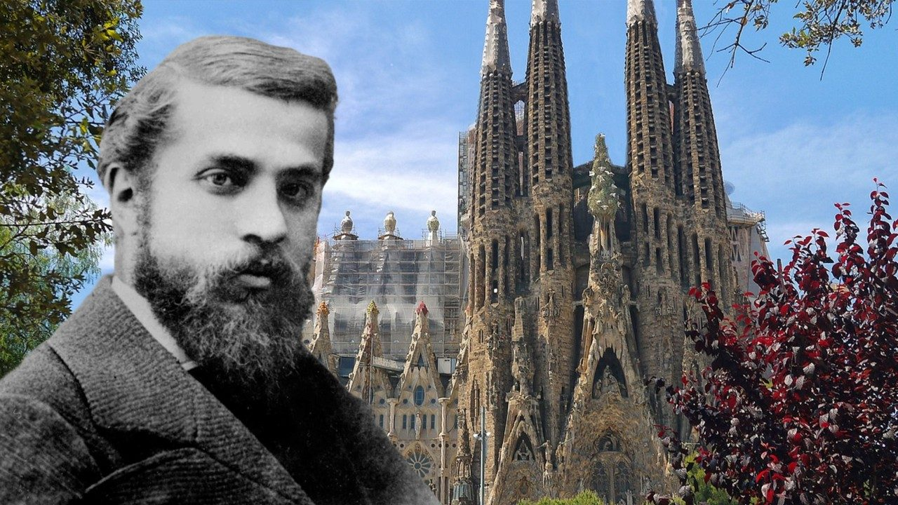

# Wizyta papieża w Barcelonie

*Dziś TOP, na który już od dawna czekam*

Papież Leon XIV przyleci do Hiszpanii. Papież Leon XIV jest moim zdaniem równym gościem, tym bardziej wydaje mi się to ciekawe.

Co więc się szykuje:

## Podróż papieża Leona XIV do Hiszpanii

**Oficjalny program:** 6–12 czerwca 2026.

**Trasa:** Rzym → Madryt → Barcelona/Montserrat → Gran Canaria → Teneryfa → Rzym.

W Barcelonie papież będzie 9–11 czerwca, główny moment nastąpi 10 czerwca o 19:30 w Sagrada Família, gdzie odprawi mszę i inauguruje / pobłogosławi wieżę Jezusa Chrystusa.

**Program w Barcelonie:**

- **9.06** — 12:25 przylot na El Prat, 13:00 modlitwa w katedrze św. Eulalii, 20:00 wigilia na Stadionie Olimpijskim Lluís Companys.
- **10.06** — 10:50 więzienie Brians 1, 12:00 różaniec na Montserrat, 16:30 organizacja charytatywna w kościele Sant Agustí, 19:30 msza w Sagrada Família i inauguracja wieży.

Frekwencja: przy Sagrada przewiduje się około 8 000 osób: mniej więcej 4 000 wewnątrz i 4 000 na zewnątrz przed fasadą Narodzenia; 4 200 biletów ma trafić do wiernych z barcelońskich parafii. Obecni mają być królowie, Pedro Sánchez, Salvador Illa, przedstawiciele kościoła oraz nawet 1 600 dziennikarzy.

## Bezpieczeństwo i pieniądze

Barcelona szykuje nadzwyczajny reżim bezpieczeństwa: 5 600 Mossos d'Esquadra + 500 Guardia Urbana, czyli ponad 6 000 policjantów. Okolice Sagrady mają mieć dziewięć kwartałów z maksymalnym reżimem bezpieczeństwa, kontrole mieszkańców, zamknięcia ulic, wzmocnioną komunikację miejską, zamknięcie stacji metra Sagrada Família, wielkoformatowe ekrany na Glòries i Arc de Triomf oraz zaplecze medyczne w szpitalu Sant Pau.

Koszty: dla Barcelony podaje się 1,6 mln € z taksy turystycznej. Cały pobyt w Hiszpanii media szacują różnie: co najmniej 15 mln €, gdzie indziej nawet 25 mln €, przy czym pieniądze publiczne mają stanowić około 20%.

Korzyść: szacunki wpływu ekonomicznego wahają się mniej więcej między 90–125 mln €, nowszy szacunek medialny mówi nawet o 150 mln €. Obejmuje to hotele, transport, gastronomię, media, usługi ochroniarskie i produkcyjne.

## Dlaczego papież przyjeżdża

To nie jest „tylko dla Sagrady", ale Sagrada jest symbolicznym sercem całej podróży. Oficjalnie chodzi o podróż do Madrytu, Barcelony i na Wyspy Kanaryjskie, z naciskiem na wiarę, kulturę, młodych, ubogich, więźniów i migrantów. W Barcelonie wszystko koncentruje się jednak w wyjątkowym momencie: 100 lat od śmierci Antoniego Gaudíego – 10 czerwca 1926 – i ukończenie najwyższej wieży świątyni.

Gaudí jest dla kościoła ważny: papież Franciszek w 2025 roku ogłosił go czcigodnym, co oznacza oficjalne uznanie jego „heroicznych cnót" i krok w stronę możliwej beatyfikacji.

## Jaka Sagrada czeka na papieża

Na papieża czeka Sagrada, która po 144 latach budowy osiągnęła swój szczyt: wieża Jezusa Chrystusa ma 172,5 m i po zamontowaniu górnej części krzyża 20 lutego 2026 jest najwyższym punktem bazyliki. Prace wewnętrzne przy wieży mają trwać jeszcze w latach 2027–2028. To najwyższa budowla stworzona przez człowieka w Barcelonie. To ważne – już w czasach Gaudíego obowiązywało bowiem, że najwyższym punktem miasta jest i będzie wzgórze Montjuïc (wysokość 177 m). Tak Gaudí to zaplanował i tak zostało zbudowane. A wszystko inne w Barcelonie jest (i będzie) niższe.

Bazylika jest dziś nie tylko świątynią, ale i globalnym fenomenem: w 2025 roku miała według aktualnych danych hiszpańskich 4,8 mln sprzedanych biletów i przychody 134 mln €, z czego 113 mln € poszło na budowę.

Barcelona 10 czerwca 2026 stanie się sceną, na której spotkają się śmierć i nieśmiertelność. Sto lat po śmierci ekscentrycznego architekta, którego potrącił tramwaj i którego wzięto za biedaka, nad miastem rozbłyśnie jego najodważniejsze marzenie. Gaudí umarł jako ubogi, nierozpoznany człowiek. Wraca jako ktoś, z powodu kogo przyjeżdżają papież, królowie, politycy, biskupi, media i tysiące pielgrzymów.

