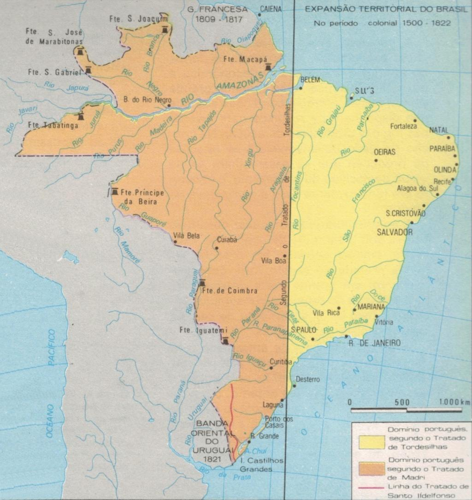

# Jak Hiszpanie z Portugalczykami podzielili świat

*W XV wieku świat również dzielono. Wtedy było to o wiele prostsze. Słyszałeś o traktacie z Tordesillas? Jeśli nic Ci to nie mówi, ten tekst powinien być dla Ciebie objawieniem 😊*

Usiądź wygodnie, zrób sobie kawę i czytaj…

W 1491 roku świat był… mały.

Po [pierwszej wyprawie Kolumba w 1492 roku](odkrycie-ameryki-zmienilo-swiat.html) pojawił się problem: Kolumb wrócił bowiem do Hiszpanii z twierdzeniem, że odkrył nową drogę do Azji. Portugalczycy jednak protestowali.

Portugalia od dziesięcioleci miała potwierdzone przez papieża prawa do odkryć wzdłuż afrykańskiego wybrzeża i do drogi do Indii wokół Afryki. Nagle pojawiła się Hiszpania z nowymi odkryciami i oba kraje zaczęły spierać się o to, do kogo będą należeć nowo znalezione terytoria.

Dlatego Hiszpanie i Portugalczycy zwrócili się do papieża Aleksandra VI (Rodrigo Borgia, swoją drogą Hiszpan), aby rozsądził ich spór.

W 1493 roku papież wydał kilka bull, które wyznaczyły umowną linię na Atlantyku: wszystko na zachód od niej miało przypaść Hiszpanii.

Portugalczykom wcale się to jednak nie spodobało, ponieważ linia była zbyt blisko Europy i faworyzowała Hiszpanię. I tak ostatecznie porzucili papieski podział świata i spotkali się w Tordesillas bezpośrednio. Było to w 1494 roku. Podpisali tam wówczas traktat, który przesunął linię podziału dalej na zachód.

Linia biegła mniej więcej 370 mil morskich na zachód od Wysp Zielonego Przylądka:

- wszystko na wschód od linii → Portugalia
- wszystko na zachód → Hiszpania

Nikt jednak wówczas nawet nie przypuszczał, jak wielka jest właściwie Ameryka.

## Dlaczego w Brazylii nie mówi się po hiszpańsku

Kiedy Portugalczyk Pedro Álvares Cabral dotarł w 1500 roku do wybrzeży Brazylii, okazało się, że część Ameryki Południowej leży po portugalskiej stronie linii podziału.

Dlatego Brazylia przypadła Portugalii.

Czy to był przypadek? Historycy spierają się do dziś.

Według tradycyjnej interpretacji – tak. Gdy podpisywano traktat, nikt nie wiedział, że Brazylia w ogóle tam jest. Portugalczycy po prostu mieli szczęście, że wschodni cypel Ameryki Południowej sięgał do ich części świata.

Istnieje jednak i druga teoria: niektórzy historycy sądzą, że Portugalczycy mogli mieć pewne poszlaki, że na zachodzie istnieje ląd. Dlatego podczas negocjacji nalegali na przesunięcie linii bardziej na zachód.

Dla tej teorii nie ma jednak bezpośredniego dowodu. Nie mamy żadnego portugalskiego dokumentu, który potwierdzałby, że znali Brazylię przed 1500 rokiem. Dlatego większość historyków zachowuje ostrożność.

Portugalczycy opanowali obszar dzisiejszej Brazylii i stopniowo rozszerzyli go głęboko w głąb lądu. Hiszpanie opanowali większość reszty Ameryki.

Skutek widzimy do dziś:

- Brazylia ma ponad 200 milionów mieszkańców i mówi po portugalsku.
- Niemal cała reszta Ameryki Łacińskiej mówi po hiszpańsku.

To fascynujące, że jedna linia narysowana na mapie w kastylijskim miasteczku Tordesillas ponad 530 lat temu do dziś wpływa na język, kulturę i tożsamość setek milionów ludzi. A przy tym całkiem możliwe, że negocjatorzy w ogóle nie przeczuwali, że właśnie decydują o losie przyszłej Brazylii.

