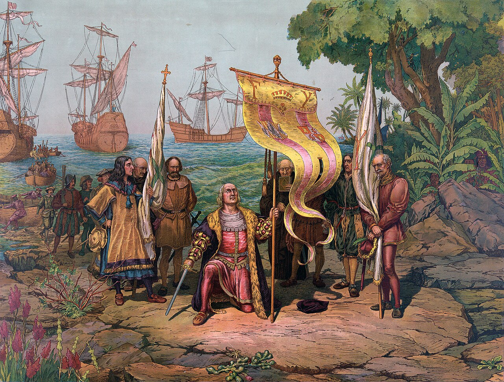
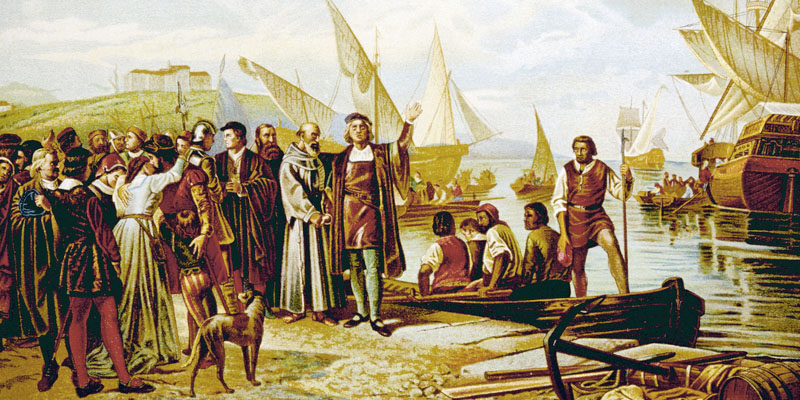

# Odkrycie Ameryki zmieniło cały świat. Nie z powodu Kolumba, lecz tego, co nastąpiło później

Kiedy Krzysztof Kolumb w 1492 roku przybił do brzegów Ameryki, sądził, że znalazł nową drogę do Azji. W rzeczywistości jednak zapoczątkował proces, który w ciągu kilku dziesięcioleci zmienił funkcjonowanie całej planety.

Nie chodziło tylko o odkrycie nowego kontynentu. Rozpoczęła się jedna z największych transformacji w dziejach ludzkości – tak zwana **wymiana kolumbijska**.

Historycy tym pojęciem określają ogromny przepływ roślin, zwierząt, chorób, ludzi, technologii i idei między Starym a Nowym Światem. Skutki tej wymiany były tak rozległe, że wpłynęły na odżywianie, gospodarkę, demografię i układ sił na świecie. Dlatego wielu badaczy uważa rok 1492 za rzeczywisty początek globalizacji.

Przez tysiące lat Ameryka rozwijała się oddzielnie od Europy, Azji i Afryki. Gdy otworzyły się regularne szlaki morskie przez Atlantyk, między oboma światami zaczęły przepływać rzeczy, które dotąd istniały tylko po jednej stronie oceanu.

Z Ameryki do Europy, Afryki i Azji trafiły ziemniaki, kukurydza, pomidory, kakao, wanilia, papryka, dynie, orzeszki ziemne czy tytoń. W przeciwnym kierunku wędrowały pszenica, trzcina cukrowa, kawa, cytrusy, konie, krowy, świnie i owce.

Dziś bez wielu z tych roślin nie wyobrażamy sobie codziennego życia. Kuchnia włoska bez pomidorów, węgierski gulasz bez papryki czy belgijska czekolada bez kakao po prostu by nie istniały.

Być może największy wpływ miał zwykły ziemniak. Dawał wysokie plony nawet na mniej żyznych obszarach i pomógł Europie wyżywić szybko rosnącą populację. Niektórzy historycy sądzą, że bez ziemniaków nie byłby możliwy wzrost ludności Europy w XVIII i XIX wieku, a może i rewolucja przemysłowa w znanej nam postaci.

Równie zasadniczą zmianą było przybycie koni do Ameryki. Choć dawni przodkowie koni powstali właśnie na kontynencie amerykańskim, tysiące lat temu tam wyginęli. Gdy Hiszpanie przywieźli je z powrotem, zmienili tym życie wielu ludów indiańskich. Plemiona Wielkich Równin w ciągu kilku pokoleń stały się znakomitymi jeźdźcami, a ich sposób życia przeszedł zasadniczą przemianę.

Wymiana kolumbijska miała jednak też swoją ciemną stronę.

Najbardziej niszczycielskimi „podróżnikami" nie byli żołnierze ani koloniści, lecz mikroorganizmy. Rdzenni mieszkańcy Ameryki nie mieli żadnej odporności na europejskie choroby, takie jak ospa, odra, grypa czy tyfus. Epidemie rozprzestrzeniały się szybciej niż sami zdobywcy i w niektórych regionach w ciągu kilku dziesięcioleci uśmierciły aż dziewięćdziesiąt procent rdzennej ludności. Była to jedna z największych katastrof demograficznych w dziejach ludzkości.

Skutki nie były jednak wyłącznie biologiczne. Odkrycie Ameryki zasadniczo zmieniło także geopolityczną mapę świata.

Do końca XV wieku ośrodek europejskiego handlu znajdował się w basenie Morza Śródziemnego. Największe bogactwa skupiały włoskie miasta, takie jak Wenecja czy Genua, które kontrolowały handel między Europą a Azją. Znaczącą rolę odgrywało także Imperium Osmańskie, przez którego terytorium wiodły ważne szlaki handlowe.

Po 1492 roku centrum światowych wydarzeń zaczęło jednak przesuwać się ku Atlantykowi.

Na znaczeniu zyskały kraje z dostępem do oceanu. Najpierw Portugalia i Hiszpania, później Holandia, Francja, a przede wszystkim Anglia. Z amerykańskich kolonii do Europy płynęły ogromne ilości srebra i złota, powstawały nowe szlaki handlowe, a Atlantyk stopniowo stał się główną arterią światowego handlu.

Podczas gdy w średniowieczu Europa była raczej jednym z peryferyjnych regionów Eurazji, w kolejnych stuleciach stała się centrum nowo powstającego systemu globalnego. Mocarstwa europejskie zbudowały rozległe imperia kolonialne, które sięgały do Ameryki, Afryki, Azji i Oceanii.

Po raz pierwszy w dziejach powstał świat, w którym wydarzenia na jednym kontynencie mogły bezpośrednio wpłynąć na życie ludzi na drugim krańcu planety.

Właśnie tu leży prawdziwe znaczenie wyprawy Kolumba. Ważna była nie tylko dlatego, że Europejczycy odkryli nowy kontynent. Ważna była przede wszystkim dlatego, że połączyła dwa światy, które przez tysiąclecia były oddzielone.

Od 1492 roku nie istniała już żadna znacząca część Ziemi, która byłaby całkowicie odizolowana od reszty ludzkości. Rośliny, zwierzęta, choroby, ludzie, towary i idee zaczęły krążyć wokół całej planety. Narodził się pierwszy naprawdę globalny świat.

Niezależnie od tego, czy dziś pijemy kawę, jemy ziemniaki, czekoladę czy pomidory, używamy produktów świata, który powstał właśnie dzięki tej historycznej zmianie. Odkrycie Ameryki nie było więc tylko jednym z ważnych wydarzeń w dziejach. Było momentem, który zasadniczo przekształcił życie na całej planecie i którego skutki odczuwamy do dziś.

