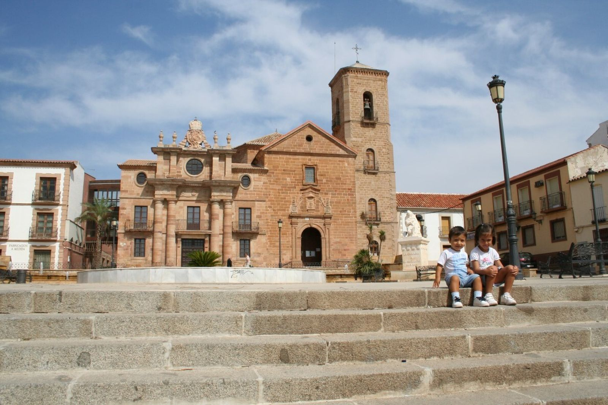
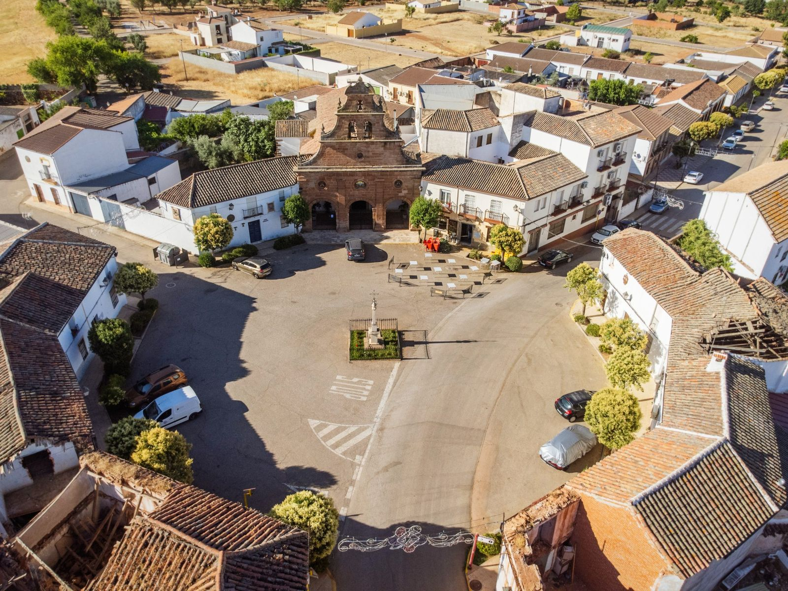
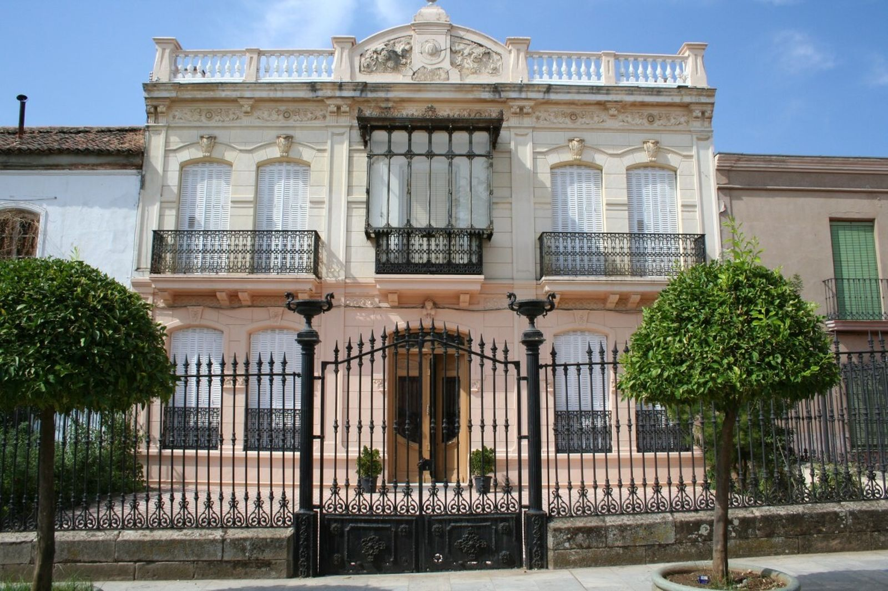

# La Carolina – nieco inne południe

Tak właśnie przygotowuję sobie kolejny tekst. Lubię to. Zbieram dane o pewnym andaluzyjskim miasteczku, którego prawie nikt nie zna, a które wyskoczyło na mnie wczoraj przy porównywaniu cen nieruchomości w Hiszpanii. (jest tam tanio, bardzo tanio – w tym miasteczku, mam na myśli 😊).

Zaczęłam z tego przygotowywać coś, co miałoby ręce i nogi… i rozmarzyłam się… pisałam, i tak to tutaj przynoszę 😊. Wyobrażasz to sobie? Dziś chcę pisać o pewnym miejscu, którego nie zna nawet wielu Hiszpanów. Jest fantastyczne. Hiszpańskie, południowe, tanie i chciałabym tam mieszkać.

Potrafię to sobie wyobrazić i myślę, że żyłoby mi się tam całkiem nieźle.

Że mogłabym pozwolić sobie na lepsze mieszkanie niż mam tutaj za mniej pieniędzy, że te pieniądze miałabym dla siebie i swojej rodziny.

Że miałabym świetną opiekę zdrowotną, a jako osoba prowadząca działalność płaciłabym 80,- euro miesięcznie za wszystko. Spokojnie przez pierwsze dwa lata.

Zaczęłabym jakiś swój projekt. Małą kawiarenkę z księgarnią albo kwiaciarnię z ziołami, albo co ja wiem. Rozważałam nawet pracę w służbach technicznych: pracują tam głównie młodzi ludzie, ale jest mix, pracuje się na zewnątrz, dba się o miejską zieleń – to chyba by mi się podobało. Miałabym czystą głowę.

Że chodziłabym tam do biblioteki, jeździłabym na rowerze albo na vespie, brałabym udział w świętach, byłabym aktywna w jakimś stowarzyszeniu, spotykałabym się z przyjaciółmi i byłoby mi dobrze.

Czasem pojechałabym autobusem albo pociągiem do Jaén po kulturę i dobre wino, czasem autobusem albo pociągiem zajechałabym do Madrytu lub miejsc w Kastylii i z pewnością jakoś bym to zorganizowała, żeby móc czasem wyskoczyć nad morze (gdy byłabym na emeryturze, byłoby to wyjątkowo proste dzięki IMSERSO, czyli programowi dla hiszpańskich emerytów). Po Hiszpanii albo gdzie indziej, to zależy od tego, jak bardzo i czy chciałabym pracować. Byłoby tam mnóstwo słonecznych dni, ciepło, jesienią nie popadałabym w depresję, zimą mogłabym chodzić po okolicznych lasach – lubię chodzić, a tam szłoby to wyśmienicie. Jest tam dobre wino; nie należę do tych, którzy potrafią je w pełni docenić, ale pewnie czasem wypiłabym kieliszek, bo smakuje dobrze. I dobrze się je pije z przyjaciółmi. Jadłabym zdrowo – miałabym nieprawdopodobny wybór całkowicie świeżych warzyw i owoców zerwanych wczoraj kawałek dalej. Każdego dnia świeży sok ze słodkich wyciskanych pomarańczy. Najlepsza oliwa z oliwek na świecie. Wybierałabym – jak robią to miejscowi – hmmm, ta marka… jak im poszło w zeszłym roku? Jakie były zbiory?… rozkoszowałabym się tym. Dużo więcej bym się ruszała. Już choćby dlatego, że na zewnątrz nie byłoby mi zimno. Byłoby tam czysto, bezpiecznie, ludzie znaliby się i zwracaliby się do mnie po imieniu. Ja byłabym wobec nich uprzejma i pełna szacunku, a oni byliby uprzejmi i pełni szacunku wobec mnie. Większość z nich…

No tak… no…

……

Andaluzja to dla nas najczęściej białe wioski albo nadmorskie kurorty, gaje oliwne, morze, korrida i flamenco.

To miejsce jest jednak inne.

Nazywa się La Carolina i leży na północy prowincji Jaén, u podnóża gór Sierra Morena, niedaleko parku przyrodniczego Despeñaperros. To właśnie tędy przez stulecia wiódł główny trakt między Madrytem a Andaluzją. Dziś obok miasta przebiega autostrada A-4, a z La Caroliny jest około 50 minut do Jaén, półtorej godziny do Granady, dwie i pół godziny do Malagi i niecałe trzy godziny do Madrytu.

Na pierwszy rzut oka sprawia wrażenie zwykłego andaluzyjskiego miasteczka. Tyle że nim nie jest.

## Jak miasto wygląda i czym jest wyjątkowe?

La Carolina nie jest typową andaluzyjską wsią z krętymi uliczkami. To „klejnot urbanistyczny Andaluzji". Miasto zostało założone w 1767 roku przez króla Karola III jako modelowe miasto oświecenia. Ma fascynujący regularny, szachownicowy układ z szerokimi, prostymi bulwarami i wielkimi placami, co w tej części Hiszpanii sprawia niemal „amerykańskie" wrażenie. Dzięki temu poruszanie się po mieście i parkowanie są bardzo proste.

## Mieszkańcy i historia, która nas łączy

Miasto liczy około 14 700 mieszkańców (tzw. carolinenses). Ciekawostką dla nas jest to, że pierwszymi osadnikami było ponad 6 000 kolonistów z Europy Środkowej, przede wszystkim Niemców i Szwajcarów, którzy przynieśli tu swoje zwyczaje i nazwiska, jakie w okolicy spotkasz do dziś.

Dziś żyje tu około 15 tysięcy mieszkańców, a niektóre nazwiska wciąż przypominają niemieckie czy szwajcarskie korzenie pierwszych osadników. Tego, co nas łączy, jest w tej historii więcej – pisałam o tym [w tekście o Karolu V](../historia/gdy-czechami-rzadzil-hiszpanski-krol.html). To wszystko jest bardzo ciekawe.

## Jak się tu żyje i co można tu robić?

Dobrze.

Są szkoły, szkoły średnie, obiekty sportowe, miejski basen, ośrodek zdrowia, supermarkety, restauracje i zwykłe usługi. Większe szpitale są w Linares (20 minut samochodem) i w Jaén. Kampus uniwersytecki jest również w Linares, a główny uniwersytet w Jaén.

To nie jest region turystyczny. Nie spotkasz tu tłumów obcokrajowców ani całych budynków apartamentów dla turystów. Większość mieszkańców stanowią miejscowi Andaluzyjczycy.

Miasto leży w sercu gór Sierra Morena, co oznacza, że przyrodę i szlaki turystyczne masz tuż za progiem.

**Infrastruktura:** Znajdziesz tu wszystko, czego potrzeba – od supermarketów (np. Día) i sklepów przy głównej ulicy Calle Madrid, przez szkoły, akademie językowe, aż po nowoczesne obiekty sportowe i miejski basen.

**Czystość i porządek:** Odwiedzający często chwalą czystość miasta oraz sprawne, krystalicznie czyste fontanny na placach.

## Kultura i rozrywka: czym tu żyją i co można robić?

Życie toczy się tu głównie dla miejscowych — na placach, w barach, w teatrze miejskim, na targach, podczas świąt, procesji, ferii i weekendowych spotkań.

W zwykłym tygodniu to spokojne andaluzyjskie miasto. Ludzie chodzą do pracy, dzieci do szkoły, seniorzy przesiadują w kawiarniach, po południu życie przenosi się do barów i na spacery. W weekend centrum budzi się głównie wokół placów, kawiarni, restauracji i lokalnych przybytków. To nie zgiełk Malagi ani Sewilli, raczej normalny hiszpański rytm: poranna kawa, zakupy, aperitif, obiad, wieczorne paseo i posiedzenie z przyjaciółmi.

A potem są okresy, gdy La Carolina naprawdę ożywa.

W lutym obchodzi się Candelarias y Rosquillas de San Blas. W poszczególnych dzielnicach rozpala się ogniska, sąsiedzi spotykają się na zewnątrz, piecze się, gawędzi, a święto czasem kończy się nad ranem churros z czekoladą. To dokładnie ten typ lokalnej tradycji, której w turystycznym kurorcie nie doświadczysz.

Krótko potem przychodzi karnawał, który w La Carolinie ma bardzo dobrą renomę w całej okolicy. Ulice opanowują maski, pochody, comparsas i chirigotas — czyli satyryczne grupy śpiewacze typowe dla hiszpańskiego karnawału. Karnawał trwa kilka dni i kończy się tradycyjnym „pogrzebem sardynki". A co ciekawe: w La Carolinie karnawał, według miejscowych źródeł, obchodzono nawet w czasach, gdy gdzie indziej był zakazany.

Wiosną nadchodzi Semana Santa, czyli Wielki Tydzień. Procesje, bractwa, muzyka, zapach kadzidła, świece, cisza na ulicach — klasyczna andaluzyjska pobożność, ale w mniejszej i bardziej kameralnej skali niż w wielkich miastach. Tutaj człowiek nie stoi w tłumie turystów, lecz obserwuje święto, którym miasto naprawdę żyje.

I właśnie w Wielkanoc pojawia się jedna z najpiękniejszych osobliwości La Caroliny: Pintahuevos. To tradycja malowania pisanek, którą przynieśli tu w XVIII wieku środkowoeuropejscy koloniści. W Andaluzji spodziewałbyś się procesji, byków, flamenco czy oliwy z oliwek — ale malowane jajka? Właśnie tutaj tak. I jest to jeden z najpiękniejszych dowodów na to, że La Carolina ma naprawdę inną historię niż większość andaluzyjskich miast.

W maju odbywa się Feria de Mayo. To już klasyczna andaluzyjska zabawa: muzyka, atrakcje, stoiska, rodziny z dziećmi, seniorzy, konie, zwierzęta gospodarskie, przejazd konny, caseta municipal, koncerty i wspólne jedzenie. Feria nie jest tu tylko „wesołym miasteczkiem", ale też przypomnieniem wiejskiego i rolniczego charakteru okolicy.

W lipcu miasto świętuje Fiestas de la Fundación, czyli rocznicę swojego założenia. I tutaj historia nie jest składana tylko do muzeum — wychodzi na ulice. Odbywają się rekonstrukcje historyczne, komentowane i teatralizowane zwiedzania, wydarzenia kulturalne, gry rodzinne, targi nawiązujące do kolonistów oraz wręczanie nagród. Wspomina się rok 1767, gdy król Karol III założył La Carolinę jako stolicę tzw. Nowych Osad Sierra Moreny.

W lipcu w okolicy upamiętnia się także bitwę pod Las Navas de Tolosa, jedną z kluczowych bitew hiszpańskich dziejów. I znów — to nie tylko suchy zapis w podręczniku. W regionie ta historia pojawia się w pomnikach, świętach, nazwach miejsc i lokalnej tożsamości.

Jesienią La Carolina przypomina o sobie również gastronomicznie. Lokalną specjalnością jest paté de perdiz, czyli pasztet z kuropatwy. W ostatnich latach organizuje się wokół niego wydarzenia gastronomiczne, konkursy, pokazy gotowania i degustacje. Do tego dochodzą trasy tapas, gdy ludzie chodzą po uczestniczących barach i restauracjach, próbują małych porcji i głosują na najlepszą tapę.

A życie kulturalne? Ono też tu istnieje. Miasto ma Teatro Carlos III, gdzie odbywają się spektakle teatralne, koncerty, musicale dla dzieci, konkursy karnawałowe czy programy kulturalne. Latem organizuje się tu również Festival Puerta de Andalucía, który przyciąga już znane nazwiska hiszpańskiej sceny muzycznej.

Więc nie — La Carolina nie jest zaspaną dziurą, gdzie po szóstej wieczorem gasną światła.

To małe miasto, w którym żyje się normalnie, lokalnie i po hiszpańsku. Bez tłumów turystów, bez zawyżonych cen, bez nadmorskiej histerii. Ale z kawiarniami, świętami, teatrem, gastronomią, historią, procesjami, feriami i bardzo silnym poczuciem lokalnej tożsamości.

To miejsce dla kogoś, kto nie potrzebuje co wieczór nowego beach baru, ale doceni prawdziwe życie hiszpańskiego miasta.

## Czy da się tu znaleźć pracę?

La Carolina to nie tylko tanie miasteczko pośród gajów oliwnych. To jedno z centrów przemysłowych północnej Andaluzji.

Miasto liczy wprawdzie tylko około 15 tysięcy mieszkańców, ale dysponuje trzema strefami przemysłowymi o powierzchni ponad 700 000 m² i ma siedzibę niemal 100 firm. Miejscowy ratusz wręcz aktywnie prezentuje się jako centrum przemysłowe północnej Andaluzji.

### Najwięksi pracodawcy bezpośrednio w La Carolinie

**ALVIC Group** — jeden z największych pracodawców w regionie. Firma produkuje komponenty meblowe, kuchnie, designerskie powierzchnie i materiały do wnętrz. Zatrudnia setki osób.

**Clarton Horn** — producent klaksonów samochodowych i komponentów elektronicznych dla przemysłu motoryzacyjnego. Należy do znaczących zakładów przemysłowych w okolicy.

**Surtel Electrónica** — firma elektroniczna założona przez byłych pracowników Siemensa po zamknięciu miejscowego zakładu.

**Mniejsze firmy przemysłowe** — w okolicy działają dziesiątki mniejszych przedsiębiorstw zajmujących się obróbką metali, konstrukcjami ze stali nierdzewnej, usługami przemysłowymi i naprawami maszyn; są tu lakiernie oraz oczywiście budownictwo i przetwórstwo spożywcze – jak wszędzie w Hiszpanii.

### Linares – prawdziwe źródło ofert pracy

I tu sytuacja zaczyna być naprawdę ciekawa: Linares jest oddalone o około 20 minut samochodem i ma niemal 60 tysięcy mieszkańców. Po latach upadku przemysł znów się tu rozkręca.

**Santana Motors** — legendarna fabryka samochodów Santana wznowiła produkcję. Planuje utworzyć około 170–200 miejsc pracy w najbliższych latach. Ciekawe okazje mogą pojawić się przy montażu pojazdów, w logistyce, w magazynie, zakupach, administracji lub na stanowiskach technicznych.

**Escribano Mechanical & Engineering** — nowoczesna hiszpańska firma technologiczna nastawiona na przemysł obronny. W Linares powstaje nowy zakład z oczekiwanymi około 150 miejscami pracy (mechanika, konstrukcje, CAD, zarządzanie projektami, elektrotechnika, produkcja).

**Desay SV** — chińska firma technologiczna produkująca elektronikę i wyświetlacze do samochodów. Przewiduje się utworzenie setek miejsc pracy.

## A teraz najciekawsze – ceny nieruchomości

Średnia cena nieruchomości wynosi tu około 640 € za metr kwadratowy. Tak, czytasz dobrze. Za kwotę, za którą na wybrzeżu często nie kupisz nawet garażu, tutaj możesz nabyć mieszkanie lub dom.

Dziś na przykład znalazłam:

- mieszkanie 50 m² z balkonem i windą za 450 € miesięcznie
- tradycyjny andaluzyjski folwark (cortijo) o powierzchni 100 m², z basenem, dwiema studniami i działką o powierzchni 1,5 hektara z 200 drzewami oliwnymi za 530 € miesięcznie

…

No, ja bym tam żyła 😊

