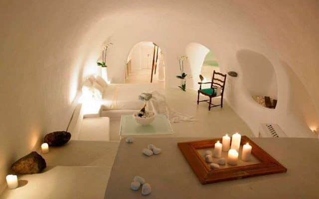
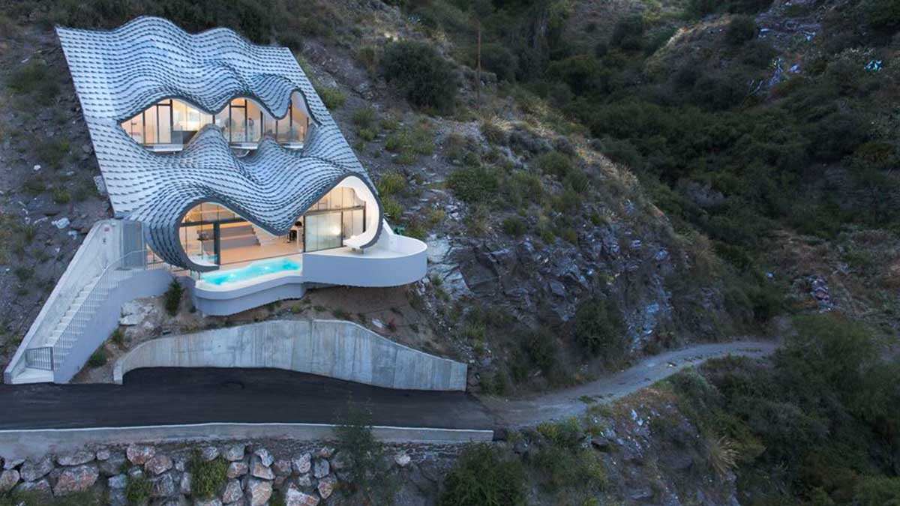
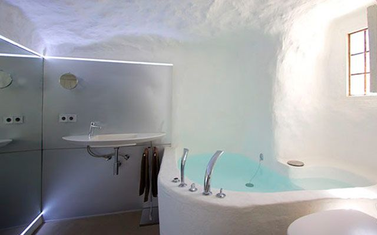
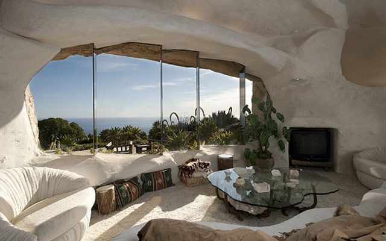
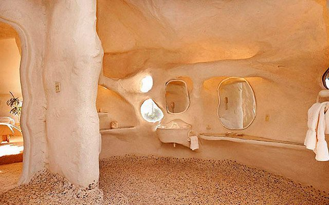
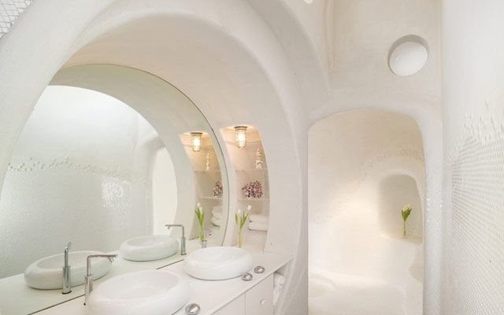

# Chcielibyście mieszkać w jaskini?

Wyobraź sobie, że na zewnątrz panują letnie upały powyżej 40 °C, ale w domu nie potrzebujesz klimatyzacji. Zimą z kolei nie ogrzewasz – a mimo to w środku jest przyjemne 18 do 20 stopni. To nie futurystyczny projekt ekologiczny, lecz liczący kilka stuleci sposób mieszkania, który do dziś sprawdza się w południowej Hiszpanii.

W andaluzyjskiej wsi Zújar w prowincji Granada ludzie wciąż mieszkają w tzw. *casas cueva* – domach jaskiniowych wykutych w skale. I co zaskakujące, nie jest to tylko atrakcja turystyczna. Dla wielu mieszkańców domy te są zwyczajnym, wygodnym i bardzo tanim sposobem na życie.

Mieszkania jaskiniowe mają w Andaluzji długą tradycję. Najwięcej jest ich w okolicach miast Guadix, Baza czy właśnie Zújar. Dzięki specyficznej budowie gleby i miękkiej skale można było łatwo wydrążyć domy bezpośrednio we wzgórzach.

Na pierwszy rzut oka często wyglądają niepozornie – z zewnątrz widać tylko białą fasadę z drzwiami i kominem. Prawdziwa przestrzeń kryje się jednak we wnętrzu góry. To właśnie skała jest tajemnicą ich wyjątkowej energooszczędności.

## Naturalna klimatyzacja za darmo

Domy jaskiniowe działają jak doskonały naturalny izolator. Ziemia wokół domu utrzymuje stabilną temperaturę przez cały rok – zwykle między 18 a 20 °C.

Latem w środku panuje przyjemny chłód, podczas gdy na zewnątrz pali żar. Zimą z kolei temperatura nie spada tak drastycznie jak w zwykłych domach.

Efekt? Niemal zerowe koszty klimatyzacji, minimalne zapotrzebowanie na ogrzewanie, niskie rachunki za energię i bardzo przyjemny mikroklimat. W czasach drogiej energii coś tak prostego wydaje się aż niewiarygodnie nowoczesne.

## Jaskinia z Wi-Fi i nowoczesną kuchnią

Choć to tradycyjny sposób mieszkania, dzisiejsze *casas cueva* zdecydowanie nie przypominają prehistorycznych jaskiń.

Wiele domów jest całkowicie wyremontowanych i ma nowoczesne łazienki, wyposażone kuchnie, internet, kominki, tarasy z widokiem na góry, a często także basen.

W środku panuje zaskakująca cisza. Grube ściany tłumią hałas z zewnątrz i wiele osób opisuje mieszkanie w jaskini jako wyjątkowo spokojne i przytulne.

## Ile kosztuje życie w jaskini?

I tu przychodzi SZOK.

W okolicy Zújar wciąż można znaleźć nadające się do zamieszkania domy jaskiniowe za około 20 000 €. Mniejsze wyremontowane domy najczęściej kosztują między 25 a 40 tysięcy euro, w zależności od wielkości i stanu. Bardziej luksusowe obiekty turystyczne są oczywiście droższe.

Ceny są jednak wciąż nieporównywalnie niższe niż w większości Europy. To jeden z powodów, dla których tą okolicą zaczynają interesować się obcokrajowcy szukający tańszego i spokojniejszego życia w Hiszpanii.

## Czy da się tam pracować?

Zújar to mała miejscowość licząca kilka tysięcy mieszkańców, więc możliwości pracy nie są tak szerokie jak w dużych miastach. Mimo to istnieje kilka kierunków:

### Turystyka

To właśnie domy jaskiniowe przyciągają coraz więcej turystów. Ludzie pracują tu w małych pensjonatach i kwaterach, w restauracjach, jako zarządcy obiektów turystycznych lub wynajmują własne *casas cueva* przez Airbnb.

### Praca zdalna

Dla cyfrowych nomadów okolica może być bardzo interesująca. Oferuje niskie koszty życia, spokój, słoneczną pogodę i stabilny internet w wielu domach.

### Rolnictwo i lokalne usługi

Okolica to teren rolniczy. Uprawia się oliwki, migdały czy zboże. Część mieszkańców pracuje w rolnictwie, budownictwie lub usługach.

### Uzdrowiska i turystyka przyrodnicza

Niedaleko znajdują się termy Baños de Zújar oraz ogromny zbiornik wodny Embalse del Negratín, który przyciąga odwiedzających ze względu na kąpiele, kajaki czy turystykę pieszą.

## Romantyka… ale nie dla każdego

Życie w jaskini brzmi romantycznie – i dla wielu osób naprawdę takie jest. Spokój, minimum stresu, wolne tempo życia i niemal zerowe rachunki za energię mają ogromny urok.

Z drugiej strony trzeba liczyć się też z rzeczywistością: okolica jest dość odległa, bez samochodu praktycznie się nie obejdzie, oferta pracy jest ograniczona i nie każdy przyzwyczai się do życia w małej andaluzyjskiej społeczności.

Mimo to liczba osób szukających alternatywy dla drogiego i hektycznego życia w miastach rośnie.

Zújar leży w prowincji Granada w Andaluzji, w pobliżu gór Sierra de Baza i jeziora Negratín. Okolica znana jest z dużej liczby tradycyjnych mieszkań jaskiniowych oraz bardzo gorącego klimatu latem.

