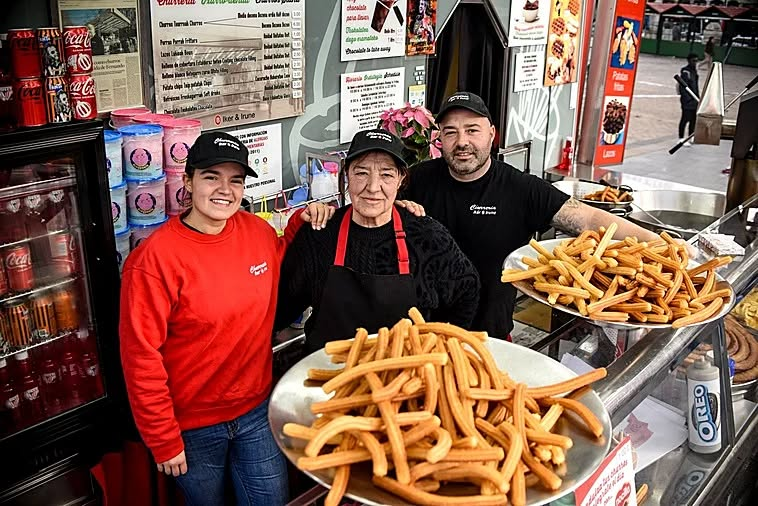
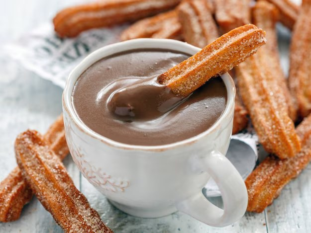
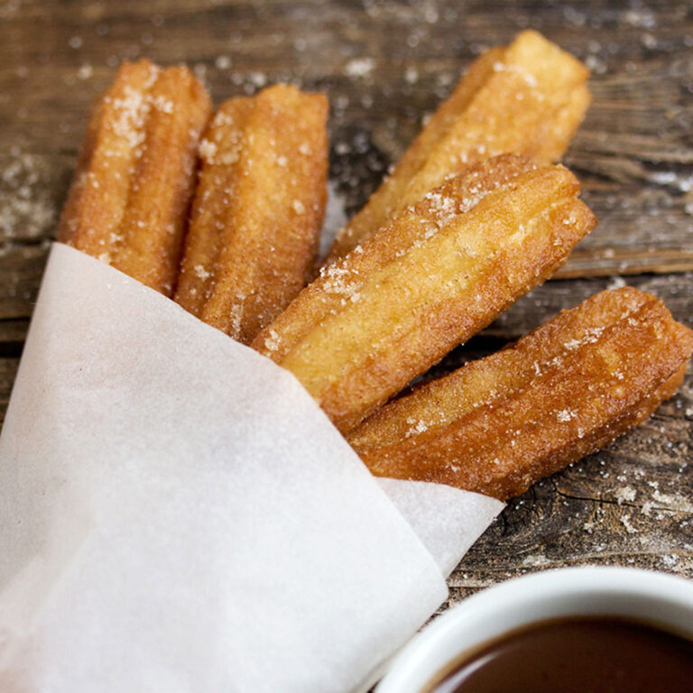
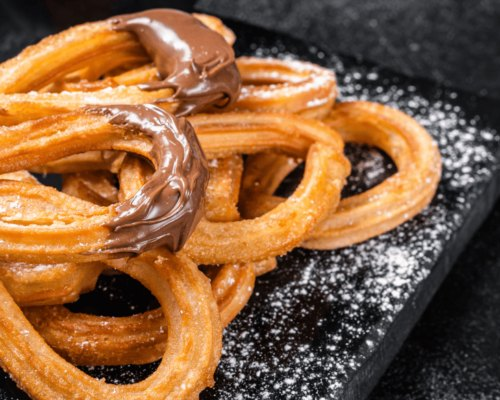
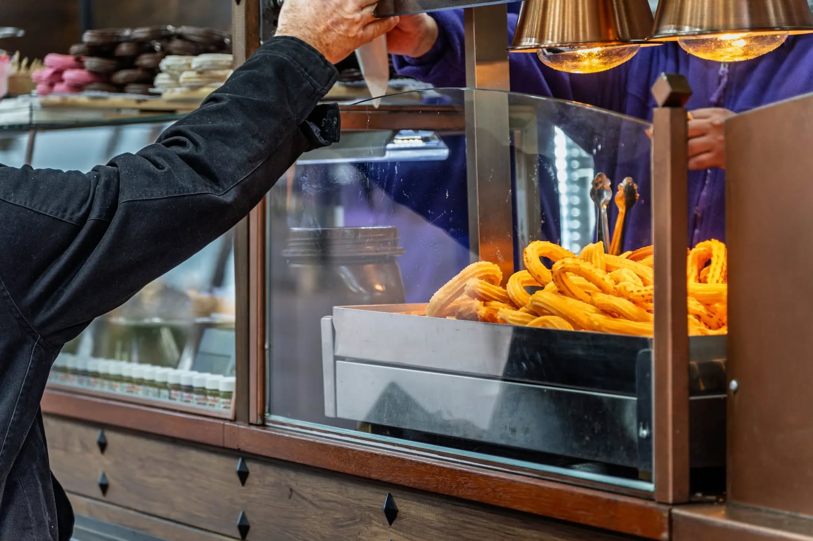

# Churros con Chocolate

## Czym to właściwie jest – i dlaczego stało się fenomenem?

**Churros con chocolate** to na pierwszy rzut oka prosta rzecz: **świeżo smażone paluszki z ciasta (churros)**, czasem lekko ocukrzone, a do tego **gęsta gorąca czekolada**, w której macza się churro. Nie deser w „cukierniczym" sensie. Raczej rytuał. Krótka przerwa, ciepło w dłoniach, cukier na palcach, ciężki kakaowo-czekoladowy zapach. Drobne szczęście, którego nie da się całkiem przyspieszyć.

Churros nigdy nie były tylko atrakcją turystyczną. W Hiszpanii przez długi czas była to całkiem **normalna zimowa rzecz**: po targu, po spacerze, ale przede wszystkim **po nocnym życiu**, po teatrze, dyskotece (wiele churrerías było otwartych aż do rana).

Tyle że w ostatnich latach churros con chocolate zachowują się inaczej niż dawniej — nie jak „lokalna klasyka", lecz jak **wiralowa ikona**.

## Jak to poznasz nawet bez liczb? Kolejki

W Barcelonie są dziś chwile, gdy przed niektórymi churrerías stoją długie kolejki ludzi — często młodzi Azjaci, ale i miejscowi. Nie chodzi tylko o smak. Chodzi o „muszę to mieć": spróbować, zrobić zdjęcie, udostępnić, potwierdzić swoje miejsce choćby na **Instagramie czy TikToku**.

Pewna znana katalońska churrería w dzielnicy gotyckiej stała się wręcz **„miejscem pielgrzymek"** po tym, jak odwiedziła ją i udostępniła z niej zdjęcia jedna światowa gwiazda popu — a historia zaczęła rozchodzić się jak lawina. (Tu nie jesteśmy już w gastronomii, lecz w socjologii.)

Gdy porównujemy **Madryt** z **Barceloną**, wciąż prawdą jest, że stolicą churros i miejscem o największym zagęszczeniu churrerías jest Madryt (o rząd wielkości więcej niż Barcelona). Ale Barcelona ma jedną dodatkową przewagę: to turystyczna megascena, gdzie z jedzenia łatwo robi się treść.

---

## Dlaczego to tak hiszpańskie – a zarazem tak światowe?

Churros to **archetyp prostego jedzenia**: mąka, woda, sól, olej. Powstały gdzieś w przestrzeni codzienności, gdzie nie chodzi o elegancję, lecz o ciepło, energię i prostotę. Odpowiada temu też ich natura: churro jest najsmaczniejsze w pierwszych minutach po usmażeniu. To jedzenie chwili obecnej. **To nie tort na jutro. To teraz.** 😊

## Skąd właściwie wzięły się churros?

Mimo całej dzisiejszej sławy w churros jest coś zaskakującego: **nie wiemy dokładnie, gdzie i kiedy powstały.** Churros nie są jedzeniem dworu ani książek kucharskich. To jedzenie praktyczne, anonimowe i codzienne — a właśnie takie potrawy są w dziejach słabo udokumentowane.

### Teoria pasterska – jedzenie poza miastem

Jedna z najczęściej przytaczanych teorii łączy pochodzenie churros z **pasterzami z wnętrza Hiszpanii**, często wspomina się okolice dzisiejszej Kastylii. Logika jest prosta:

- mąka, woda i sól to surowce, które były dostępne także poza miastami,
- ciasto można przygotować bez pieca,
- smażenie jest szybkie i skuteczne.

Niektórzy autorzy łączą nawet nazwę churro z kształtem rogów miejscowej rasy owiec churra. Pewności nie mamy, ale symbolicznie ma to sens: churro jako jedzenie ludzi żyjących z dala od ośrodków władzy i kultury.

Jednocześnie tę teorię traktuje się dziś z rezerwą — głównie z powodu pytania, czy smażenie w oleju w warunkach górskich było rzeczywiście aż tak praktyczne. Ale jako wyjaśnienie kulturowe (niekoniecznie dosłowne) sprawdza się bardzo dobrze.

### Miejska rzeczywistość: jedzenie uliczne

Co mamy lepiej udokumentowane, to obecność churros w hiszpańskich miastach najpóźniej w XVII wieku. Pojawiają się na ówczesnych przedstawieniach Madrytu, w kontekście targowisk i sprzedaży ulicznej. Nie jako danie odświętne, lecz jako coś, co kupuje się po drodze, za parę drobnych, szybko i bez ceregieli.

I tu ważny moment: churros stały się „klasyką narodową" nie dlatego, że były wyjątkowe, lecz dlatego, że były powtarzalne, niezawodne i dostępne.

### Ślad azjatycki? Chińska inspiracja przez Portugalię

Kolejna — i bardzo fascynująca — teoria przesuwa pochodzenie jeszcze dalej. Niektórzy historycy gastronomii wskazują na **podobieństwo churros do chińskiego smażonego ciasta youtiao**, które było znane w Azji na długo przedtem, zanim churros pojawiły się w Europie.

Myśl brzmi: **portugalscy kupcy**, którzy w XVI wieku przebywali w Azji, mogli poznać ten typ jedzenia i przenieść go do Europy. Na Półwyspie Iberyjskim przepis dostosował się następnie do miejscowych smaków i technik — na przykład użycie gwiaździstej tylki, która nadaje churros ich typowy kształt.

Ale i tu nie ma ostatecznego dowodu.

## Do tego wszystkiego wtrąca się czekolada

Pod koniec XV i przede wszystkim w XVI wieku w Hiszpanii uprawiano mnóstwo nowych roślin. Roślin, których Europa dotąd nie znała, jak na przykład ziemniaki i pomidory. Tak, były to rośliny z „Indii Wschodnich", jak Hiszpanie pierwotnie nazwali to, co w 1492 roku odkryto. **Wraz z Kolumbem do Europy przybyła też czekolada.**

Ona, w przeciwieństwie do tego, jak spożywali ją rdzenni mieszkańcy Ameryki Środkowej i Południowej, w Europie długo czekała, zanim stała się napojem „ludowym". Czekolada była początkowo napojem władzy: droga, rzadka, owiana tajemnicą, należąca do klasztorów, na dwory królewskie, do środowisk, gdzie o jedzeniu myśli się jak o leku, substancji wzmacniającej lub rytuale towarzyskim wyższych warstw.

I tu powstaje **paradoks**, który dla churros con chocolate jest absolutnie kluczowy:

> Hiszpania przywiozła kakao do Europy, ale minęły wieki, zanim czekolada „spotkała się" z churros.

Nie dlatego, że Hiszpanie nie mieli pomysłu. Dlatego, że społeczeństwo nie było jeszcze gotowe, by luksus spotkał się z ulicą.

---

## Jak powstał ten słynny duet (i dlaczego tak późno)

Gdy spojrzysz na dzieje jedzenia, często okaże się, że największe innowacje nie rodzą się w kuchni, lecz w ekonomii, logistyce i życiu miejskim.

Dopiero w XIX wieku stopniowo zmienia się kilka rzeczy naraz:

- rośnie kultura miejska i życie nocne,
- rozwijają się lokale typu chocolaterías,
- surowce tanieją i upraszcza się zaopatrzenie,
- słodycze przestają być przywilejem i stają się dostępną przyjemnością.

I wtedy rodzi się to, co dziś uważamy za „odwieczne": churros jako szybki, tani, gorący kęs **plus** gęsta czekolada jako dostępny napój — idealna para.

W Madrycie staje się to miejskim rytuałem: po teatrze, po imprezie, po długiej nocy — czekolada z churros jako ciepła kropka nad i, powrót do ciała, do ziemi, do rzeczywistości.

---

## Co z tego wynika?

Niezależnie od tego, czy churros powstały u pasterzy, na miejskich targach, czy jako adaptacja obcej inspiracji, zawsze chodziło o to samo: **jedzenie, które ma zaspokoić głód, rozgrzać i sprawić przyjemność.** Bez ambicji bycia „wysoką kuchnią". I właśnie dlatego ciekawe jest, że z czegoś tak prostego z czasem stała się ikona kulturowa, która należy do życia nocnego nie tylko Madrytu i wielkich hiszpańskich miast, ale także daleko za oceanem (w Ameryce Łacińskiej i w USA); po którą stoi się w długich kolejkach w Barcelonie i która pojawia się w mediach społecznościowych wszelkiego rodzaju na całym świecie.

---

## Gdzie na churros con chocolate w Barcelonie? (Top 5)

1. **Xurreria Manuel San Román** — Carrer dels Banys Nous, 8
2. **Granja Dulcinea** — Carrer de Petritxol, 2
3. **La Pallaresa Xocolateria** — Carrer de Petritxol, 11
4. **Xurreria Laietana** — Via Laietana, 46
5. **Xurreria Trébol** — Carrer de Còrsega, 341 (Gràcia)

---

