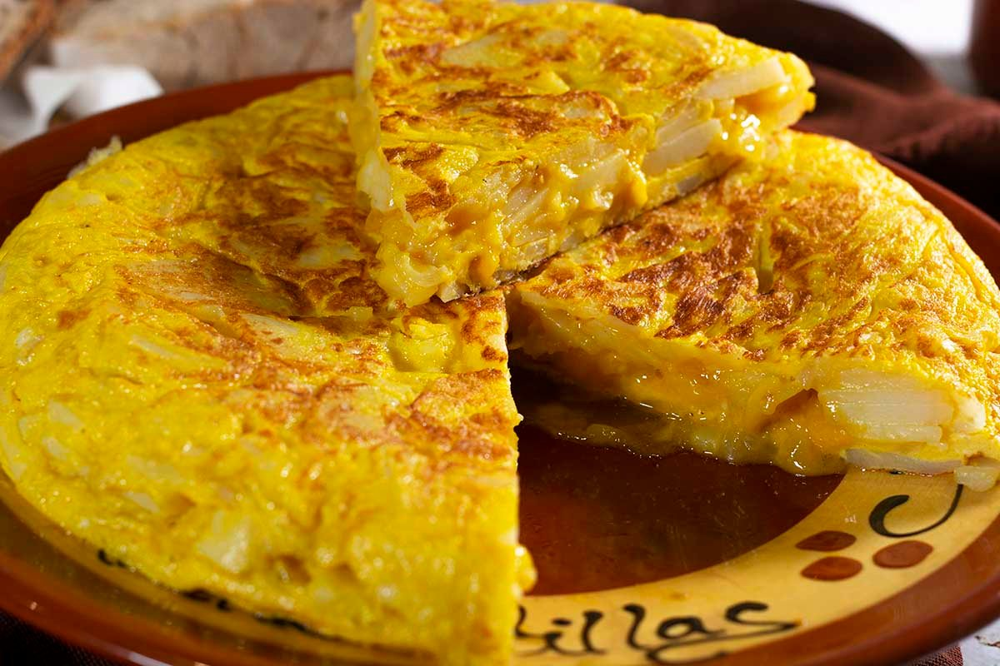

# Tortilla de Patatas

Również hiszpańskie społeczeństwo jest mocno podzielone na dwa nieprzejednane obozy: tortilla **z** czy **bez** cebuli? Oto kluczowe pytanie każdego porządnego Hiszpana.

Ja wolę tę z cebulą, bo w tortilli jest ona niezwykle delikatna i słodka. Ale przeżyję też to, gdy ktoś pozwoli sobie jej nie dodać. 😃

## Składniki (4 porcje)

- 5–6 większych ziemniaków
- 1 średnia cebula (opcjonalnie… ale wiemy swoje 😉)
- 6 jajek
- dobra oliwa z oliwek
- sól

## Sposób przygotowania

1. Ziemniaki obierz i pokrój na cienkie plastry lub półplasterki. Nie w kostkę — tortilla ma być delikatna.
2. Na patelni rozgrzej sporo oliwy z oliwek i smaż ziemniaki powoli, na średnim do małego ogniu. Nie mają być chrupiące, mają zmięknąć i lekko się „konfitować".
3. Jeśli należysz do drużyny „z cebulą", dodaj ją pokrojoną w cienkie paski mniej więcej w połowie smażenia i pozwól jej zesłodnieć.
4. Gotowe ziemniaki (i cebulę) odcedź — oliwę spokojnie zachowaj na kolejne gotowanie.
5. W misce roztrzep jajka z solą i wmieszaj do nich jeszcze ciepłe ziemniaki. Odstaw na kilka minut, aby smaki się połączyły.
6. Masę wlej na lekko natłuszczoną patelnię i smaż kilka minut z jednej strony.
7. Za pomocą talerza obróć tortillę i dopiecz z drugiej strony.

W środku może pozostać lekko wilgotna — tak lubi ją wielu Hiszpanów. Jeśli wolisz bardziej ścisłą, potrzymaj ją na ogniu chwilę dłużej.

Podaje się letnią. I najlepiej w towarzystwie, w którym o cebuli dyskutuje się z uśmiechem. 🙂

---

