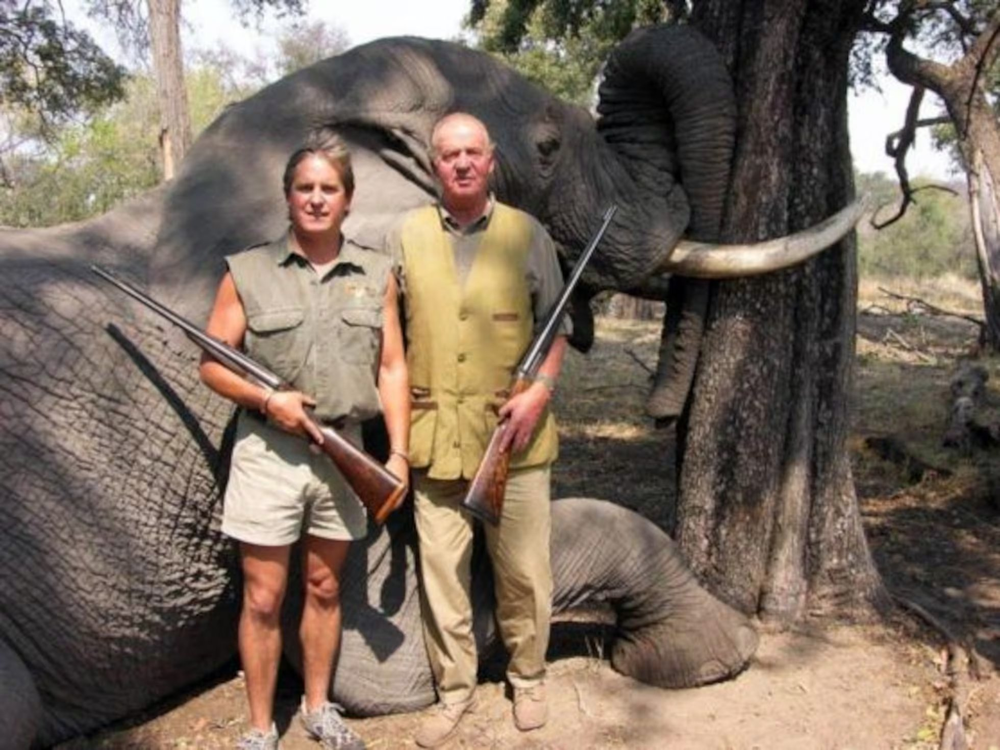
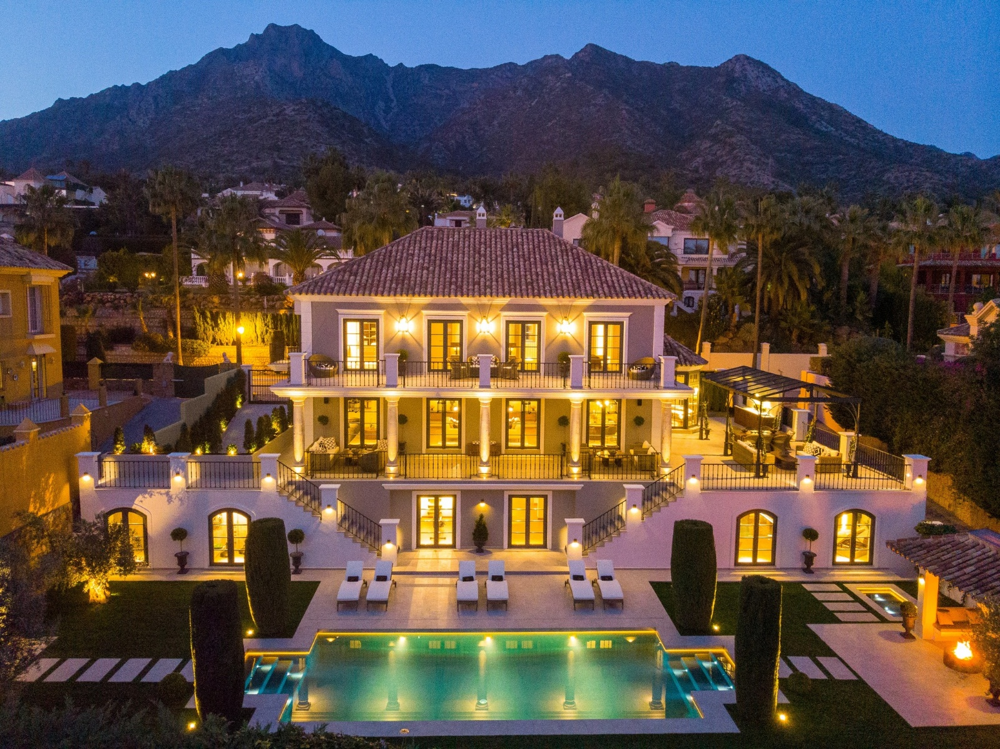

# Gdy monarchia przestaje kryć rodzinę za wszelką cenę

Hiszpańska monarchia w ostatnich piętnastu latach przeżyła coś, co można odczytać jako podręcznikowy przykład tego, jak dwór królewski może stać się zakładnikiem własnych rodzinnych kompromisów – i jak szybko rozpływa się kapitał reputacyjny, gdy opinia publiczna zaczyna pytać o rzeczy najprostsze: kto za co płaci, kto z kim robi interesy, kto jest czyim gościem i dlaczego.

Hiszpania jest monarchią konstytucyjną. Król nie jest politykiem wykonawczym, jest symbolem ciągłości państwa. I właśnie dlatego jego największą walutą jest zaufanie. Gdy je traci, nie jest to tylko osobisty dramat jednej rodziny – to wstrząs dla instytucji.

## Juan Carlos: król wyznaczony przez Franco, który nie poszedł jego drogą

Juan Carlos I został wybrany przez generała Franco i w 1969 roku oficjalnie wyznaczony na jego następcę. Zakładano, że będzie kontynuował autorytarny kurs reżimu. Po śmierci Franco w 1975 roku poszedł jednak inną drogą i poparł przejście do pluralistycznej demokracji i systemu konstytucyjnego.

Kluczowym momentem był 23 lutego 1981 roku, gdy grupa funkcjonariuszy Guardia Civil pod wodzą podpułkownika Tejero wtargnęła do parlamentu i wzięła posłów jako zakładników. Telewizyjne wystąpienie króla w mundurze naczelnego dowódcy sił zbrojnych, w którym odrzucił pucz, odegrało zasadniczą rolę w jego udaremnieniu. Narodził się silny mit: KRÓL, KTÓRY URATOWAŁ DEMOKRACJĘ.

Ten mit był w Hiszpanii tak silny, że wiele z zakulisowego życia króla długo pozostawało poza zainteresowaniem opinii publicznej.

Tyle że monarchia stoi na symbolach. A symbol może upaść w jednej chwili. Dla Juana Carlosa tą chwilą był kwiecień 2012 roku i Botswana.

## Botswana 2012: słoń, złamane biodro i pytania, których nie dało się już ignorować

Juan Carlos wybrał się prywatnie do Botswany na safari połączone z polowaniem na słonie. Podróż miała pozostać ukryta przed opinią publiczną. Tyle że król podczas pobytu złamał biodro i musiał być pilnie przewieziony do Madrytu. Dopiero wtedy Hiszpania dowiedziała się, gdzie była głowa państwa – i w jakim stylu.

Krótko po operacji król wypowiedział zdanie, które przeszło do historii: „Lo siento mucho. Me he equivocado y no volverá a ocurrir." („Bardzo mi przykro. Popełniłem błąd i to się więcej nie powtórzy.")

Tyle że przeprosiny nie wystarczyły. Po raz pierwszy zaczęto otwarcie mówić, że problem nie leży tylko w polowaniu na słonie.

Hiszpania przechodziła wtedy przez głęboki kryzys gospodarczy, bezrobocie przekraczało 20%, młodzi ludzie nie mieli pracy. Luksusowe safari w Afryce sprawiało wrażenie kpiny.

Botswana nie była jednak tylko o polowaniu.

To właśnie ta podróż znacznie uwidoczniła także jego pozamałżeński związek z Corinną Larsen, która była obecna na safari. A przede wszystkim otworzyła szersze pytanie: skąd pochodzą pieniądze, w jakich kręgach obraca się król i jakie ma powiązania z zagranicznymi elitami – zwłaszcza z monarchiami Zatoki Perskiej.

## Saudyjskie powiązania: stare przyjaźnie i nowe podejrzenia

Juan Carlos miał z władcami Zatoki Perskiej długotrwałe relacje już od lat 70. W czasie kryzysu naftowego odgrywał rolę pośrednika przy nawiązywaniu kontaktów z Arabią Saudyjską. Stopniowo między nim a niektórymi członkami saudyjskiej rodziny królewskiej wytworzyły się osobiste więzi.

Udokumentowane jest, że saudyjscy władcy spędzali lata w Hiszpanii, zwłaszcza w okolicach Marbelli i Puerto Banús, gdzie mieli swoje rezydencje i gdzie cumowały ich jachty (Shaf London znajdziesz w Puerto Banús i dziś). Juan Carlos odwiedzał ich podczas tych pobytów. Sama obecność na jachtach ani kontakty towarzyskie oczywiście nie są przestępstwem – ale w kontekście późniejszych afer finansowych te relacje zaczęto postrzegać inaczej.

I właśnie tu pojawia się nazwisko Mohameda Eyada Kayalego.

## Mohamed Eyad Kayali: most między Botswaną a Zatoką Perską

Kayali jest w poważnej hiszpańskiej prasie wspominany przede wszystkim jako człowiek, który zaprosił króla do Botswany. Teksty śledcze (np. Orient XXI) opisują go zarazem jako przedsiębiorcę powiązanego z saudyjskim kręgiem i osobę, która zajmowała się logistyką i sprawami majątkowymi saudyjskich elit w Hiszpanii.

Południowoafrykańskie śledztwo amaBhungane, opierające się m.in. na Panama Papers i Paradise Papers, łączy go następnie ze strukturami offshore, w których figurował jako dyrektor lub posiadacz pełnomocnictw w spółkach powiązanych z saudyjskimi aktywami – nieruchomościami, firmami czy luksusowym majątkiem.

Nic z tego samo w sobie nie jest wyrokiem. Ale razem tworzy to obraz środowiska, w którym mieszają się polityka, biznes, luksus i nieprzejrzyste struktury.

I właśnie w to środowisko Botswana wpasowała się aż zaskakująco dokładnie.

## Corinna Larsen: dar 100 milionów dolarów i szwajcarski ślad

Corinna Larsen nie była tylko kochanką króla. Stopniowo stała się kluczową postacią w debacie o dziwnych przepływach finansowych.

W 2008 roku saudyjski król Abdullah przelał 100 milionów dolarów na konto fundacji Lucum, zarejestrowanej w Panamie, której założycielem był Juan Carlos. Konto prowadzono w szwajcarskim banku Mirabaud. Według oświadczenia Juana Carlosa chodziło o osobisty dar.

W 2012 roku część tych środków (około 65 milionów dolarów) przelano na konto Corinny Larsen. Król twierdził później, że chodziło o osobisty dar. Szwajcarskie śledztwo badało, czy pieniądze miały związek z prowizjami za kontrakt na kolej dużych prędkości między Mekką a Medyną. Postępowanie ostatecznie umorzono bez aktu oskarżenia z powodu braku dowodów.

Formalnie więc Juan Carlos nie został w tej sprawie skazany. Ale szkoda reputacyjna była ogromna.

## Zięć, który poszedł siedzieć: sprawa Nóos

A potem przyszedł kolejny cios – tym razem z najbliższego kręgu rodzinnego.

Iñaki Urdangarin, mąż infantki Cristiny, był w latach 90. gwiazdą sportu. Reprezentował Hiszpanię w piłce ręcznej, zdobywał medale olimpijskie, uchodził za nowoczesną, sympatyczną twarz monarchii. Pamiętam jego ślub z infantką Cristiną w barcelońskiej katedrze św. Eulalii – był wtedy ulubieńcem publiczności.

Sprawa Nóos pokazała jednak inny obraz. Urdangarin za pośrednictwem instytutu non-profit Nóos zdobywał publiczne kontrakty od rządów regionalnych, przy czym część środków była według sądu wyprowadzana do prywatnych struktur.

W 2018 roku został prawomocnie skazany na pięć lat i dziesięć miesięcy więzienia za sprzeniewierzenie, oszustwa i nadużycie wpływów. Trafił do odbywania kary w więzieniu Brieva w prowincji Ávila. Część kary rzeczywiście odbył, później złagodzono mu reżim.

Małżeństwo z infantką Cristiną nie przetrwało presji całej sprawy – po latach stopniowego rozstawania ich rozwód sfinalizowano w 2024 roku.

To był moment, w którym z osobistych skandali zrobił się kryzys systemowy.

## Filip VI: oddzielenie instytucji od rodziny

Syn Juana Carlosa, Filip VI, po wstąpieniu na tron zrozumiał, że monarchia może przetrwać tylko wtedy, gdy zdystansuje się od problemów.

W 2020 roku publicznie ogłosił, że zrzeka się jakiegokolwiek przyszłego spadku po ojcu i że Juan Carlos traci państwową apanaż. Król wysłał tym jasny sygnał: instytucja nie jest tarczą dla rodzinnych afer.

Krótko potem Juan Carlos udał się na emigrację do Zjednoczonych Emiratów Arabskich.

Był to dramatyczny krok. Ale była to także próba ratowania instytucji.

## Po co o tym przypominać

Istnieją rzeczy udowodnione sądownie. I istnieją rzeczy, które pozostają w szarej strefie – śledztwa, przecieki dokumentów, podejrzenia, które nigdy nie przeradzają się w wyrok.

Tyle że monarchia to nie tylko konstrukcja prawna. To instytucja symboliczna.

A symbol nie może długo przetrwać, jeśli opinia publiczna nabierze poczucia, że istnieją dwie płaszczyzny rzeczywistości: jedna dla zwykłych obywateli i druga dla rodziny u dworu.

Dlatego pewien tekst o monarchii przypomniał mi właśnie Hiszpanię. Nowoczesna monarchia utrzyma się tylko wtedy, gdy potrafi powiedzieć „nie" także własnym ludziom. Gdy przyjmie, że rodzina nie stoi ponad prawem.

I że zaufanie traci się szybciej niż tron.

## Fotografie

**1 i 2** – hiszpański król Juan Carlos w Botswanie, zanim zranił biodro:

**3** – jacht saudyjskiej rodziny królewskiej Shaf London cumujący w porcie Puerto Banús (Marbella, Hiszpania):

**4** – tzw. Milla de oro (Złota Mila) w Marbelli, gdzie znajdują się pałace, rezydencje i wille europejskiego „jet-setu" oraz saudyjskiego króla Fahda:

