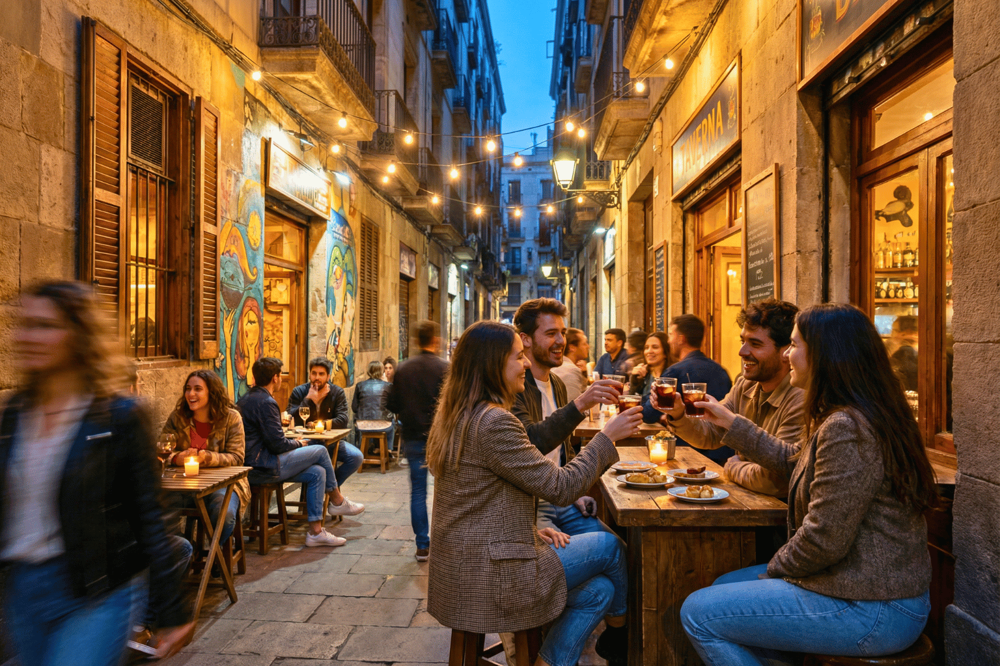
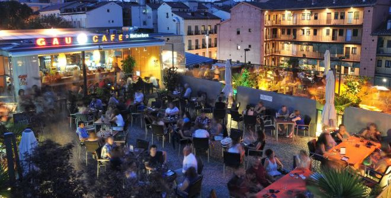

# Hiszpański rytm życia (część 2)

*Wermut, długie obiady i dlaczego Hiszpanie nigdzie się nie spieszą*

Hiszpanie mają jedno powiedzenie, które wydaje mi się genialne: *no vivo para trabajar. Trabajo para vivir.* Czyli… nie żyję, żeby pracować. Pracuję, żeby żyć.

Jeśli w pierwszej części wydawało Ci się, że Hiszpanie jedzą późno, poczekaj, aż doświadczysz hiszpańskiej soboty.

Pierwsze tygodnie w Hiszpanii bywają dla Środkowoeuropejczyka nieco mylące. O jedenastej przed południem zdaje Ci się, że to najwyższy czas coś robić.

Hiszpan w tym czasie dopiero siada na słońcu przed barem i zamawia wermut.

Nie, to nie obiad. I właściwie nawet nie przekąska. To… po prostu wermut.

Istnieje nawet wyrażenie „hacer el vermut", czyli dosłownie „iść na wermut".

Nie chodzi jednak tyle o sam napój, ile o rytuał towarzyski: schodzi się rodzina, przychodzą przyjaciele. Zamawia się coś małego do podjadania – oliwki, migdały, chipsy, *berberechos* (sercówki), anchois albo tapas.

Ktoś bierze wermut. Ktoś piwo. Ktoś coś bezalkoholowego.

Siedzi się. Rozmawia. Nikt nigdzie się nie spieszy.

Po wermucie często następuje spacer.

A potem obiad.

Jeśli jesteś przyzwyczajony do obiadu o dwunastej, w Hiszpanii poczujesz się trochę jak kosmita. W wielu rodzinach w weekend nie zaczyna się bowiem obiadu wcześniej niż o drugiej po południu, a bardzo często dopiero koło trzeciej.

I nie jest to szybki posiłek między dwoma obowiązkami.

Obiad to wydarzenie.

Zwykły rodzinny obiad ma zwykle kilka dań:

Najpierw „PRIMER PLATO". Może to być sałatka, warzywa, zupa, makaron, ryż lub inne lżejsze danie.

Następnie „SEGUNDO PLATO". Ryba. Mięso. Paella. Potrawy duszone. Zależnie od regionu i pory roku.

Do obiadu podaje się zwyczajowo wodę i wino.

Po daniu głównym przychodzi „POSTRE" – deser. Czasem owoce. Innym razem flan, *natillas* albo jakiś domowy słodki przysmak.

I oczywiście kawa. Mała, czarna, słodka.

Bez kawy obiad jakby się nawet nie kończył.

Jak pewnie się domyślasz, tego nie da się zjeść w pół godziny. Rodzinny obiad może trwać dwie, trzy, czasem nawet cztery godziny. I nikomu nie wydaje się to dziwne.

Wręcz przeciwnie.

To właśnie wspólnie spędzony czas jest najważniejszy.

Wieczorem życie toczy się dalej.

Zwłaszcza w ciepłych miesiącach ludzie wracają na ulice. Dzieci bawią się na placach. Rodziny spacerują. Bary i restauracje powoli się zapełniają.

Kiedy byłam w Hiszpanii po raz pierwszy, fascynowało mnie, ile małych dzieci spotyka się na dworze jeszcze późnym wieczorem: wózki, babcie, rodziny, grupki nastolatków.

Wszyscy na zewnątrz. Wszyscy razem.

Na kolację często wyrusza się dopiero po dziewiątej.

Zacząć kolację o dziesiątej wieczorem jest w wielu częściach Hiszpanii zupełnie normalne. Na południu szczególnie.

Restauracje mają kuchnię otwartą do późna w nocy i nikt nie dziwi się, że o jedenastej wieczorem zamawiasz danie główne.

A jest jeszcze jedna rzecz, którą w Hiszpanii lubię.

Ludzie wiedzą, że na ważne rzeczy trzeba znaleźć czas.

Na rodzinę.
Na przyjaciół.
Na jedzenie.
Na rozmowę.
Na zwykłe spotkanie.

Nie twierdzę, że wszystko jest lepsze niż u nas. Ale ten spokojniejszy stosunek do czasu to coś, co fascynuje mnie w Hiszpanii już od ponad trzydziestu lat.

A im bardziej jedzie się na południe, tym wolniej zdaje się płynąć czas.

W Kadyksie zupełnie najbardziej. 😊
