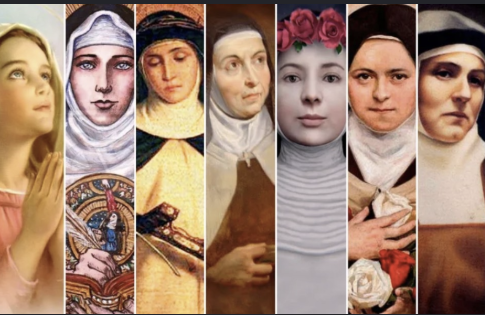

# Hiszpańskie imiona

Gdy po raz pierwszy przyjechałam do Hiszpanii, jedną z rzeczy, które mnie zszokowały, były imiona (przede wszystkim żeńskie). Panienka przy kasie w supermarkecie, która dumnie nosi identyfikator z imieniem CONCEPCIÓN – czyli „POCZĘCIE", kelnerka, na którą wołają ASUNCIÓN (czyli „WNIEBOWZIĘCIE") albo sąsiadka AMPARO („SCHRONIENIE").

Choć dzisiejsza Hiszpania jest tylko w niewielkim stopniu katolicka (w porównaniu z niedawną przeszłością), imiona żeńskie mają tu często charakter religijny, co jest skutkiem silnej tradycji katolickiej głęboko zakorzenionej w kraju. Te imiona nie są tylko formalnością – odzwierciedlają wiarę, kulturę i historię Hiszpanii.

Wydaje mi się to ciekawe, więc przygotowałam małą próbkę tego, jak możesz nazywać się w Hiszpanii.

Najlepsze wydaje mi się to, gdy kobieta nazywa się MARÍA JOSÉ (Maria Józef), a mężczyzna JOSÉ MARÍA (Józef Maria) – zawsze zastanawiam się, jak taki kraj może funkcjonować? :-D (funkcjonuje, tylko trzeba to przyjąć i zrozumieć)... a więc...

## Zaczynamy od ciekawostek

W Hiszpanii istnieje wiele starszych, jednowyrazowych, religijnych imion żeńskich, które są głęboko zakorzenione w tradycji katolickiej. Imiona te są nie tylko piękne, ale niosą też silne znaczenie symboliczne. Oto wybór tych najbardziej znanych:

### Imiona inspirowane Matką Boską i wiarą chrześcijańską

- **Asunción** – Wniebowzięcie, przypomina Wniebowzięcie Najświętszej Maryi Panny.
- **Pilar** – Filar, nawiązuje do Matki Boskiej na Filarze (Nuestra Señora del Pilar).
- **Concepción** – Poczęcie, symbolizuje Niepokalane Poczęcie Najświętszej Maryi Panny.
- **Dolores** – Boleści, nawiązuje do Matki Boskiej Bolesnej.
- **Luz** – Światło, przypomina Matkę Boską Światłości.
- **Mercedes** – Łaski, przypomina Matkę Boską Miłosierną (Nuestra Señora de la Merced).
- **Rosario** – Różaniec, symbol modlitwy różańcowej.
- **Carmen** – Góra Karmel, Matka Boska Szkaplerzna.
- **Ángeles** – Aniołowie, Matka Boska Anielska.
- **Paz** – Pokój, Matka Boska Pokoju.
- **Soledad** – Samotność, Matka Boska w Osamotnieniu.
- **Milagros** – Cuda, Matka Boska Cudowna.
- **Victoria** – Zwycięstwo, Matka Boska Zwycięska.
- **Regina** – Królowa, nawiązanie do Matki Boskiej Królowej Niebios.
- **Amparo** – Schronienie, Matka Boska jako opiekunka.

## Tradycyjne religijne imiona żeńskie

### Imiona inspirowane Matką Boską

- **María del Carmen (Mari del Karmen)** – Matka Boska Szkaplerzna
- **María de los Ángeles (Mari de los Ancheles)** – Matka Boska Anielska
- **María del Rosario (Mari del Rosarjo)** – Matka Boska Różańcowa
- **María de la Concepción (Mari de la Konsepsjon)** – Matka Boska Niepokalanego Poczęcia
- **María de la Asunción (Mari de la Asunsjon)** – Matka Boska Wniebowzięta
- **María de la Paz (Mari de la Pas)** – Matka Boska Pokoju
- **María de la Luz (Mari de la Lus)** – Matka Boska Światłości
- **María de los Dolores (Mari de los Dolores)** – Matka Boska Bolesna
- **María del Pilar (Mari del Pilar)** – Matka Boska na Filarze (patronka Saragossy)
- **María de la Merced (Mari de la Merced)** – Matka Boska Miłosierna

### Imiona inspirowane innymi świętymi

- **Teresa** (po świętej Teresie z Ávili)
- **Lucía** (po świętej Łucji, patronce niewidomych)
- **Catalina** (po świętej Katarzynie)
- **Rosa** (po świętej Róży z Limy)
- **Ángela** (po świętej Anieli)
- **Clara** (po świętej Klarze z Asyżu)
- **Margarita** (po świętej Małgorzacie)
- **Inés** (po świętej Agnieszce Rzymskiej)
- **Ana** (po świętej Annie, matce Najświętszej Maryi Panny)

### Imiona złożone

- **María Teresa**
- **Ana María**
- **María Isabel**
- **María Jesús (Mari Czus)** – bardzo częste i lubiane imię
- **María José (Mari Czose)** – imię inspirowane Świętą Rodziną

### Współczesne wariacje

- **Luz María** – połączenie światła i Matki Boskiej
- **Pilar María** – odwrócony format powszechnego „María del Pilar"
- **Carmen Rosa** – połączenie dwóch maryjnych wezwań
- **María Ángeles (Mariańczi)** – skrócona i spieszczona forma „María de los Ángeles"
- **Amparo** – Schronienie, Matka Boska jako opiekunka.

### Imiona inspirowane świętymi lub cnotami chrześcijańskimi

- **Virtudes** – Cnoty.
- **Esperanza** – Nadzieja.
- **Caridad** – Miłość, dobroczynność.
- **Fe** – Wiara.
- **Gloria** – Chwała.
- **Regina** – Królowa.
- **Inmaculada** – Niepokalana.
- **Purificación** – Oczyszczenie (Matka Boska Gromniczna).
- **Visitación** – Nawiedzenie, przypomina nawiedzenie św. Elżbiety przez Maryję.
- **Salvación** – Zbawienie.

**Współczesna postać i zmiany:** W czasach współczesnych imiona te są wciąż powszechne, ale często łączone z innymi imionami (np. María del Carmen, Ana María, María Jesús). Niektóre starsze imiona, jak Asunción czy Mercedes, są dziś rzadsze, ale wciąż mają swoich zwolenników, zwłaszcza w tradycyjnych rodzinach.

**Ciekawostka:** W Hiszpanii często używa się zdrobnień tych imion. Na przykład María Jesús jest znana jako „Chus", María de los Ángeles jako „Mariańczi", a María del Carmen jako „Maricarmen".

Imiona religijne są częścią tożsamości kulturowej Hiszpanii i pozostają ważnym elementem tradycji rodzinnej także w czasach współczesnych.

