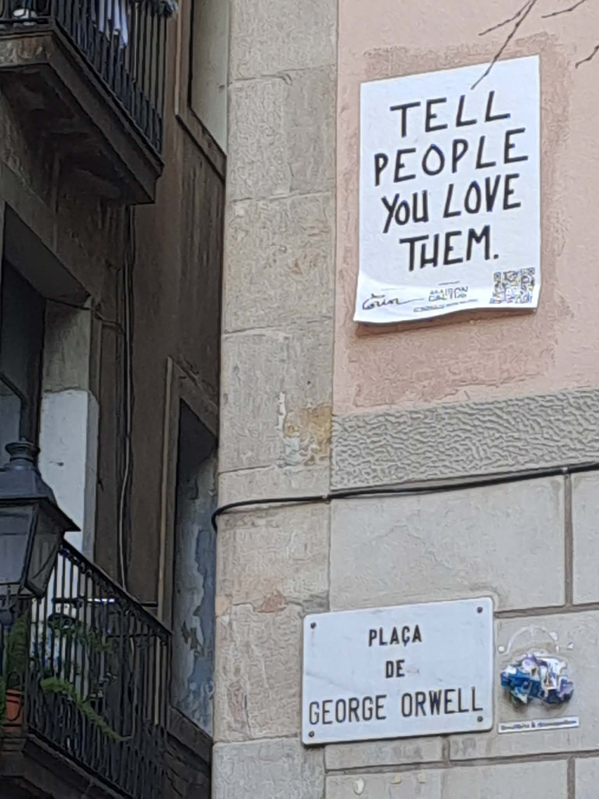

# Mała opowieść o tolerancji

Przystanek autobusowy w jednej z wiosek u podnóża katalońskich Pirenejów.

Piękna pogoda. Nigdzie nikogo.

Na niezadaszonej ławce siedzi młoda dziewczyna, jakieś siedemnaście do dziewiętnastu lat.

Tatuaże. Wyraziste kolczyki – uszy, nos, język.

Zapala jointa i spokojnie pali.

Nadchodzi starsza, elegancka pani, jakieś osiemdziesiąt lat.

Przysiada się.

Dziewczyna pozdrawia pierwsza.

Pani odpowiada.

Dziewczyna pyta, czy nie przeszkadza jej palenie.

Pani mówi, że nie – są przecież na zewnątrz, na powietrzu.

Zaczynają rozmawiać.

Śmieją się.

Po chwili gawędzą, jakby znały się od lat.

A przecież nigdy wcześniej się nie widziały.

Przyjeżdża autobus.

Wsiadają razem.

Siadają obok siebie.

Kropka.

Byłam przy tym.

Zdarzyło się to jakieś trzy lata temu i pamiętam to do dziś.

Bo wtedy – i właściwie także teraz – mnie to wzruszyło.

