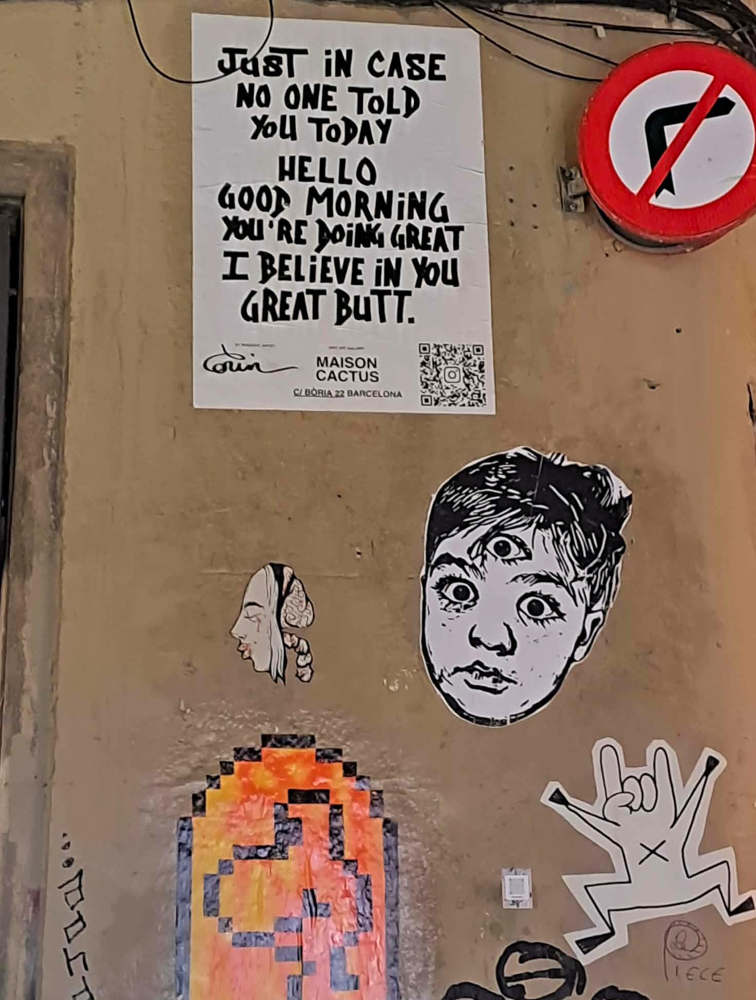

# O wolności

Im dłużej przebywam w Hiszpanii i Katalonii, tym bardziej uświadamiam sobie, że WOLNOŚĆ nie jest tu sloganem ani walką ideologiczną.

To codzienna praktyka. Zaczyna się od ELEMENTARNEJ LUDZKIEJ PRZYZWOITOŚCI.

Od pytania: „Czy to Panu/Pani przeszkadza?" Od umiejętności dzielenia przestrzeni z kimś, kto jest inny – wiekiem, poglądem, stylem życia.

W Barcelonie (i gdzie indziej w Katalonii oraz w Hiszpanii) widać to na ulicach: Na ścianach domów mówi się tu o klimacie, ekologii, wolności myślenia, seksualności, tożsamości. Czasem poważnie, czasem z ironią, często z humorem. Ale niemal nigdy złośliwie.

## Do zdjęć

**1.** Ta witryna nie jest z Barcelony, lecz z Kordoby, wciąż konserwatywnej Andaluzji. Dwie kobiety się całują, a obok nich widnieje zdanie:

> „Spokojnie, jesteśmy tylko obrazkiem, nie możemy zrobić ci krzywdy."

Żaden manifest. Żadna prowokacja. Tylko ciche stwierdzenie.

**2.** Na jednej z barcelońskich ścian jest prosty angielski tekst:

> „Negacjoniści zmian klimatu robią sobie selfie przy pożarach lasów, tańcząc w płomieniach naszej przyszłości."

To nie groźba. To ostre, ale spokojne nazwanie rzeczywistości. Bez krzyku. Bez etykietek.

**3.** Kilka ulic dalej wisi plakat z innym przesłaniem:

> „Na wypadek, gdyby nikt ci dziś tego nie powiedział: cześć, dzień dobry, jesteś wspaniała, wierzę w ciebie… i ta pupa!"

Humor, przerysowanie, ludzkość. To też jest wolność słowa.

**4.** A potem są rzeczy zupełnie praktyczne. Choćby pojemnik na szkło w Kordobie. Napisano na nim:

> „Są ludzie, którzy myślą, że szkło można wymieszać z resztą odpadów. Są też tacy, którzy wierzą, że Ziemia jest płaska. I że wampiry istnieją. To jednak problem mieszania myśli."

Jasny przekaz. Bez obelg. Z uśmiechem.

Hiszpanie i Katalończycy są przy tym wyraźnie „niepoprawni". Politycznie i po ludzku. Obowiązuje tu niepisana zasada, że każdy ma prawo wyrazić swoje zdanie – nawet niewygodne, nawet niepoprawne. Gdy ktoś się z nim nie zgadza, spokojnie się pokłócą. Głośno. Emocjonalnie. Czasem wygląda to, jakby się nie lubili. Ale na tym się kończy.

Ten człowiek powie to zdanie znowu następnym razem. A pozostali przyjmą je dokładnie tak samo. To nie koniec przyjaźni, związku ani rodziny. Nawet w rodzinach – co na początku naprawdę mnie zaskoczyło – mówi się otwarcie praktycznie o wszystkim. Bez obaw, że „tego się nie mówi". Bez strachu, że na zawsze kogoś przez to stracisz.

I właśnie tutaj coraz bardziej uświadamiam sobie różnicę, którą w Polsce odczuwam coraz silniej: autocenzurę.

Staranie, by kogoś nie urazić. Lepiej zamilczeć. Lepiej nie mówić. Lepiej „zostawić to". Tyle że to nie jest tolerancja. To milczenie ze strachu.

Wolność słowa nie oznacza tu bezwzględności. Nie oznacza krzyku. Nie oznacza uciszania. Oznacza zdolność zniesienia tego, że ktoś inny widzi świat inaczej. I rozmawiania ze sobą także wtedy, gdy się ze sobą nie zgadzamy.

Może wolność nie zaczyna się od wielkich słów. Może zaczyna się od odwagi, by mówić – i od pewności, że przez to nie stracimy miejsca przy stole. Na ławce. Albo w autobusie.
