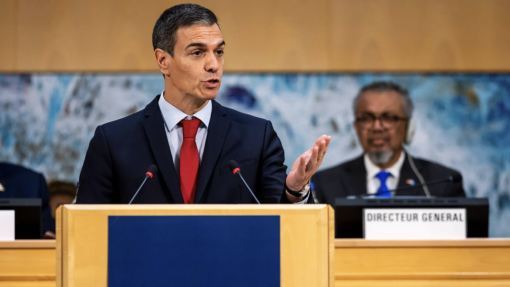

# Jak to jest w Hiszpanii z osobami powyżej 52. roku życia

## Wsparcie dla osób w wieku 52+

W Hiszpanii istnieje dla osób w wieku 52+ bardzo specyficzny system ochrony bezrobotnych, który w Europie jest dość nietypowy. Nie chodzi bowiem tylko o zwykły zasiłek dla bezrobotnych, lecz o mechanizm, który ma pomóc starszym osobom przetrwać okres od utraty pracy aż do emerytury – a zarazem zachować im przyszłą emeryturę.

Cały system działa w kilku etapach.

Gdy człowiek po pięćdziesiątce traci w Hiszpanii pracę, pierwszą fazą jest klasyczne „paro", czyli zasiłek dla bezrobotnych oparty na wcześniejszych składkach. Jeśli ktoś przez długie lata pracował i miał solidne wynagrodzenie, zasiłek ten może być stosunkowo wysoki. Nierzadko jest to kwota około 1 200–1 600 € miesięcznie, czasem i więcej. Wysokość zależy od wcześniejszej pensji i liczby przepracowanych lat.

Zasiłek może trwać maksymalnie dwa lata. Przez pierwsze sześć miesięcy człowiek otrzymuje około 70% swojej podstawy wymiaru, później świadczenie spada do 60%. Już tu widać różnicę w porównaniu z wieloma innymi krajami: hiszpański system jest wobec osób, które długo pracowały, stosunkowo ochronny.

Problem pojawia się po wyczerpaniu „para". I właśnie tu wchodzi do gry kluczowy mechanizm: subsidio para mayores de 52 años – zasiłek dla bezrobotnych powyżej 52. roku życia.

To wyjątkowo ważne świadczenie, ponieważ nie działa tylko jak zwykła pomoc socjalna. Jego prawdziwe znaczenie polega na tym, że państwo dalej odprowadza za beneficjenta składki emerytalne (cotizaciones para jubilación). Innymi słowy: człowiek wprawdzie już nie pracuje, ale system zachowuje się tak, jakby nadal trwało ubezpieczenie potrzebne do przyszłej emerytury.

A to jest w Hiszpanii zasadnicze.

Bez tych składek wiele osób po pięćdziesiątce doznałoby bowiem dramatycznego spadku przyszłej emerytury. Hiszpański system emerytalny jest mocno oparty na długości ubezpieczenia i wysokości składek. Gdyby ktoś przez kilka lat przed emeryturą został „poza systemem", mógłby stracić znaczną część przyszłej emerytury, a nawet nie spełnić warunków do pełnej emerytury.

Dlatego świadczenie to jest wśród Hiszpanów uważane za bardzo cenne, nawet jeśli sama miesięczna kwota nie jest wysoka. W 2026 roku wynosi około 480–500 € miesięcznie. Sam zasiłek więc nie zapewni komfortowego utrzymania, ale państwo jednocześnie kontynuuje odprowadzanie składek do Seguridad Social, co w dłuższej perspektywie ma ogromną wartość.

Kolejną bardzo ważną rzeczą jest to, że to wsparcie można pobierać aż do osiągnięcia właściwego wieku emerytalnego. Praktycznie oznacza to, że osoba, która na przykład w wieku 53 lat traci zatrudnienie i już nie znajdzie nowej pracy, może pozostać w systemie ochrony socjalnej aż do emerytury.

To właśnie tworzy w Hiszpanii poczucie względnego bezpieczeństwa u starszego pokolenia. Wiele osób wie, że jeśli po pięćdziesiątce stracą pracę, państwo całkowicie ich „nie odetnie".

## Płaca minimalna w Hiszpanii (SMI) – 2026

Od 1 stycznia 2026 hiszpańska płaca minimalna wynosi:

- **1 221 € brutto miesięcznie** w 14 wypłatach
- czyli **17 094 € brutto rocznie**
- lub ok. **1 423 € miesięcznie**, jeśli pracownik dostaje pensję rozłożoną na 12 wypłat.

W Hiszpanii powszechny jest system **14 pensji rocznie**:

- 12 zwykłych pensji miesięcznych
- letnia i bożonarodzeniowa „extra paga".

## Średnia płaca w Hiszpanii (najnowsze oficjalne dane)

Najnowsze oficjalne dane hiszpańskiego urzędu statystycznego INE:

- **28 049,94 € brutto rocznie** (dane za rok 2023, opublikowane w maju 2025)
- co odpowiada w przybliżeniu:
- **2 337 € brutto miesięcznie** przy 12 wypłatach
- lub ok. **2 004 €** przy klasycznych 14 wypłatach.

## IMV – Ingreso Mínimo Vital (2026)

IMV to państwowy minimalny dochód socjalny dla osób w ubóstwie lub bez wystarczających dochodów.

Podstawowa kwota dla osoby samotnej w 2026 roku:

- **733,60 € miesięcznie**

Wysokość IMV rośnie w zależności od:

- liczby członków gospodarstwa domowego
- liczby dzieci
- samotnego rodzicielstwa
- niepełnosprawności.

Do tego mogą dochodzić:

- dodatki na dzieci (CAPI)
- dodatki z tytułu niepełnosprawności
- regionalne świadczenia socjalne wspólnot autonomicznych.

