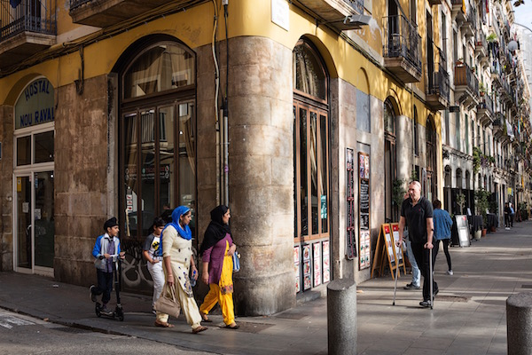
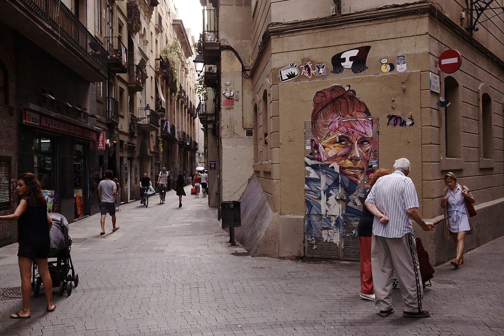

# Żadnego chaosu ani stref no-go. Hiszpania i inna twarz migracji

BARCELONA, RAVAL. Wystarczy odejść kilka kroków od La Rambli i człowiek znajduje się w zupełnie innym świecie – a mimo to wciąż w centrum miasta.

Zaraz przy wejściu do dzielnicy jest mój ulubiony bar. Trzy taborety, mała lada, żaden designerski lokal. Przychodzę tu regularnie i z przyjemnością. Wermut mają tu wyśmienity, tani, a przede wszystkim jest na co patrzeć. Biorę kieliszek, miseczkę marynowanych oliwek i obserwuję ruch dookoła. Obok mnie starszy Katalończyk, za mną turyści, wokół przechodzą ludzie z zakupami.

Normalne miasto.

Kilka kroków dalej Rambla del Raval. Plac zabaw, ławki, ludzie przesiadują, rozmawiają. Turyści fotografują ogromnego kota Botera. Wokół bary i restauracje, do których chodzą miejscowi – nie „śmiałkowie", lecz zwykli ludzie.

Ulice są żywe. Małe sklepy, sklepiki nocne, rzeźnie halal, ale i klasyczne hiszpańskie bary. Mężczyźni w szalwar kamiz, kobiety w hidżabach – ale zdecydowanie nie większość. Ten mix jest widoczny, ale nie jest oddzielony.

Raval nie jest strefą no-go ani „obcym światem". To normalna dzielnica. Nieco brudniejsza (choć ostatnio barceloński ratusz włożył sporo pracy i mocno Raval wysprzątał) i czasem głośniejsza. To miejsce, do którego ludzie chodzą – na jedzenie, na drinka, na spacer.

---

Podobne wrażenie mam też w madryckim LAVAPIÉS – tylko z inną atmosferą.

Tutaj bardziej czuć Afrykę i Amerykę Łacińską. Restauracje z kuchnią etiopską, senegalską czy bangladeską nie są egzotyką, lecz zwykłą częścią dzielnicy. A przede wszystkim: chodzą tam madrytczycy.

Lavapiés żyje wieczorem. Place pełne ludzi, kieliszki wina, tapas, gwar, śmiech. Obok siebie miejscowi i migranci. Dzieci, pary, grupy przyjaciół. Turyści, którzy przyszli tu właśnie dlatego, że to „żyje".

Wystarczy przejść kilka ulic – kolorowe fasady, otwarte lokale, ludzie siedzący na zewnątrz. Atmosfera bardziej śródziemnomorska niż „problemowa". Nie przypadkiem Lavapiés znalazł się w 2019 roku wśród DZIESIĘCIU NAJLEPSZYCH DZIELNIC NA ŚWIECIE.

Również tu są kobiety w hidżabach, mężczyźni z Afryki, ludzie z różnych zakątków świata. Ale nie są oddzieleni. Są częścią jednej przestrzeni.

---

A potem jest jeszcze jedno miejsce, gdzie człowiek spodziewałby się czegoś dokładnie odwrotnego: ALGECIRAS.

Port na południu Hiszpanii, kilka kilometrów od Afryki. Jedna z głównych bram migracji do Europy. Miejsce, które – według naszego uproszczonego postrzegania – powinno być brudne, chaotyczne i pełne problemów.

## Rzeczywistość jest dość inna

Algeciras nie jest żadną linią frontu. To normalne miasto. Tak, więcej policji, więcej kontroli, czasem tematy takie jak przemyt czy narkotyki (powoduje to nie tylko bliskość Afryki, ale przede wszystkim bliskość Gibraltaru). Ale poza tym? Kawiarnie pełne ludzi, zwykłe życie, żadnego poczucia kolapsu.

---

Tu zaczyna nam się to „nie zgadzać".

Bo gdy człowiek śledzi polską debatę, ma wrażenie, że zachodnia Europa jest pełna niebezpiecznych dzielnic, do których się nie chodzi. Afrykańskich gangów. Muzułmańskich fanatyków. „Stref no-go".

W Hiszpanii nic takiego nie przeżyłam.

To nie znaczy, że problemy nie istnieją. Ale rzeczywistość wygląda inaczej.

Tak, w Ravalu spotkasz wielu ludzi z Pakistanu lub Bangladeszu. Ale właśnie to jest ekstremalna koncentracja, która tworzy zniekształcony obraz. W całej Hiszpanii migranci z krajów muzułmańskich spoza Afryki stanowią tylko niewielki ułamek populacji.

---

W sumie w Hiszpanii mieszka około 10 milionów ludzi urodzonych za granicą – mniej więcej jedna piąta populacji. Największe grupy nie są jednak te, które większość osób sobie wyobraża. Dominują Ameryka Łacińska, Unia Europejska i Maroko. Azja to mniejszy segment. A medialnie najbardziej widoczne grupy są w rzeczywistości mniejszościowe.

To nie jest detal. To zasadnicza różnica między rzeczywistością a wyobrażeniem.

---

Jeszcze w 1975 roku Hiszpania była praktycznie bez migrantów. Wszystko, co widzimy dziś, powstało w ciągu ostatnich trzydziestu lat.

Najwięcej zaś w ciągu kilku zaledwie lat na początku tysiąclecia.

Między rokiem 2000 a 2005 do kraju przybyły miliony ludzi. Najczęściej dlatego, że ich własne kraje się waliły. Ekwador, Argentyna, Kolumbia. Do tego otwarcie rynku pracy dla Rumunów i długotrwała presja z Maroka.

Każda fala migracji miała konkretny powód.

---

Ci ludzie w przeważającej większości nie przyjechali, by siedzieć w domu.

W Hiszpanii pracuje dziś mniej więcej dwie trzecie migrantów (z ogólnej liczby, do której należą dzieci, studenci i osoby starsze). Ich aktywność ekonomiczna jest wyższa niż u rodzimej populacji. Znajdziesz ich w budownictwie, gastronomii, turystyce, służbie zdrowia, opiece. Często wykonują pracę, o którą miejscowi nie zabiegają. Niektórzy prowadzą działalność.

---

Tak, migranci są w przestępczości bardzo nieznacznie nadreprezentowani. To fakt. Ale najczęściej chodzi o drobną przestępczość – kradzieże, kieszonkowstwo, narkotyki. Nie o załamanie bezpieczeństwa.

Hiszpania ma jeden z najniższych poziomów przestępczości z użyciem przemocy w Europie.

---

Migranci nie są tu izolowani w zamkniętych enklawach. Są wymieszani z miejscową populacją. Pracują, mieszkają i funkcjonują w tej samej przestrzeni.

Raval ani Lavapiés nie są idealne. Ale nie są to „strefy zakazane".

Kolejna ważna rzecz: Hiszpania nie jest krajem tranzytowym. Większość migrantów tu zostaje. Język, praca i możliwość legalizacji sprawiają, że zostać ma sens.

---

A państwo o tym wie.

Hiszpańska polityka nie jest oparta na tym, jak zatrzymać migrację. Stara się nią zarządzać. Legalizacja, włączenie do pracy, integracja. Nie ideologia, lecz pragmatyzm.

Bo Hiszpania ma problem, którego nie da się obejść: demografię.

Dzietność około 1,1 dziecka na kobietę. Starzejąca się populacja. Bez migrantów kraj by nie dał rady. Już dziś mniej więcej jedna czwarta nowo narodzonych dzieci ma matkę urodzoną za granicą.

Migracja to nie tylko temat polityczny. To konieczność.

---

To jednak nie znaczy, że wszystko działa bez problemów. Napięcia istnieją. Część społeczeństwa uważa, że migrantów jest za dużo. Istnieją problemy z mieszkaniami, lokalną przestępczością czy bezrobociem w niektórych grupach.

Ale nie są to problemy, które rozkładałyby państwo, co jest absolutnie kluczowe.

---

Hiszpania pokazuje, że migracja nie musi wyglądać tak, jak często ją sobie wyobrażamy.

Jest mniej dramatyczna, niż się wydaje. Bardziej wymieszana. I w dużej mierze oparta na pracy.

Że tak jest, najlepiej możesz sprawdzić sam. Gdy pojedziesz do Barcelony, zajrzyj do Ravalu, warto. A być w Madrycie i nie wpaść wieczorem do Lavapiés to jakby cię tam wcale nie było.

