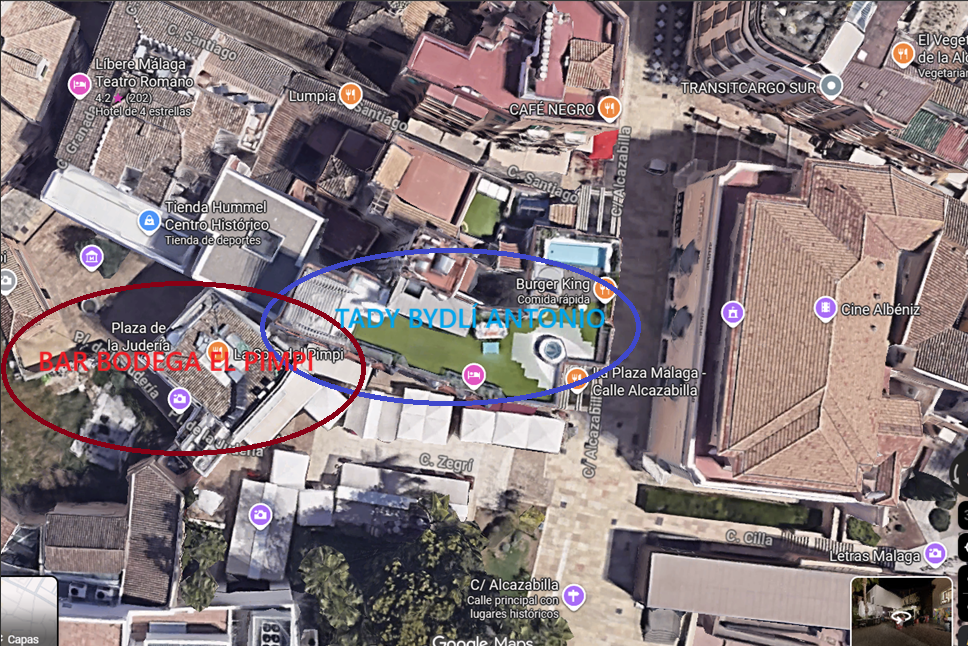
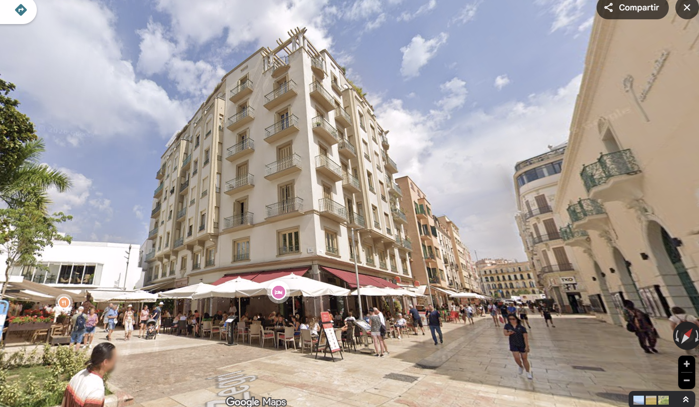

# Antonio Banderas – najsłynniejszy pokutnik Wielkanocy

W Wielki Czwartek (*Jueves Santo*) w Hiszpanii kulminują święta wielkanocne. Dziś w dzień i w nocy przez miasta przechodzą najliczniejsze procesje, atmosfera jest najgęstsza, a ulice hiszpańskich miast wypełniają dziesiątki tysięcy ludzi.

W Maladze ten dzień ma jednak jeszcze jeden szczególny moment. Wśród pokutników pojawia się mężczyzna, którego zna cały świat – Antonio Banderas.

Bez czerwonego dywanu, bez ochrony. W tunice, z kapturem i świecą w ręku. Po prostu jako jeden z wielu.

---

## Malaga – procesje, gdzie spojrzysz

Semana Santa należy w Maladze do największych wydarzeń roku. Przez cały tydzień na ulice wychodzi około 42 bractw religijnych, czyli *cofradías*, które przeprowadzają ponad cztery dziesiątki procesji. Samego Jueves Santo wychodzi osiem wielkich bractw, a historyczne centrum wypełniają dziesiątki tysięcy ludzi. Ulice zamieniają się w nieprzerwany strumień widzów, muzyki i powoli kroczących pochodów. To właśnie w tej atmosferze pojawia się jeden z najsłynniejszych uczestników.

---

## Rodowity malagijczyk

Antonio Banderas urodził się w 1960 roku właśnie w Maladze. Ojciec był policjantem, matka nauczycielką. Pierwotnie chciał być zawodowym piłkarzem, ale kontuzja przywiodła go do teatru. Później wyjechał do Madrytu, gdzie zaczął współpracować z reżyserem Pedrem Almodóvarem, a stamtąd jego droga wiodła aż do Hollywood.

Widzowie znają go z filmów takich jak The Mask of Zorro, Desperado, Evita, Philadelphia czy Puss in Boots. Za film Pain and Glory otrzymał nominację do Oscara. Mimo to nigdy nie przestał wracać do domu.

---

## Pokutnik wśród innych

Antonio Banderas jest członkiem bractwa Lágrimas y Favores i regularnie uczestniczy w procesji jako *nazareno*. W przeszłości angażował się też jako *costalero*, czyli jeden z mężczyzn, którzy niosą ciężkie paso. Może ono ważyć kilka ton, a procesja trwa wiele godzin. Większość costaleros kończy więc około pięćdziesiątki i także Antonio Banderas dziś już paso nie nosi. W procesji jednak wciąż chodzi. Dla miejscowych ważne jest, że nie jest tylko symboliczną twarzą. Jest naprawdę częścią tradycji.

---

## Jeden „z paczki"

W Maladze nie postrzegają go tylko jako gwiazdy Hollywood. Raczej jako „jednego z nich". Ludzie spotykają go na ulicy, w teatrze, na promenadzie czy w restauracjach. Nie jest otoczony ochroną, zatrzyma się, przywita, zrobi zdjęcie. Sprawia wrażenie wielkiego sympatyka i fajnego gościa. Po problemach zdrowotnych w 2017 roku zaczął spędzać w Maladze jeszcze więcej czasu i dziś przebywa tu przez większość roku.

---

## Bar, w którym jest u siebie

Jednym z miejsc, gdzie można go czasem spotkać, jest legendarny El Pimpi. Antonio Banderas jest jednym z jego współwłaścicieli, a lokal znajduje się tuż obok miejsca, w którym mieszka. Należy do najsłynniejszych barów w mieście. Ściany są pełne zdjęć znanych osobistości, ale Banderas przychodzi tu raczej jako miejscowy. Siada, bierze wino i rozmawia z ludźmi.

---

## Inwestycje w rodzinne miasto

Antonio Banderas nigdy nie ukrywał, że jego główną inwestycją jest rodzinna Malaga. Jednym z najbardziej widocznych przykładów jest właśnie El Pimpi, którego został współwłaścicielem. Nie był to przypadek – aktor mieszka w domu naprzeciwko i do tego baru chodzi od młodości. Według miejscowych przychodzi tu niepostrzeżenie, często w czapce z daszkiem, przesiaduje przy kieliszku wina i spędza czas z przyjaciółmi lub rodziną. Na ścianach lokalu do dziś wiszą zdjęcia młodego Banderasa podpisującego jedną z beczek w piwnicy.

Inwestycje w miasto sięgają jednak znacznie dalej. Za pośrednictwem fundacji Lágrimas y Favores co roku wspiera projekty społeczne i edukacyjne w Maladze. Poza tym przyczynił się do powstania projektu teatralnego, który zaowocował otwarciem Teatro del Soho CaixaBank, dziś jednego z najważniejszych ośrodków kultury miasta.

Aktor ma w historycznym centrum Malagi mieszkanie w pobliżu Alcazaby, skąd jest tylko kilka kroków do miejsc, w których odbywają się największe procesje. To właśnie stąd często wyrusza w miasto podczas Semana Santa. Dla miejscowych jest symbolem tego, że nawet światowa gwiazda może pozostać mocno związana ze swoim miastem.

Jako współwłaściciel El Pimpi przyczynił się ponadto do otwarcia nowej taberny tego lokalu w hotelu Puente Romano w Marbelli, jednym z najbardziej prestiżowych miejsc całej okolicy.

---

## Tradycja silniejsza niż sława

W Wielki Czwartek można więc zobaczyć w Maladze niezwykły obraz. Gwiazda Hollywood kroczy w procesji razem z tysiącami innych. Bez wyjątków, bez przywilejów. Po prostu jako członek bractwa.

W Hollywood gwiazda. W Maladze to po prostu Antonio. 😊
