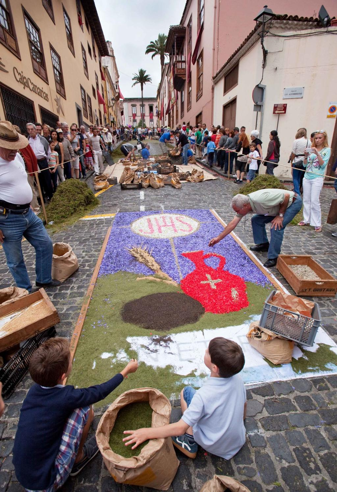

# Corpus Christi w La Orotava

*Jest 4 czerwca. W Hiszpanii obchodzi się Corpus Christi, święto Bożego Ciała.*

Kiedyś mieszkałam rok na Teneryfie. Właśnie skończyłam jedną szkołę, byłam na czwartym roku drugiej, miałam rozesłane życiorysy do wszystkich polskich biur podróży i czekałam, czy któreś się odezwie. Odezwało się. Szukali rezydentki dla polskich i niemieckich klientów na Teneryfie. Na rok.

Miało to jeden haczyk. Wymagali prawa jazdy.

Tego wtedy nie miałam.

Nastąpił ekspresowy kurs w Warszawie, egzaminy i w ciągu kilku tygodni trzymałam w ręku zupełnie nowe prawo jazdy. Krótko potem wylądowałam na południowym lotnisku Teneryfy, odebrałam w wypożyczalni Opla Corsę i ruszyłam autostradą w kierunku północy wyspy.

Cała się trzęsłam. To była moja pierwsza jazda autostradą w życiu.

Po około trzydziestu kilometrach z samochodu zaczęło się kurzyć. Przerażona zatrzymałam się na poboczu. Co teraz? W panice zostawiłam samochód i ruszyłam pieszo szukać pomocy. Kto kiedyś jechał autostradą wokół Teneryfy, ten teraz pewnie z rozpaczą puka się w czoło.

Po kilku kilometrach natrafiłam na stację benzynową. Jeden z pracowników zlitował się nade mną, podjechał ze mną do samochodu, spojrzał na niego i z uśmiechem wyjaśnił mi, że dobrze bywa jeździć ze zwolnionym hamulcem ręcznym.

Rok na Teneryfie stał się ostatecznie wielkim sprawdzianem moich umiejętności. Nie tylko kierowniczych. Stopniowo pokochałam tę wyspę i do dziś wspominam ją jako jeden z najpiękniejszych okresów swojego życia.

Jednym z najmocniejszych przeżyć były przygotowania do Corpus Christi w miasteczku La Orotava.

## Całe miasto pachnie kwiatami

Kilka dni przed uroczystością miasto zaczyna się zmieniać.

Wieczór w wieczór otwierają się warsztaty, gdzie schodzą się miejscowi. Przede wszystkim kobiety, ale nie tylko. Siedzą przy długich stołach i godzinami obrywają płatki z róż, goździków, hortensji, gerber, stokrotek, bugenwilli i innych kwiatów. Inni przygotowują liście paproci i kolejną zieleń.

Spędziłam z nimi 2 wieczory pośród oszałamiającego zapachu kwiatów, z rękami zabarwionymi pyłkiem, i napełniałam z nimi wiklinowe kosze – do każdego jeden odcień. Rozmawiało się, popijało, śmialiśmy się do późnej nocy.

Potem poszłam spać.

Gdy rano wróciłam, plac z wczorajszego wieczoru zamienił się w wielkie płótno. Na bruku wstępnie naszkicowane wzory, które ludzie zaczynali stopniowo wypełniać kwiatami i kolorowymi piaskami.

## Tradycja licząca prawie 200 lat

Corpus Christi, czyli Uroczystość Najświętszego Ciała i Krwi Pańskiej, należy do najważniejszych świąt katolickich. W Hiszpanii obchodzi się je już od stuleci, ale tradycja kwiatowych dywanów w La Orotavie jest młodsza.

Za jej początek uważa się rok 1847. Wtedy miejscowa szlachcianka Leonor del Castillo ozdobiła przestrzeń przed swoim domem kwiatami na przejście procesji. Jej pomysł spodobał się na tyle, że zaczęli go naśladować kolejni mieszkańcy miasta.

Z jednej ozdobionej ulicy powstała tradycja, która dziś przyciąga odwiedzających z całego świata.

## Tysiące kwiatów i setki wolontariuszy

Przygotowania zaczynają się tygodnie przed samą uroczystością.

Trzeba zebrać i kupić ogromną ilość kwiatów. Wolontariusze następnie przez długie godziny oddzielają płatki od łodyg i sortują je według odcieni.

Na dekorację ulic idą dziesiątki tysięcy kwiatów i całe tony materiału roślinnego.

W przygotowania angażują się całe rodziny. Rodzice, dzieci i dziadkowie. Wielu tworzy dywany przez całe życie i przekazuje swoje doświadczenie kolejnym pokoleniom.

## Dywan z wulkanu

Najsłynniejsze dzieło w La Orotavie wcale nie jest jednak z kwiatów.

Na placu Plaza del Ayuntamiento przed ratuszem co roku powstaje monumentalny obraz o powierzchni niemal 900 metrów kwadratowych. A jest on stworzony z materiału, który pochodzi ze stoków wulkanu Teide.

To kolorowe piaski – rozdrobnione skały wulkaniczne i minerały z obszaru Las Cañadas pod Teide.

Czarne odcienie pochodzą głównie z bazaltów. Czerwone i ochrowe barwy tworzą skały bogate w tlenki żelaza. Jasne odcienie dają tufy wulkaniczne i popioły. Po rozdrobnieniu i przesianiu powstaje drobny materiał przypominający kolorowy piasek.

Przygotowanie centralnego dywanu trwa kilka tygodni. Materiał trzeba posortować, rozdrobnić i przesiać na różne frakcje. Nad gotowym dziełem pracują dziesiątki doświadczonych twórców, których nazywa się alfombristas.

## Piękno na jeden dzień

To święto jest przepiękne i… przemijające.

Setki ludzi pracują całymi tygodniami. Tworzą przepiękne obrazy z kwiatów i wulkanicznych piasków. A potem przez miasto przechodzi procesja.

W ciągu kilku godzin dywany zaczynają znikać pod krokami uczestników.

To, co powstawało tygodniami, znika w ciągu jednego dnia.

A mimo to kolejnego roku zaczyna się od nowa.

## Gdzie jeszcze znajdziesz kwiatowe dywany

Tradycja kwiatowych dywanów nie jest przywilejem Teneryfy. Piękne uroczystości Corpus Christi można zobaczyć także w katalońskim Sitges, w Toledo, Granadzie czy Sewilli. Nigdzie indziej nie znajdziesz jednak tak wyjątkowego połączenia sztuki kwiatowej i krajobrazu wulkanicznego jak właśnie w La Orotavie, gdzie na jeden dzień w dzieło sztuki zamienia się nie tylko miasto, ale i sam wulkan Teide.

