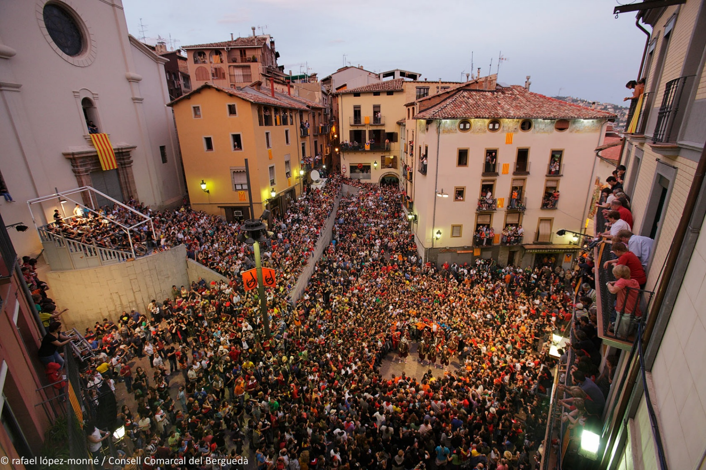

# La Patum – ognie, diabły i Boże Ciało

*Dziś (4 czerwca) w miasteczku Berga kulminuje jedna z najstarszych tradycji Europy: La Patum de Berga.*

La Patum to jedna z bardzo ciekawych tradycyjnych uroczystości Hiszpanii.

Odbywa się w mieście Berga, około 100 km na północ od Barcelony, u podnóża Pirenejów.

Nie jest to festiwal folklorystyczny ani rekonstrukcja historyczna. Miejscowi traktują ją jako część swojej tożsamości. Wiele rodzin uczestniczy w niej od pokoleń, a niektóre role dziedziczy się z ojca na syna.

W 2005 roku uroczystość została uznana przez UNESCO za Arcydzieło Ustnego i Niematerialnego Dziedzictwa Ludzkości, a w 2008 roku została wpisana na Reprezentatywną listę niematerialnego dziedzictwa kulturowego ludzkości.

## Już prawie 600 lat

Według zachowanych wzmianek po raz pierwszy obchodzono ją w Berdze w 1454 roku, ale najpewniej jest sporo starsza. Niektóre postacie mamy udokumentowane z XVI, inne z XVII wieku. Jest jedną z najstarszych nieprzerwanie obchodzonych uroczystości ludowych w Europie.

## Czym jest Patum

Pierwotnie była to religijna procesja Corpus Christi (Bożego Ciała).

W średniowieczu większość mieszkańców była niepiśmienna, więc kościół używał różnych scen teatralnych, które obrazowo wyjaśniały ludziom historie biblijne.

Do procesji stopniowo dołączali diabły, anioły, smoki, olbrzymy, Maurowie i chrześcijańscy rycerze.

Z czasem stały się popularniejsze niż sama procesja i zaczęły żyć własnym życiem. Z uroczystości religijnej stopniowo zrobiła się mieszanka średniowiecznego teatru, pogańskich rytuałów ognia, katolickiej symboliki i ludowej zabawy.

## Elementy pogańskie

Tych jest tu mnóstwo: z dużym prawdopodobieństwem uroczystość nawiązuje do znacznie starszych obchodów przesilenia letniego i kultu ognia.

Kościół nie zniósł tych zwyczajów, lecz włączył je do obchodów Corpus Christi.

Dlatego dziś obok chrześcijańskich obchodów płoną tu ognie, biegają demony i potwory, słychać bębny, tłum rytualnie tańczy – wszystko to są elementy obchodów przedchrześcijańskich.

## Jak powstała nazwa

Hiszpanie zbytnio się z tym nie certolą: dźwięk bębna słyszą jako „pa-tum, pa-tum, pa-tum" – i stąd stopniowo przyjęło się określenie całej uroczystości.

## Kiedy się odbywa

Co roku w tygodniu święta Corpus Christi.

## Ile ludzi przyjeżdża

Dokładne liczby różnią się w zależności od roku, ale w główne dni do miasta zjeżdżają się dziesiątki tysięcy ludzi, a historyczne centrum bywa dosłownie przepełnione.

## Salt de Plens – szaleństwo osiąga szczyt

Wyobraź sobie mały średniowieczny plac.

Gasną światła.

Plac wypełnia się tysiącami ludzi.

Nagle pojawiają się dziesiątki demonów pokrytych pirotechniką.

Wszystkie lonty zapalają się jednocześnie.

W ciągu kilku sekund cały plac zamienia się w morze ognia, dymu, iskier, bębnów i krzyku, a tysiące ludzi przy tym wszystkim tańczą.

Ten moment nazywa się Salt de Plens i jest uważany za jedną z najintensywniejszych uroczystości ludowych w całej Hiszpanii.

## Ciekawostka

Choć jest to uroczystość pełna ognia, miejscowi przychodzą na nią także z dziećmi.

Istnieje nawet osobna Patum Infantil, gdzie dzieci mają własny pochód, własne postacie i własną „małą Patum".

To pięknie pokazuje, że dla mieszkańców Bergi nie jest to atrakcja turystyczna, lecz tradycja przekazywana z pokolenia na pokolenie.
