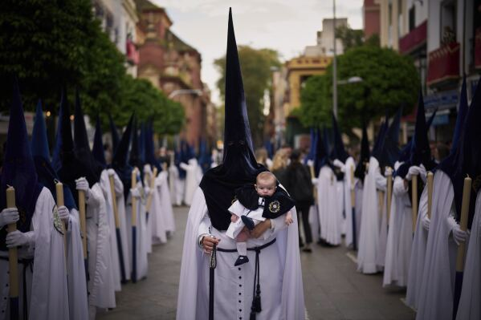
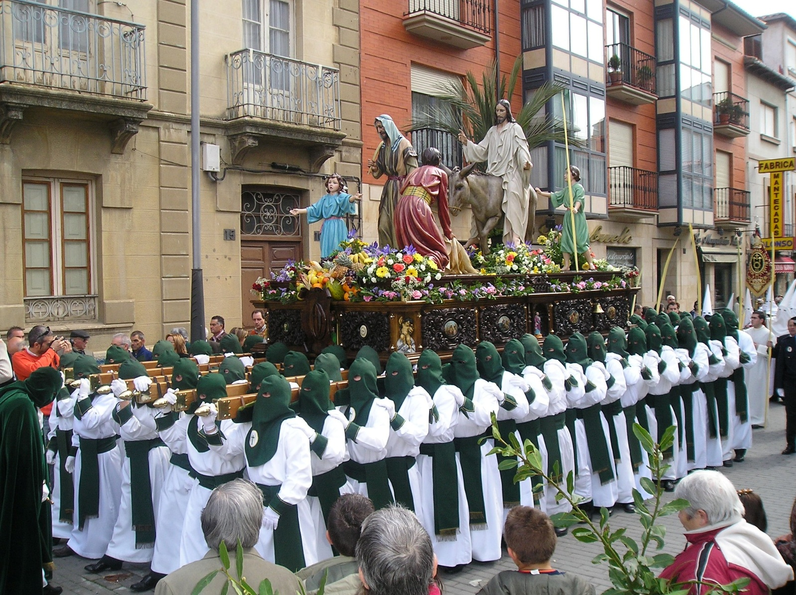

# Wielki Poniedziałek – Lunes Santo: stukilogramowe krzyże na plecach i godziny procesji boso

Po uroczystej Niedzieli Palmowej w Hiszpanii zaczyna się prawdziwa Semana Santa.

W Lunes Santo na ulice wyruszają pierwsze mniejsze procesje poszczególnych bractw. Nazywa się je tu *cofradías*.

Cofradías powstawały już w średniowieczu, najczęściej między XIV a XVII wiekiem. Zakładały je cechy, społeczności sąsiedzkie lub grupy wiernych. Pierwotnie opiekowały się chorymi, organizowały pogrzeby i uroczystości religijne. Stopniowo stały się z nich zorganizowane stowarzyszenia z własnymi statutami, majątkiem i długą tradycją.

Dziś istnieją ich w Hiszpanii setki. Tylko w Sewilli działa ponad 60 takich bractw, w Maladze ponad czterdzieści. Niektóre mają setki członków, inne tysiące. Członkostwo często dziedziczy się w rodzinach i nierzadko w jednym bractwie są trzy pokolenia.

Cofradías funkcjonują przez cały rok. Spotykają się, planują trasy procesji, naprawiają figury, przygotowują muzykę, a przede wszystkim rozdzielają role. Te są ściśle określone i dla wielu członków bardzo prestiżowe.

---

## Bosi pokutnicy

Najbardziej widoczni są **pokutnicy** – *nazarenos* w długich habitach i spiczastych kapturach (o nich powiemy sobie jutro). Niektórzy idą boso. To forma pokuty lub osobistego ślubu.

**Bosi pokutnicy mogą iść ulicami nawet kilka godzin.** Trasa procesji ma zwykle od trzech do 8 kilometrów i trwa od czterech do ośmiu godzin. Bruk jest zimny, czasem mokry, i nierzadko uczestnicy kończą z pęcherzami i otarciami.

---

## Drewniane krzyże

Inni **niosą drewniane krzyże**. Te mniejsze ważą około 20 czy 30 kilogramów, ale w niektórych miastach istnieją i znacznie cięższe. Nierzadko jest to krzyż ważący **sto kilogramów** i więcej. Niektóre mają po kilka metrów, a pokutnicy przechodzą z nimi ulicami całe godziny. Waga nie jest rywalizacją. To osobisty ślub – tzw. *promesa*. Ludzie sami dobrowolnie wybierają obciążenie i często powtarzają je co roku.

Krzyż niesie się powoli, bez pośpiechu, w ciszy. Czasem pokutnik trzyma go na ramieniu, czasem ciągnie po ziemi. Po kilku godzinach marszu bolą plecy, ramiona i ręce. Mimo to wielu zgłasza się do procesji ponownie.

---

## Costaleros pod feretronem

Najtrudniejsze zadanie mają *costaleros* – mężczyźni ukryci pod feretronem, którzy niosą ogromne figury. Jedna konstrukcja może ważyć nawet ponad tonę. W jednym „paso" bierze udział kilkudziesięciu ludzi, którzy się zmieniają. Mimo to pozostają pod konstrukcją długie dziesiątki minut w całkowitej ciszy. O najbardziej znanym costalero, Antoniu Banderasie, też jeszcze napiszę.

---

## Tradycja, zobowiązanie i kwestia honoru

Cofradías finansują swoje działania same – ze składek członkowskich, darów i tradycji rodzinnych. Udział w procesji w dodatku nie jest darmowy. Członkowie często sami kupują własny strój, który może kosztować setki euro. Mimo to zainteresowanie jest ogromne.

Dla turystów Semana Santa to wspaniałe widowisko. Dla członków cofradías to jednak sprawa osobista. Tradycja, zobowiązanie i często kwestia honoru.

I właśnie w Lunes Santo zaczynają wychodzić na ulice pierwsze procesje, które pokazują, że Semana Santa to nie tylko uroczystość, lecz żywa tradycja, którą ludzie w Hiszpanii naprawdę przeżywają.

