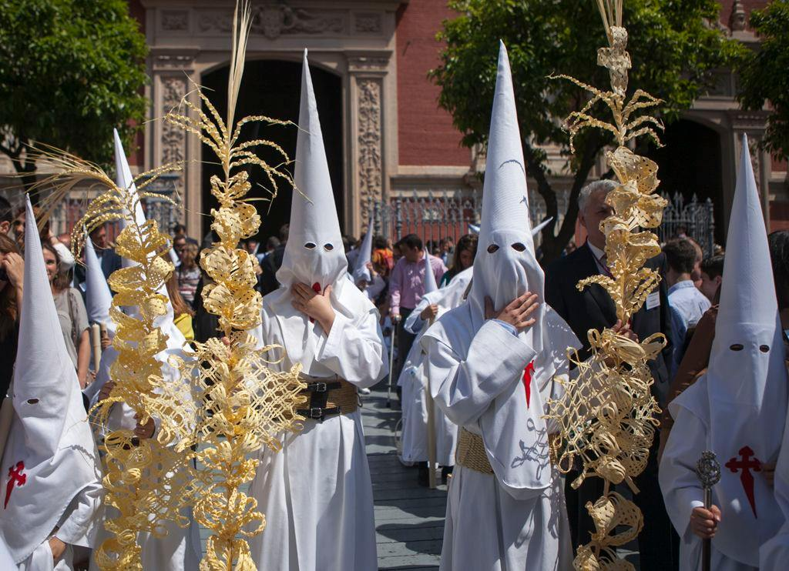
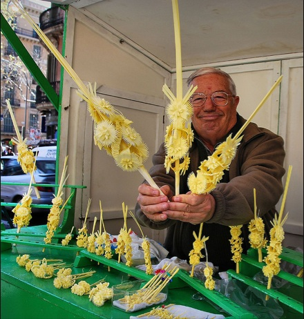

# Semana Santa – dzień pierwszy

## Zaczynamy Niedzielą Palmową – Domingo de Ramos

Atmosfera **pierwszego dnia** jest inna niż w kolejnych dniach. Jest uroczysta, jaśniejsza, mniej dramatyczna. Ulice wypełniają się ludźmi, dzieci trzymają w rękach palmowe gałązki, a miasta powoli przygotowują się na najintensywniejszy tydzień całego roku.

Korzenie tego dnia sięgają biblijnej historii, która jest właściwie początkiem wielkanocnego dramatu.

Według Ewangelii Jezus przybył do Jerozolimy krótko przed swoim ukrzyżowaniem. Nie wjechał jako król na koniu, lecz na zwykłym ośle – symbolu pokory. Ludzie witali go jak Mesjasza. Rozkładali na ziemi swoje płaszcze i machali gałązkami palmowymi, co w starożytności było znakiem czci i zwycięstwa. Wołali „Hosanna" i sławili jego przybycie.

To paradoksalny moment. Ten sam tłum, który go witał, kilka dni później będzie wołał „Ukrzyżuj go".

Właśnie dlatego Domingo de Ramos jest początkiem dramatycznego łuku, który kulminuje w Wielki Piątek.

---

## Palmowe gałązki na ulicach

W Hiszpanii ta biblijna historia przekłada się na tradycję, która jest żywa do dziś.

**Palmowych gałązek** – czyli *ramos* – ludzie najczęściej nie kupują w kościele, lecz na ulicy. Już kilka dni przed Niedzielą Palmową w centrach miast pojawiają się stragany i małe targi, gdzie sprzedaje się proste palmowe gałązki oraz długie, ozdobne palmy dla dzieci. W Andaluzji typowe są jasne, niemal białe palmy, często bardzo precyzyjnie plecione.

**Ramos są następnie święcone w kościele.** Ale na tym tradycja się nie kończy.

Wielu zabiera je do domu i wiesza na balkonach, wkłada w okna lub przymocowuje do drzwi. Pozostają tam często cały rok jako symbol błogosławieństwa i ochrony domu. W hiszpańskich miastach w te dni zobaczysz więc balkony ozdobione palmowymi liśćmi – niepozorny, ale bardzo typowy detal, który sygnalizuje, że Semana Santa się zaczęła.

Jednym z najbardziej typowych obrazów Domingo de Ramos są **dzieci z ogromnymi liśćmi palmowymi**. W Andaluzji często te liście mają półtora metra, czasem i dwa metry. Małe dziecko z palmą większą od siebie to scena, którą zobaczysz w każdym mieście. Dla dzieci to małe święto – i często cicha rywalizacja, kto będzie miał najwyższy liść.

W odróżnieniu od kolejnych dni Semana Santa Domingo de Ramos nie jest aż tak o pokucie i cierpieniu. To dzień oczekiwania. Pierwsze bractwa wychodzą na ulice, ale muzyka jest jeszcze uroczysta, nie żałobna. Tuniki mają często jaśniejsze barwy, a atmosfera sprawia wrażenie niemal radosnej.

To także dzień, w którym Hiszpanie uświadamiają sobie, że zaczyna się coś wielkiego. Miasta zaczynają się zapełniać, bary są pełne, ludzie stoją na rogach ulic i czekają na pierwsze procesje. Jeszcze jest jasno, jeszcze jest ciepło, jeszcze mówi się głośno.

**Semana Santa właśnie się zaczęła.**

